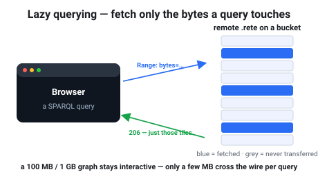
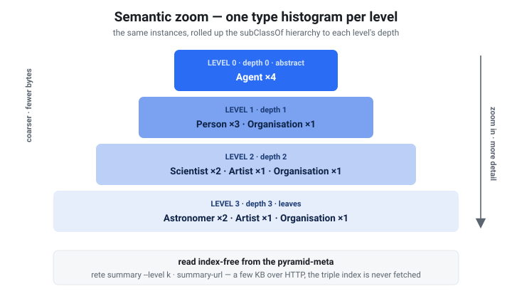
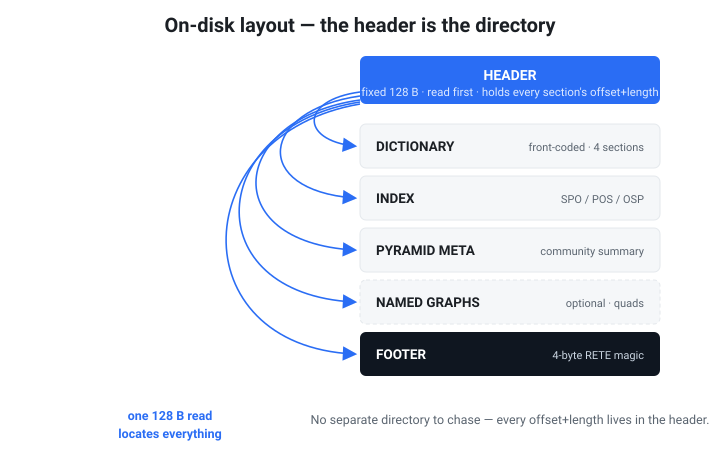

<p align="center">
  
</p>

<p align="center">
  <b>Put an RDF graph in one file. Drop it on a URL. Query it with SPARQL — no database server.</b>
</p>

<p align="center">
  <a href="https://caviri.github.io/rete/playground.html"><b>▶ Try it in your browser</b></a> ·
  <a href="https://caviri.github.io/rete/explore-100mb.html">100 MB / 1 GB explorer</a> ·
  <a href="https://caviri.github.io/rete/atlas.html">Historical atlas</a> ·
  <a href="https://caviri.github.io/rete/">Docs</a>
</p>

---

## What is rete?

The name comes from Latin **rēte**, meaning "net". Pronounce it **RAY-teh**
(Classical Latin: roughly `/ˈreː.te/`).

`rete` packs a whole RDF graph — its dictionary, permutation indexes, a community
summary, and a self-describing **schema pyramid** — into **one immutable `.rete`
file**. Put that file on S3, GitHub Pages, or any HTTP host that supports range
requests, hand a client the URL, and it runs **real SPARQL** against the file in
place, **fetching only the bytes a query needs**. The same engine compiles to
WebAssembly, so a **browser can query the file directly with no backend**.

> Think **Parquet** (for tables) or **PMTiles** (for maps) — but for **RDF
> graphs + SPARQL**.

<p align="center">
  
</p>

- **No server.** The file *is* the database. Publish once to static hosting.
- **Query in place.** SELECT / ASK / CONSTRUCT / DESCRIBE, joins, OPTIONAL,
  UNION, MINUS, FILTER, subqueries, property paths, GROUP BY / aggregates, XSD
  casts and the SPARQL 1.1 function library, named graphs, and **GeoSPARQL**
  (geometry + time) — **[~75% of the W3C query-evaluation suite](https://caviri.github.io/rete/conformance.html)**
  (309 tests; ≈89% excluding the RDFS/OWL-entailment regime rete leaves out by
  design and the SERVICE tests, which need a live endpoint — `SERVICE`
  federation itself [is supported](https://caviri.github.io/rete/sparql.html)).
- **Lazy over HTTP.** Range-read a remote file: a selective query faults in only
  the dictionary chunks and index tiles it touches, so a **1 GB graph stays
  interactive** in the browser ([try it](https://caviri.github.io/rete/explore-100mb.html)).
- **Self-describing.** Every file can carry its own **[Dataset Card](https://caviri.github.io/rete/dataset-cards.html)**
  (counts, vocabulary, detected signals, and a library of **ready-to-run starter
  queries**) plus a **[schema pyramid](https://caviri.github.io/rete/semantic-zoom.html)** —
  a *leveled* `rdf:type` legend you read **index-free** in a couple of range
  requests. See below.
- **Small + fast to open.** Compressed (zstd) with indexes prebuilt, so it
  *opens in ~16 ms* — no load/index step. (See [benchmarks](#how-fast).)
- **Runs in the browser.** Same engine in WASM — the
  **[interactive playground](https://caviri.github.io/rete/playground.html)** is
  a single offline HTML page.

## Clients

One engine, four languages — every client opens local files *and* remote URLs
(lazy HTTP range reads) and returns parsed SPARQL results:

| Client | Get it | Notes |
|---|---|---|
| **Python** [](https://pypi.org/project/rete-graph/) | `pip install rete-graph` | CPython ≥ 3.9 wheels for Linux/macOS/Windows **plus Pyodide** (JupyterLite, marimo WASM) · [docs](https://caviri.github.io/rete/python.html) · [tutorial](https://caviri.github.io/rete/python-build-tutorial.html) |
| **JavaScript** [](https://www.npmjs.com/package/rete-graph) | `npm install rete-graph` — or one `<script>` tag: `cdn.jsdelivr.net/npm/rete-graph/dist/rete-graph.min.js` | Node ≥ 18 + browsers; TypeScript types included · [docs](https://caviri.github.io/rete/javascript.html) |
| **R** | `remotes::install_github("caviri/rete", subdir = "clients/r", build = FALSE)` (needs Rust; CRAN/R-universe pending) | R ≥ 4.2; SPARQL results as data frames · [docs](https://caviri.github.io/rete/r.html) |
| **Rust** | `rete-core` / `rete-cli` in this repo (crates.io release pending) | native + wasm · [Rust API](https://caviri.github.io/rete/rust-api.html) · [CLI reference](https://caviri.github.io/rete/cli.html) |
| **Browser, zero install** | [playground](https://caviri.github.io/rete/playground.html) · [SPARQL IDE](https://caviri.github.io/rete/yasgui.html) | query any `.rete` URL with no install at all |
| **Claude Desktop** | [**⬇ rete.mcpb**](https://data.graphplaza.com/mcpb/rete.mcpb) — double-click it (or take the checksummed copy from [Releases](https://github.com/caviri/rete/releases)) | one-click [MCP Bundle](https://github.com/modelcontextprotocol/mcpb): the engine runs locally, so your own graphs stay on your machine and work offline · [docs](https://caviri.github.io/rete/agents.html) |

## Claude Code plugin

This repo doubles as a Claude Code plugin marketplace. Two commands wire
everything into Claude — the build/publish **skills** and the **rete MCP
server** (SPARQL + SHACL over 60+ public knowledge graphs, entity search,
dataset cards, media previews):

```
/plugin marketplace add caviri/rete
/plugin install rete-graph@rete
```

After install: ask Claude to query any dataset ("how many Spanish laws cite
the Constitution?"), validate shapes, preview IIIF/PDF media, or build a
`.rete` from your own data with `/rete-graph:rete-from-graph`. The same MCP
server also plugs into **ChatGPT** (developer mode or as a connector) and any
other MCP client — see the
[agentic interfaces guide](https://caviri.github.io/rete/agents.html).

## Self-describing & semantic zoom

Open a `.rete` you've never seen and the **cold-start problem** bites: which
classes exist, how do they connect, where do you even start? rete fixes this by
shipping the answer *inside the file*, read over a couple of HTTP range requests
**without ever touching the triple index**:

- The **Dataset Card** (`rete card-url <url>`) — title/license, term and class
  counts, the vocabulary, detected affordances (label / time / geo predicates,
  spatial bbox, …), and an auto-generated, **runnable** starter-query library.
- The **schema pyramid** (`rete summary --level k`) — a leveled `rdf:type`
  histogram where abstract classes describe the coarse view and leaf classes
  resolve as you zoom in. It also keeps the **lateral** relations between classes
  (not just the `is-a` tree), as a *non-exclusive* graph.

<p align="center">
  
</p>

```text
$ rete summary big.rete --level 0     # the big picture, index-free
   12048  <http://schema.org/Person>
    3017  <http://schema.org/Organization>
$ rete summary big.rete --level 2     # zoom in — leaves resolve
    4102  <http://schema.org/Scientist>  …
```

Full guide: **[Semantic zoom (schema pyramid)](https://caviri.github.io/rete/semantic-zoom.html)**.

## When does rete make sense?

✅ **A good fit when…**
- You want to **publish a graph dataset** and let people query it without
  standing up (and paying for) a triplestore — just static hosting + a URL.
- The data is **read-mostly / versioned snapshots** (a release, a daily dump, a
  knowledge-base export) rather than constantly mutated.
- You need **SPARQL in the browser** / at the edge / in a notebook, with no
  backend.
- You ship **many graphs** (per-tenant, per-dataset, sharded by year) and want
  each to be one cheap, cacheable, queryable artifact — even
  [federated across several files](https://caviri.github.io/rete/federation.html)
  (UNION federation: per-source results merged; cross-file joins are *not* resolved).
- You care about **bounded, progressive reads** — fetch a coarse overview first,
  drill into detail only where a query needs it (PMTiles-style, for graphs).

🚫 **Reach for a real triplestore instead when…**
- You need **frequent writes / transactions / live updates** (rete files are
  immutable — you rebuild to change them).
- You need an **always-on SPARQL endpoint** with a mature, battle-tested planner
  (e.g. [Oxigraph](https://github.com/oxigraph/oxigraph), Jena, GraphDB). rete's
  engine wins or ties most benchmark shapes against Oxigraph, but it is
  optimized for *publish-and-query*, not server throughput — see the honest
  [comparison](https://caviri.github.io/rete/BENCHMARK.html#comparison-vs-oxigraph-real-opencitations-network).
- You need full **OWL/RDFS entailment** at query time — rete bakes a fixed set of
  RDFS/OWL-RL inferences at build (`rete build --materialize`) rather than
  entailing during evaluation.

## Quick start

Everything runs through the checked-in **Docker Compose/devcontainer** toolchain
(nothing builds on your host):

```sh
# Build the canonical image, then build the CLI in the shared target volume:
docker compose build dev
docker compose run --rm dev cargo build --release -p rete-cli
```

```sh
# 1. Build a .rete from N-Triples / Turtle / N-Quads (--card embeds the self-description):
rete build examples/social.nt -o social.rete --card --title "Social graph"

# 2. Query it — a triple pattern, or full SPARQL:
rete query  social.rete --predicate '<http://ex/knows>'
rete why    social.rete --predicate '<http://ex/knows>'   # explain result provenance
rete sparql social.rete "PREFIX e: <http://ex/> \
  SELECT ?p ?age WHERE { ?p e:age ?age . FILTER(?age > 27) }"

# 3. Read the self-description (no index touched) and the leveled type legend:
rete card    social.rete            # counts, vocabulary, signals, starter queries
rete summary social.rete --level 0  # the schema pyramid at its most abstract level

# 4. Or query straight from a URL — fetches only the byte ranges it needs:
rete card-url   https://my-bucket.s3.amazonaws.com/social.rete   # 2 range requests
rete query-url  https://my-bucket.s3.amazonaws.com/social.rete --object '<http://ex/Alice>'
rete sparql-url https://my-bucket.s3.amazonaws.com/social.rete "SELECT * WHERE { ?s ?p ?o } LIMIT 5"
```

`query-url` resolves bound terms from the dictionary, then range-fetches only the
best-matching permutation payload for that triple pattern; `sparql-url`
faults in index tiles as a query touches them. `rete cost --explain` shows when a
query can use the summary-only or routed-pattern budgets.

### Try it in your browser (no install)

The **[playground](https://caviri.github.io/rete/playground.html)** is a
self-contained offline page bundling the WASM engine and **40+ example datasets**
— from tiny embedded graphs to **remote, lazily-queried** ones served over HTTP
range requests:

- a real **588k-triple OpenCitations** citation network,
- the **getty-ulan** artist-mentorship lineage (~205k triples, remote),
- the **entire 98 MB OpenHistoricalMap** planet (~6.1M dated, geolocated features), and
- a **104 MB and a 1 GB slice of Wikidata** — queried in the browser **without
  downloading them**.

Pick a dataset, run filterable SPARQL examples, inspect progressive exactness
metadata, validate SHACL, explore reachability, render schema summaries, and
explain triple-pattern provenance — all offline. Two focused demos:

- **[100 MB / 1 GB explorer](https://caviri.github.io/rete/explore-100mb.html)** —
  the same Wikidata slice four ways (rete / Parquet / DuckDB / SQLite), lazy over HTTP.
- **[Historical atlas](https://caviri.github.io/rete/atlas.html)** — GeoSPARQL +
  time over a `.rete`, with 80+ map overlays (battles, castles, treaties, …).

## How fast?

Real **OpenCitations** citation network (539,246 sanitized triples from the
~588k-triple playground dataset), vs
[Oxigraph](https://github.com/oxigraph/oxigraph) (in-memory), in the dev
container — full writeup in [Benchmarks](https://caviri.github.io/rete/BENCHMARK.html):

| | rete | Oxigraph |
|---|--:|--:|
| **Open / load the graph** | **16 ms** (indexes prebuilt in the file) | ~2,200 ms (parse + index) |
| SPARQL queries (24 operators) | **wins or ties 20/24** · 24/24 results identical | sub-ms to tens of ms |
| Batch reachability, 300 seeds | 453 ms → **36 ms** with `--parallel` | 2,591 ms |

rete opens ~100–160× faster, and after the 2026 engine rework (lazy slot-row
pipeline, adaptive index-nested-loop joins, top-k ORDER BY) it wins or ties most
SPARQL shapes — aggregates, GROUP BY, DISTINCT, OPTIONAL, UNION/VALUES, paths,
sorted pagination. Oxigraph keeps a fractional edge on ASK, the tightest LIMIT
joins, and non-literal REGEX scans. File size: ~11.7× smaller than raw
N-Triples, ~1.27× of `gzip` — but *queryable*.

> **Honest note on the pyramid.** Two structures ship in the file: the
> *community summary* scales with the graph and helps overview/aggregate queries
> but adds build time and gives node-selective queries no benefit (use
> `--no-pyramid` to drop it); the *schema pyramid* is bounded by the ontology and
> stays cheap at any scale. See the
> [cost-vs-benefit benchmark](https://caviri.github.io/rete/BENCHMARK.html#the-pyramid-cost-vs-benefit).

## How it's laid out

A 1 KB header — a small fixed core plus a typed **section directory** — points at
every section, so a client reads only what it needs (and new sections are just new
directory entries).

<p align="center">
  
</p>

See the **[format spec](https://caviri.github.io/rete/SPEC.html)** and
**[architecture](https://caviri.github.io/rete/architecture.html)** for the details.

## Documentation

- **[Graph data 101](https://caviri.github.io/rete/intro.html)** — new to RDF/graphs? Start here.
- **[Getting started](https://caviri.github.io/rete/getting-started.html)** · **[Architecture](https://caviri.github.io/rete/architecture.html)** · **[CLI reference](https://caviri.github.io/rete/cli.html)** · **[SPARQL support](https://caviri.github.io/rete/sparql.html)** · **[GeoSPARQL](https://caviri.github.io/rete/geosparql.html)** · **[SHACL validation](https://caviri.github.io/rete/shacl.html)**
- **[Dataset Cards](https://caviri.github.io/rete/dataset-cards.html)** · **[Semantic zoom (schema pyramid)](https://caviri.github.io/rete/semantic-zoom.html)** · **[Reasoning & coherence](https://caviri.github.io/rete/reasoning.html)** · **[Federated queries](https://caviri.github.io/rete/federation.html)**
- **[Interactive playground](https://caviri.github.io/rete/playground.html)** · **[100 MB / 1 GB explorer](https://caviri.github.io/rete/explore-100mb.html)** · **[Historical atlas](https://caviri.github.io/rete/atlas.html)**
- **[Format spec](https://caviri.github.io/rete/SPEC.html)** · **[Benchmarks](https://caviri.github.io/rete/BENCHMARK.html)** · **[SPARQL conformance](https://caviri.github.io/rete/conformance.html)** · **[Browser / WASM](https://caviri.github.io/rete/browser.html)**

The docs render as Markdown on GitHub, or as an HTML site (`docs/*.html`,
regenerated with `cargo run -p docgen`).

## Status

**v0.3.0** — first crates.io release (see [CHANGELOG](CHANGELOG.md)).
Working end-to-end — the single-file format, dictionary + permutation indexes, the
community summary and a self-describing **schema pyramid**, SPARQL + GeoSPARQL,
lazy HTTP-range queries (with per-tile synopses that prune a routed tile before
fetching it), and the browser/WASM engine. **Stable file-format generation 1**
(header byte `0x05`) is the compatibility baseline for Rete 1.x: stable readers
keep reading it, and an incompatible future layout must retain generation-1 read
support plus a documented migration path. Pre-1.0 experimental `.rete` files
must be rebuilt from RDF source. The Rust, CLI, and WASM APIs are release
candidates until 1.0.0 final. SPARQL evaluation is exact for supported shapes
(no implicit OWL/RDFS query-time entailment); cross-file federation is
UNION-fan-out, while SPARQL 1.1 `SERVICE` calls external endpoints from inside a
query.

## Develop (Docker only)

```sh
docker compose run --rm dev cargo test --workspace --exclude rete-bench
docker compose run --rm dev cargo run -p rete-cli -- info some.rete
docker compose run --rm dev bash scripts/smoke.sh
docker compose run --rm dev uv run python scripts/build_playground.py
docker compose run --rm gate                   # full Playwright regression gate
docker compose run --rm gate-catalog           # all 73 embedded catalog queries
docker compose run --rm gate-catalog-live      # all 431 catalog queries (slow, live R2)
docker compose run --rm gate-firefox           # regular gate in Firefox
```

Open the repository in its devcontainer for an interactive shell backed by the
same `dev` service. `check`, `wasm`, `wasm-async`, `docs`, and the `gate*` services
are named Compose services used by local development and release verification.

CI runs fmt, clippy, the test matrix, the CLI smoke test, a query-engine
regression check (`qbench --check`: per-query row counts + time ceilings), and
the WASM build in containers, so nothing builds on the host. See
[Getting started](https://caviri.github.io/rete/getting-started.html) for the dev-container setup.

## Support

rete is free and open source. If it's useful to you, you can support its
development on Ko-fi:

<a href='https://ko-fi.com/M1W723PEW3' target='_blank'></a>

## License

[Apache-2.0](LICENSE).
