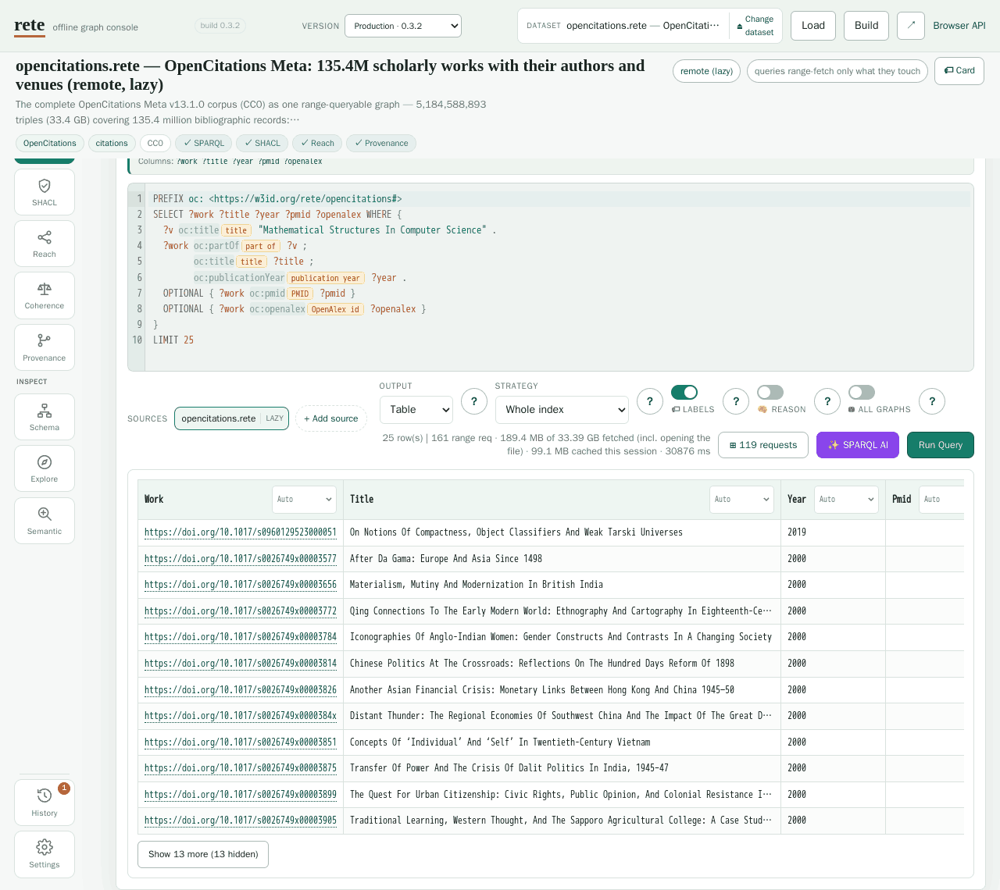
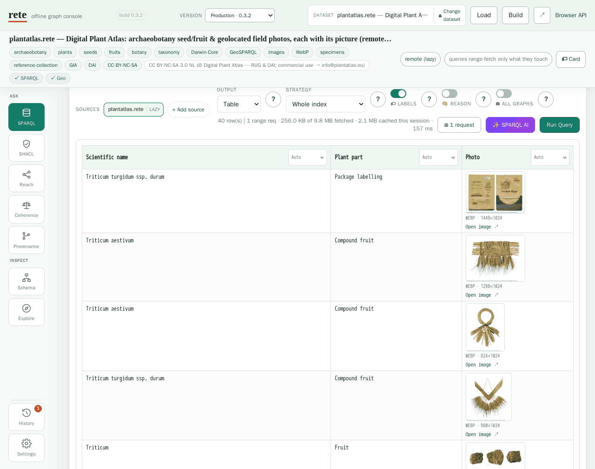
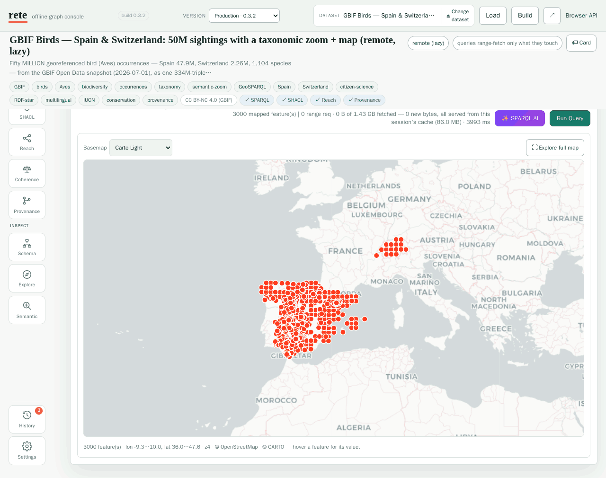

<p align="center">
  
</p>

<p align="center">
  <b>Put an RDF graph in one file. Drop it on a URL. Query it with SPARQL — no database server.</b>
</p>

<p align="center">
  <a href="https://caviri.github.io/rete/playground.html"><b>▶ Try it in your browser</b></a> ·
  <a href="https://caviri.github.io/rete/jslab.html">JS lab (D3)</a> ·
  <a href="https://caviri.github.io/rete/atlas.html">Historical atlas</a> ·
  <a href="https://caviri.github.io/rete/">Docs</a>
</p>

<p align="center">
  <a href="https://github.com/caviri/rete/actions/workflows/ci.yml"></a>
  <a href="scripts/coverage.sh"></a>
  <a href="LICENSE"></a>
  <a href="https://doi.org/10.5281/zenodo.21546287"></a>
</p>

<p align="center">
  <a href="https://crates.io/crates/rete-cli"></a>
  <a href="https://pypi.org/project/rete-graph/"></a>
  <a href="https://www.npmjs.com/package/rete-graph"></a>
  <a href="https://data.graphplaza.com/mcpb/rete.mcpb"></a>
</p>

<p align="center">
  <a href="https://caviri.github.io/rete/jupyterlite/lab/index.html?path=graph-data-science.ipynb"></a>
  <a href="https://colab.research.google.com/github/caviri/rete/blob/main/clients/python/examples/graph-data-science.ipynb"></a>
  <a href="https://mybinder.org/v2/gh/caviri/rete/main?labpath=clients%2Fpython%2Fexamples%2Fgraph-data-science.ipynb"></a>
</p>

> [!IMPORTANT]
> **Pre-1.0 — expect breaking changes.** rete is **0.3.2**, and until **1.0.0**
> *both* the public API and the `.rete` file format may change in ways that break
> what you built on them — including changes that require rebuilding a file you
> already published. See
> [compatibility](https://caviri.github.io/rete/compatibility.html) for details.

---

## What is rete?

The name comes from Latin **rēte**, meaning "net". Pronounce it **RAY-teh**
(Classical Latin: roughly `/ˈreː.te/`).

`rete` packs a whole RDF graph — its dictionary, permutation indexes, a community
summary, and a self-describing **schema pyramid** — into **one immutable `.rete`
file**. Put that file on S3, GitHub Pages, or any HTTP host that supports range
requests, hand a client the URL, and it runs **real SPARQL** against the file in
place, **fetching only the bytes a query needs**. The same engine compiles to
WebAssembly, so a **browser can query the file directly with no backend**.

> Think **Parquet** (for tables) or **PMTiles** (for maps) — but for **RDF
> graphs + SPARQL**.

<p align="center">
  
</p>

- **No server.** The file *is* the database. Publish once to static hosting.
- **Query in place.** SELECT / ASK / CONSTRUCT / DESCRIBE, joins, OPTIONAL,
  UNION, MINUS, FILTER, subqueries, property paths, GROUP BY / aggregates, XSD
  casts and the SPARQL 1.1 function library, named graphs, and **GeoSPARQL**
  (geometry + time) — **[~75% of the W3C query-evaluation suite](https://caviri.github.io/rete/conformance.html)**
  (309 tests; ≈89% excluding the RDFS/OWL-entailment regime rete leaves out by
  design and the SERVICE tests, which need a live endpoint — `SERVICE`
  federation itself [is supported](https://caviri.github.io/rete/sparql.html)).
- **Lazy over HTTP — and on disk.** Range-read the file wherever it lives: a
  selective query faults in only the dictionary chunks and index tiles it
  touches, so a **1 GB graph stays interactive in the browser** and a **52 GB
  graph opens locally in KBs** (files past 1 GiB go through the same range
  reader).
- **Bounded memory at any scale.** Aggregation streams through per-group
  accumulators — a `COUNT` over the **9.83-billion-triple** DataCite file
  returns **779,399 in 4 s inside a 2 GiB container**, and a `GROUP BY` over
  its 1.38 B-row type slice fits in 4 GiB
  ([benchmark](https://caviri.github.io/rete/BENCHMARK.html#billion-triple-scale-bounded-memory-queries-datacite)).
- **Self-describing.** Every file can carry its own **[Dataset Card](https://caviri.github.io/rete/dataset-cards.html)**
  (counts, vocabulary, detected signals, and a library of **ready-to-run starter
  queries**) plus a **[schema pyramid](https://caviri.github.io/rete/semantic-zoom.html)** —
  a *leveled* `rdf:type` legend you read **index-free** in a couple of range
  requests. See below.
- **Small + fast to open.** Compressed (zstd) with indexes prebuilt, so it
  *opens in ~20 ms* — no load/index step. (See [benchmarks](#how-fast).)
- **Runs in the browser.** Same engine in WASM — the
  **[interactive playground](https://caviri.github.io/rete/playground.html)** is
  a single offline HTML page.

## Clients

One engine, every runtime — every client opens local files *and* remote URLs
through the same lazy range reader and returns parsed SPARQL results (all
client versions track the engine's 0.3.x line):

| Client | Get it | Notes |
|---|---|---|
| **Python** [](https://pypi.org/project/rete-graph/) | `pip install rete-graph` | CPython ≥ 3.9 wheels for Linux/macOS/Windows **plus Pyodide** (JupyterLite, marimo WASM) · [docs](https://caviri.github.io/rete/python.html) · [tutorial](https://caviri.github.io/rete/python-build-tutorial.html) |
| **JavaScript** [](https://www.npmjs.com/package/rete-graph) | `npm install rete-graph` — or one `<script>` tag: `cdn.jsdelivr.net/npm/rete-graph@0.3.0/dist/rete-graph.min.js` | Node ≥ 18 + browsers; TypeScript types included · [docs](https://caviri.github.io/rete/javascript.html) |
| **Rust** [](https://crates.io/crates/rete-cli) | `cargo install rete-cli --locked`, or `rete-core` as a library | native + wasm · [Rust API](https://caviri.github.io/rete/rust-api.html) · [CLI reference](https://caviri.github.io/rete/cli.html) · [docs.rs](https://docs.rs/rete-core) |
| **Java** | `mvn -f clients/java install` — **not published to Maven Central yet**, so there is no coordinate to depend on | pure JVM — the engine as wasm on Chicory, plus an RDF4J `Sail` binding · [readme](clients/java/README.md) |
| **R** | `remotes::install_github("caviri/rete", subdir = "clients/r", build = FALSE)` (needs Rust) — **not on CRAN or R-universe** | R ≥ 4.2; SPARQL results as data frames · [docs](https://caviri.github.io/rete/r.html) |
| **Browser, zero install** | [playground](https://caviri.github.io/rete/playground.html) · [SPARQL IDE](https://caviri.github.io/rete/yasgui.html) | query any `.rete` URL with no install at all |
| **Claude Desktop** | [**⬇ rete.mcpb**](https://data.graphplaza.com/mcpb/rete.mcpb) — double-click it (or take the checksummed copy from [Releases](https://github.com/caviri/rete/releases)) | one-click [MCP Bundle](https://github.com/modelcontextprotocol/mcpb): the engine runs locally, so your own graphs stay on your machine and work offline · [docs](https://caviri.github.io/rete/agents.html) |
| **Blender** | add-on zip from [Releases](https://github.com/caviri/rete/releases) | SPARQL results as 3D scenes; bundles the Python wheels · [docs](https://caviri.github.io/rete/blender.html) |
| **Hosted gateway** | [`katospiegel-rete.hf.space`](https://katospiegel-rete.hf.space/) | no install: `/mcp` (agent tools), REST `/api`, and a W3C SPARQL 1.1 endpoint per dataset at `/sparql/{dataset}` |

## Claude Code plugin

This repo doubles as a Claude Code plugin marketplace. Two commands wire
everything into Claude — the build/publish **skills** and the **rete MCP
server** (SPARQL + SHACL over 65 public knowledge graphs, entity search,
dataset cards, media previews):

```
/plugin marketplace add caviri/rete
/plugin install rete-graph@rete
```

After install: ask Claude to query any dataset ("how many Spanish laws cite
the Constitution?"), validate shapes, preview IIIF/PDF media, or build a
`.rete` from your own data with `/rete-graph:rete-from-graph`. The same MCP
server also plugs into **ChatGPT** (developer mode or as a connector) and any
other MCP client — see the
[agentic interfaces guide](https://caviri.github.io/rete/agents.html).

## Self-describing & semantic zoom

Open a `.rete` you've never seen and the **cold-start problem** bites: which
classes exist, how do they connect, where do you even start? rete fixes this by
shipping the answer *inside the file*, read over a couple of HTTP range requests
**without ever touching the triple index**:

- The **Dataset Card** (`rete card-url <url>`) — title/license, term and class
  counts, the vocabulary, detected affordances (label / time / geo predicates,
  spatial bbox, …), and an auto-generated, **runnable** starter-query library.
- The **schema pyramid** (`rete summary --level k`) — a leveled `rdf:type`
  histogram where abstract classes describe the coarse view and leaf classes
  resolve as you zoom in. It also keeps the **lateral** relations between classes
  (not just the `is-a` tree), as a *non-exclusive* graph.

<p align="center">
  
</p>

```text
$ rete summary big.rete --level 0     # the big picture, index-free
   12048  <http://schema.org/Person>
    3017  <http://schema.org/Organization>
$ rete summary big.rete --level 2     # zoom in — leaves resolve
    4102  <http://schema.org/Scientist>  …
```

Full guide: **[Semantic zoom (schema pyramid)](https://caviri.github.io/rete/semantic-zoom.html)**.

## When does rete make sense?

✅ **A good fit when…**
- You want to **publish a graph dataset** and let people query it without
  standing up (and paying for) a triplestore — just static hosting + a URL.
- The data is **read-mostly / versioned snapshots** (a release, a daily dump, a
  knowledge-base export) rather than constantly mutated.
- You need **SPARQL in the browser** / at the edge / in a notebook, with no
  backend.
- You ship **many graphs** (per-tenant, per-dataset, sharded by year) and want
  each to be one cheap, cacheable, queryable artifact — even
  [federated across several files](https://caviri.github.io/rete/federation.html)
  (UNION federation: per-source results merged; cross-file joins are *not* resolved).
- You care about **bounded, progressive reads** — fetch a coarse overview first,
  drill into detail only where a query needs it (PMTiles-style, for graphs).

🚫 **Reach for a real triplestore instead when…**
- You need **frequent writes / transactions / live updates** (rete files are
  immutable — you rebuild to change them).
- You need an **always-on SPARQL endpoint** with a mature, battle-tested planner
  (e.g. [Oxigraph](https://github.com/oxigraph/oxigraph), Jena, GraphDB). rete's
  engine wins or ties most benchmark shapes against Oxigraph, but it is
  optimized for *publish-and-query*, not server throughput — see the honest
  [comparison](https://caviri.github.io/rete/BENCHMARK.html#comparison-vs-oxigraph-real-opencitations-network).
- You need full **OWL/RDFS entailment** at query time — rete bakes a fixed set of
  RDFS/OWL-RL inferences at build (`rete build --materialize`) rather than
  entailing during evaluation.

## Quick start

You do not need Rust, a clone of this repo, or its dev container to *use* rete.
A prebuilt CLI image is published — `ghcr.io/caviri/rete-cli`, ~30 MB on
distroless, multi-arch (amd64 + arm64) — so **RDF dump → `.rete` is one
command**:

```sh
# run this in the directory that holds your dump
docker run --rm -v "$PWD:/data" ghcr.io/caviri/rete-cli:latest \
  build /data/dump.nt -o /data/out.rete --card --title "My graph"
```
```text
embedded dataset card (16240 bytes of metadata)
wrote /data/out.rete: 5 triples, 8 terms, 1 pyramid level(s), 18061 bytes
```

`-v "$PWD:/data"` maps the current directory onto `/data` inside the container,
so `/data/out.rete` **is** `./out.rete` on your machine: the file is sitting
next to your dump when the command exits, with nothing to copy out of a
container. `--card` embeds the
[Dataset Card](https://caviri.github.io/rete/dataset-cards.html) — counts,
vocabulary, and runnable starter queries — and is optional.

Inspect and query it with the same image. One alias keeps the rest readable
(`-w /data` makes the container's working directory *your* directory, so plain
filenames work):

```sh
alias rete='docker run --rm -i -v "$PWD:/data" -w /data ghcr.io/caviri/rete-cli:latest'

rete stats   out.rete    # size, counts, top predicates, planner stats, entity shapes
rete card    out.rete    # the self-description: vocabulary, signals, starter queries
rete summary out.rete --level 0   # the schema pyramid, most abstract level
rete sparql  out.rete 'SELECT ?s ?name WHERE { ?s <http://xmlns.com/foaf/0.1/name> ?name }'
rete why     out.rete --predicate '<http://ex/knows>'   # explain result provenance
```

Variants worth knowing:

```sh
# Turtle, N-Quads and RDF/XML (.rdf / .owl — how most OWL ontologies ship) are
# detected by extension; --format nt|nq|ttl|rdfxml overrides detection.
rete build ontology.owl -o ontology.rete

# Several inputs merge into one file under a shared dictionary.
rete build part1.nt part2.nt -o merged.rete

# `-` reads stdin, so a dump never has to touch your disk (defaults to N-Triples).
curl -sL https://host/dump.nt | rete build - -o out.rete
```

> **Three container gotchas, all of them silent.** Piping needs `docker run -i`
> — the alias above sets it, but without `-i` stdin is empty and `build -`
> writes a valid, **0-triple** file and exits 0. On Linux the image runs as
> root, so add `--user "$(id -u):$(id -g)"` unless you want output owned by
> root. On Windows Git Bash, MSYS rewrites both the mount and `/data/…`
> arguments (`/data/dump.nt` becomes `C:/Program Files/Git/data/dump.nt`, and a
> `$PWD` mount resolves to a directory that is not yours — the build reports
> success and no file appears); use
> `MSYS_NO_PATHCONV=1 docker run --rm -v "$(pwd -W):/data" …`.

A graph that already lives on a URL needs no download, and no mount either if
you point the bare image at it — these are the range-read commands, fetching
only the bytes an answer needs:

```sh
docker run --rm ghcr.io/caviri/rete-cli:latest \
  card-url https://data.graphplaza.com/opencitations/opencitations.rete
# fetched 2764 of 35852509508 bytes in 3 range request(s) — index NOT fetched
#   title   : OpenCitations Meta
#   triples : 5178674356

rete query-url  https://my-bucket.s3.amazonaws.com/social.rete --object '<http://ex/Alice>'
rete sparql-url https://my-bucket.s3.amazonaws.com/social.rete 'SELECT * WHERE { ?s ?p ?o } LIMIT 5'
```

`query-url` resolves bound terms from the dictionary, then range-fetches only the
best-matching permutation payload for that triple pattern; `sparql-url`
faults in index tiles as a query touches them. `rete cost --explain` shows when a
query can use the summary-only or routed-pattern budgets.

Prefer not to go through Docker at all? The same engine ships as
`pip install rete-graph` and `npm install rete-graph` (see
[Clients](#clients)), which build and query files from Python and JavaScript
directly. The other two published images — the full toolchain and the
HTTP/MCP relay — are documented in [`docker/README.md`](docker/README.md).

### Try it in your browser (no install)

The **[playground](https://caviri.github.io/rete/playground.html)** is a
self-contained offline page bundling the WASM engine and **65 example datasets**
— from tiny embedded graphs to **remote, lazily-queried** ones served over HTTP
range requests:

- a real **588k-triple OpenCitations** citation network,
- the **getty-ulan** artist-mentorship lineage (~205k triples, remote),
- the **entire 98 MB OpenHistoricalMap** planet (~6.1M dated, geolocated features), and
- a **104 MB and a 1 GB slice of Wikidata** — queried in the browser **without
  downloading them**.

Pick a dataset, run filterable SPARQL examples, inspect progressive exactness
metadata, validate SHACL, explore reachability, render schema summaries, and
explain triple-pattern provenance — all offline. Two focused demos:

- **[JS lab](https://caviri.github.io/rete/jslab.html)** — query a `.rete` from
  JavaScript and wire the results straight into a **D3** force graph, in one page.
- **[Historical atlas](https://caviri.github.io/rete/atlas.html)** — GeoSPARQL +
  time over a `.rete`, with 80+ map overlays (battles, castles, treaties, …).

### What it looks like

Every shot below is the same single HTML page, querying a file that stays on its
URL. Each links to the deep link that reproduces it.

<p align="center">
  <a href="https://caviri.github.io/rete/playground.html#dataset=opencitations&amp;load=lazy&amp;ex=2"></a>
</p>

**SPARQL against 5.18 billion triples, from a browser tab.** `opencitations.rete`
is one 33.4 GB file on object storage. The line under the toolbar is the whole
point: 25 rows came back after **161 range requests and 189 MB** — including
opening the file. The other 33 GB were never transferred, and there is no server
on the other end.

<p align="center">
  <a href="https://caviri.github.io/rete/playground.html#dataset=plantatlas&amp;load=lazy&amp;ex=0"></a>
</p>

**The pictures are in the graph.** Those photographs are `xsd:base64Binary`
WebP literals stored *inside* the `.rete`, rendered straight into the result
cell — no image host, no second request, nothing to rot. Forty rows and their
pictures cost **one range request and 256 KB** of a 9.8 MB file. The same
renderers handle IIIF manifests, PDFs, audio, video and `.glb` 3D models.

[](https://caviri.github.io/rete/playground.html#dataset=davidrumsey&load=lazy)

**The file describes itself.** Every `.rete` can carry a
[Dataset Card](https://caviri.github.io/rete/dataset-cards.html) — licence,
counts, vocabularies, classes, and runnable starter queries. Read straight off
the header: **58.5 KB in one coalesced range request**, without touching the
triple index, on a 5 M-triple file or a 5 B-triple one alike.

<p align="center">
  <a href="https://caviri.github.io/rete/playground.html#dataset=gbif-birds&amp;load=lazy&amp;ex=10"></a>
</p>

**GeoSPARQL, drawn.** 3,000 raptor sightings selected out of a **334 M-triple,
1.43 GB** GBIF graph and put on a basemap — `geo:asWKT` literals detected in the
result and rendered as a map view. This run answers entirely from the session's
86 MB block cache, which is what makes panning around a remote graph feel local.

[](https://caviri.github.io/rete/playground.html#dataset=davidrumsey&load=lazy&mode=explore)

**Browse it like an archive, without writing SPARQL.** Explore turns each
`rdf:type` class into a table — entities as rows, their properties as columns —
so an unfamiliar graph is navigable before you know a single predicate in it.

## How fast?

Real **OpenCitations** citation network (539,246 sanitized triples from the
~588k-triple playground dataset), vs
[Oxigraph](https://github.com/oxigraph/oxigraph) (in-memory), in the dev
container — full writeup in [Benchmarks](https://caviri.github.io/rete/BENCHMARK.html):

| | rete | Oxigraph |
|---|--:|--:|
| **Open / load the graph** | **~20 ms** (indexes prebuilt in the file) | ~2,440 ms (parse + index) |
| SPARQL queries (24 operators) | **wins or ties 21/24** · 24/24 results identical | sub-ms to tens of ms |
| Batch reachability, 300 seeds | 641 ms → **39 ms** with `--parallel` | 3,026 ms |

rete opens ~120× faster, and after the 2026 engine rework (lazy slot-row
pipeline, adaptive index-nested-loop joins, top-k ORDER BY) it wins or ties most
SPARQL shapes — aggregates, GROUP BY, DISTINCT, OPTIONAL, UNION/VALUES, paths,
sorted pagination. Oxigraph keeps a fractional edge on ASK, the tightest LIMIT
joins, and non-literal REGEX scans. File size: ~6.4× smaller than raw
N-Triples, ~2.3× of `gzip` — but *queryable*.

And it holds at scale: the 52 GB, **9.83-billion-triple** DataCite file answers
a `COUNT` in **4 s inside a 2 GiB container** and a `GROUP BY` over 1.38 B rows
in 131 s inside 4 GiB — aggregation streams, memory is O(groups)
([full numbers](https://caviri.github.io/rete/BENCHMARK.html#billion-triple-scale-bounded-memory-queries-datacite)).

> **Honest note on the pyramid.** Two structures ship in the file: the
> *community summary* scales with the graph and helps overview/aggregate queries
> but adds build time and gives node-selective queries no benefit (use
> `--no-pyramid` to drop it); the *schema pyramid* is bounded by the ontology and
> stays cheap at any scale. See the
> [cost-vs-benefit benchmark](https://caviri.github.io/rete/BENCHMARK.html#the-pyramid-cost-vs-benefit).

## How it's laid out

A 1 KB header — a small fixed core plus a typed **section directory** — points at
every section, so a client reads only what it needs (and new sections are just new
directory entries).

<p align="center">
  
</p>

*The anatomy on a real specimen ([dblp.rete](https://data.graphplaza.com/dblp/dblp.rete), 179 M triples) — in the spirit of the classic Parquet file-layout figure.*

See the **[format spec](https://caviri.github.io/rete/SPEC.html)** and
**[architecture](https://caviri.github.io/rete/architecture.html)** for the details.

## Documentation

- **[Graph data 101](https://caviri.github.io/rete/intro.html)** — new to RDF/graphs? Start here.
- **[Getting started](https://caviri.github.io/rete/getting-started.html)** · **[Architecture](https://caviri.github.io/rete/architecture.html)** · **[CLI reference](https://caviri.github.io/rete/cli.html)** · **[SPARQL support](https://caviri.github.io/rete/sparql.html)** · **[GeoSPARQL](https://caviri.github.io/rete/geosparql.html)** · **[SHACL validation](https://caviri.github.io/rete/shacl.html)**
- **[Dataset Cards](https://caviri.github.io/rete/dataset-cards.html)** · **[Semantic zoom (schema pyramid)](https://caviri.github.io/rete/semantic-zoom.html)** · **[Reasoning & coherence](https://caviri.github.io/rete/reasoning.html)** · **[Federated queries](https://caviri.github.io/rete/federation.html)**
- **[Interactive playground](https://caviri.github.io/rete/playground.html)** · **[JS lab (D3)](https://caviri.github.io/rete/jslab.html)** · **[Historical atlas](https://caviri.github.io/rete/atlas.html)**
- **Run the notebooks:** **[JupyterLite](https://caviri.github.io/rete/jupyterlite/lab/index.html?path=graph-data-science.ipynb)** (in your browser, no account) · **[Colab](https://colab.research.google.com/github/caviri/rete/blob/main/clients/python/examples/graph-data-science.ipynb)** · **[Binder](https://mybinder.org/v2/gh/caviri/rete/main?labpath=clients%2Fpython%2Fexamples%2Fgraph-data-science.ipynb)**
- **[Format spec](https://caviri.github.io/rete/SPEC.html)** · **[Benchmarks](https://caviri.github.io/rete/BENCHMARK.html)** · **[SPARQL conformance](https://caviri.github.io/rete/conformance.html)** · **[Browser / WASM](https://caviri.github.io/rete/browser.html)**

The docs render as Markdown on GitHub, or as an HTML site (`docs/*.html`,
regenerated with `cargo run -p docgen`).

## Status

**v0.3.2** — the 0.3.x engine line, shipped to crates.io (`rete-core`,
`rete-cli`, `rete-wasm`, `rete-graph`), PyPI and npm with every client in
lockstep (see [CHANGELOG](CHANGELOG.md)). The Java client and the R package are
built from this repo and are not on Maven Central or CRAN.
Working end-to-end — the single-file format, dictionary + permutation indexes, the
community summary and a self-describing **schema pyramid**, SPARQL + GeoSPARQL,
lazy HTTP-range queries (with per-tile synopses that prune a routed tile before
fetching it), and the browser/WASM engine. **Stable file-format generation 1**
(header byte `0x05`, frozen 2026-07-14 and first released in 0.3.0) has not moved
since that freeze — but "stable" names the generation and is not a compatibility
promise: **no backwards-compatibility guarantee is made before 1.0.0**, and the
format may still change in ways that require rebuilding a file you already
published. The experimental generations `0x01`–`0x04` predate that freeze and
must be rebuilt from RDF source. The generation number is not the release version
— there is no Rete 1.0.0, and the Rust, CLI, and WASM APIs carry no semver
promise until there is. SPARQL evaluation is exact for supported shapes
(no implicit OWL/RDFS query-time entailment); cross-file federation is
UNION-fan-out, while SPARQL 1.1 `SERVICE` calls external endpoints from inside a
query.

## Develop (Docker only)

This section is about **building the project**, not using it — if you only want
to turn a dump into a `.rete`, the [quick start](#quick-start) above needs none
of it. Everything here runs through the checked-in Docker Compose/devcontainer
toolchain, so nothing builds on your host:

```sh
# The canonical image, then the CLI in the shared target volume (target/release/rete):
docker compose build dev
docker compose run --rm dev cargo build --release -p rete-cli
```

```sh
docker compose run --rm dev cargo test --workspace --exclude rete-bench
docker compose run --rm dev cargo run -p rete-cli -- info some.rete
docker compose run --rm dev bash scripts/smoke.sh
docker compose run --rm dev uv run python scripts/build_playground.py
docker compose run --rm gate                   # full Playwright regression gate
docker compose run --rm gate-catalog           # every embedded catalog query
docker compose run --rm gate-catalog-live      # every catalog query (slow, live R2)
docker compose run --rm gate-firefox           # regular gate in Firefox
```

Open the repository in its devcontainer for an interactive shell backed by the
same `dev` service. `check`, `wasm`, `wasm-async`, `docs`, and the `gate*` services
are named Compose services used by local development and release verification.

CI runs fmt, clippy, the test matrix, the CLI smoke test, a query-engine
regression check (`qbench --check`: per-query row counts + time ceilings), and
the WASM build in containers, so nothing builds on the host. See
[Getting started](https://caviri.github.io/rete/getting-started.html) for the dev-container setup.

## Support

rete is free and open source. If it's useful to you, you can support its
development on Ko-fi:

<a href='https://ko-fi.com/M1W723PEW3' target='_blank'></a>

## License

[Apache-2.0](LICENSE).
