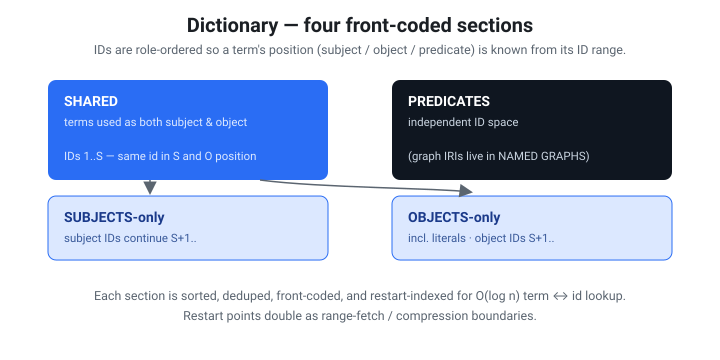

# Rete — a cloud-native, range-queryable RDF graph file

**Status:** Draft 0.1 (design) · **File extension:** `.rete` · **Magic:** `RETE\x01`

> One file. Put it on S3, GitHub, or any HTTP server that honors `Range`.
> Give a client the URL. Run SPARQL. No database server.
>
> Like **Parquet** for tables and **PMTiles** for maps — but for **RDF graphs**,
> with a **pyramid** of progressively-refined detail.

---

## 1. Goals & non-goals

### Goals
- **Single immutable file**, queryable in place over HTTP `Range` requests.
- **Bounded request count** to answer a query — the client reads a small header
  (which carries every section's byte range), then fetches only the sections a
  query actually touches (≤4 ranges for a full open; 3 for the overview path).
- **SPARQL** evaluation against the file (BGPs, joins, filters, paths, aggregates,
  named graphs, and the supported query forms in §8).
- **Progressive / pyramidal** access: a coarse *summary graph* loads first, and
  the client refines by "zooming into" regions of interest.
- **WASM-friendly**: the same query core runs in a browser and in a CLI.
- **RDF-faithful**: IRIs, blank nodes, literals (with datatype + language tag),
  and named graphs (quads).

### Non-goals (v0)
- **Mutation.** The file is build-once / read-many. Updates = rebuild (or, later,
  a separate overlay file). This buys aggressive compression and CDN caching.
- **Full SPARQL 1.1** on day one. We stage it (see §8).
- **Inference / reasoning** at query time. Materialize before build if wanted.

---

## 2. Prior art we build on

| Source | What we take |
|---|---|
| **HDT** (Header-Dictionary-Triples) | Dictionary + bitmap-encoded triples; the closest existing queryable single-file RDF format. We extend it toward range/progressive access. |
| **PMTiles** | Header → root directory → leaf directories → data, all byte-range addressable, with a bounded number of requests. This is the spine of our pyramid + index. |
| **Parquet** | Footer metadata, blocks ("row groups"), and per-block min/max "zone maps" enabling pushdown / block-skipping. |
| **FlatGeobuf** | Packed static index (R-tree) co-located in the file for streamable spatial queries; our analog indexes *graph locality*. |
| **Oxigraph** (`oxrdf`, `spargebra`, `oxttl`) | Reuse RDF model, SPARQL parser, and algebra rather than writing our own. |

---

## 3. Conceptual model

An RDF dataset = a set of **quads** `(subject, predicate, object, graph)`.

Three transformations make it range-queryable:

1. **Dictionary encoding** — every IRI / literal / blank node ⇒ a dense integer
   ID. Triples become integer triples; the dictionary is stored once, compressed.
2. **Permutation indexes** — store the integer triples sorted in multiple orders
   (SPO, POS, OSP) so *any* triple pattern resolves to a contiguous scan.
3. **Pyramid (community summarization)** — partition nodes into a hierarchy of
   communities. Level 0 is a *quotient graph* (communities as supernodes, with
   aggregated edges). Each deeper level expands supernodes into their members.

---

## 4. File layout

v0 on-disk layout (what `write_file`/`write_dataset` actually emit). The header
is the directory: it carries the absolute offset+length of every section, so a
client finds everything from the first 128-byte read — no separate directory or
metadata block to chase.


*The header is the directory: a single 128-byte read carries the offset and length of every section. The ASCII below is the precise reference.*

```
┌──────────────────────────────────────────────────────────────┐
│ HEADER            fixed-size, 128 bytes, read first.           │
│   Holds the offset+length of every section below, the codec   │
│   ids, counts, and the blake3 content hash (§4.1).             │
├──────────────────────────────────────────────────────────────┤
│ DICTIONARY        front-coded container of four sections:      │
│   ├ shared (terms used as both subject & object)               │
│   ├ subjects-only                                              │
│   ├ objects-only (incl. literals)                              │
│   └ predicates          (graph IRIs live in NAMED GRAPHS)      │
├──────────────────────────────────────────────────────────────┤
│ INDEX             default-graph permutation container:         │
│   SPO / POS / OSP streams, each a zone-mapped, delta-coded,    │
│   (optionally zstd) block. Pointed to by `root_dir_offset`.    │
├──────────────────────────────────────────────────────────────┤
│ PYRAMID META      summary superedges (community quotient graph)│
│   + optional per-community tiles. Pointed to by pyramid fields.│
├──────────────────────────────────────────────────────────────┤
│ NAMED GRAPHS      optional: (graph IRI, permutation container) │
│   per named graph, sharing the dictionary. Quads only.         │
├──────────────────────────────────────────────────────────────┤
│ FOOTER            4-byte `RETE` magic — a format/integrity     │
│                   sentinel (the directory is the header).      │
└──────────────────────────────────────────────────────────────┘
```

Each permutation section carries its own **tile directory** (format `0x02`,
§6.2): byte ranges for independently-compressed tiles, keyed by leading-id
range — so single-pattern routing fetches the selected SPO/POS/OSP section and
decompresses only the matching tile(s). Per-*community* leaf directories
(mapping `(level, tile, perm)` to byte ranges across the pyramid) are part of
the fuller design and remain future work (see `docs/BENCHMARK.md`).

### 4.1 Header (128 bytes, little-endian)

| Offset | Size | Field |
|---|---|---|
| 0 | 4 | magic `RETE` |
| 4 | 1 | format version (`0x02`; readers also accept `0x01`, see §6.2) |
| 5 | 1 | flags (bit0: has named graphs / quads) |
| 6 | 2 | header length |
| 8 | 8 | metadata offset |
| 16 | 8 | metadata length |
| 24 | 8 | dictionary offset |
| 32 | 8 | dictionary length |
| 40 | 8 | root directory offset |
| 48 | 8 | root directory length |
| 56 | 8 | pyramid-meta offset |
| 64 | 8 | pyramid-meta length |
| 72 | 1 | dictionary codec id |
| 73 | 1 | block codec id (e.g. zstd) |
| 74 | 2 | number of pyramid levels |
| 76 | 8 | total quad count |
| 84 | 8 | total term count |
| 92 | 16 | content hash (blake3, first 16 bytes) — also an ETag-like id |
| 108 | 8 | named-graphs section offset (0 if default-graph only) |
| 116 | 8 | named-graphs section length (0 if default-graph only) |
| 124 | 4 | reserved |

> Rationale: a fixed 128-byte header means **one tiny range read** (`bytes=0-127`)
> tells the client where every section lives.

The **metadata section** (offset 8 / length 16) sits between the header and the
dictionary and is `0`-length by default. When present it carries an opaque,
application-defined payload — the CLI stores a JSON [Dataset Card](dataset-cards.md)
there. Its bytes are included in the content hash (so `verify` covers it), and a
range-reading client never fetches it for a query (it reads sections by their
header offsets). A reader that doesn't understand the payload simply skips it: the
dictionary is always located via `dictionary offset`, which already accounts for
the section's length.

---

## 5. Dictionary



*Four front-coded sections with role-ordered IDs: a term's ID range reveals whether it is a subject, object, or predicate.*

- Terms are **sorted within each kind** and **front-coded** (store the shared
  prefix length + the suffix vs. the previous term). Cheap to compress, supports
  binary search for `string → id`, and prefix-friendly for IRI namespaces.
- IDs are assigned so that **shared terms get the lowest IDs**, then subjects,
  then objects — this lets a triple pattern know a term's role from its ID range.

  Concretely (the HDT four-section scheme): let `S` = #shared (terms used as
  *both* subject and object). Subject IDs are `1..=S` (shared) then `S+1..`
  (subject-only); object IDs are `1..=S` (the **same** shared IDs) then `S+1..`
  (object-only). So a shared term has one ID that means the same thing in subject
  and object position. Predicates and graphs occupy their own independent ID
  spaces. This is what `dictionary.rs` builds on top of the §5.1 sections.
- Literals carry datatype IRI (as a dictionary ID) and optional language tag.
- The dictionary is four independently-decompressible **sections** (shared /
  subjects / objects / predicates), each with a restart-indexed table (§5.1) that
  supports `O(log n)` term↔ID lookup once loaded. In v0 a client fetches the whole
  dictionary section as one range; splitting each section into independently
  range-fetchable chunks (so resolving one IRI pulls only its run) is future work
  the restart table already enables.

### 5.1 Section encoding (front-coded, restart-indexed)

Each dictionary *kind* (shared / subjects / objects / predicates / graphs) is one
**section**. Within a section terms are UTF-8, **sorted ascending**, deduped, and
assigned **dense 1-based IDs** in that order (ID `0` is reserved as "absent").

Terms are stored in **runs of `R` entries** (default `R = 16`, the *restart
interval*). Each run begins at a **restart point** storing the full term; the
remaining `R-1` entries are *front-coded* against their predecessor:

```
restart entry:   varint(0)            varint(len)  bytes[len]          # full term
delta entry:     varint(shared_pfx)   varint(suf)  bytes[suf]          # share prefix
```

A small **restart index** (one `(first_term, byte_offset)` per run, the first
terms also front-coded against each other) sits at the head of the section. Both
lookups stay within one run after a binary search over restarts:

- **`id → term`**: run = `(id-1) / R`; jump to its offset; decode forward
  `(id-1) % R` steps.
- **`term → id`**: binary-search the restart index for the candidate run; decode
  that run comparing each materialized term; return its ID or `None`.

Restart points are also the natural **chunk/compression boundaries**: a client
fetches just the run(s) covering the IDs/terms a query touches.

---

## 6. Triples / quads

- Stored as integer triples in **three permutations**: **SPO, POS, OSP**.
  These three cover all eight triple-pattern shapes (any combination of
  bound/unbound S, P, O resolves to a contiguous range in at least one index).
- Each permutation is encoded as an **adjacency / bitmap-triples** structure
  (HDT-style): for SPO, a sorted list of subjects, each with its predicate
  list, each with its object list, delta-encoded.
- Quads (named graphs) add a `G` dimension; v0 stores per-graph triple sets plus
  a default-graph union. (Full GSPO permutations are a later optimization.)
- Triples are **partitioned by pyramid tile** (see §7), and within a tile split
  into fixed-size **blocks**. Every block is prefixed with a **zone map**
  (min ID, max ID, count) so the query planner can skip blocks — Parquet-style.

### 6.1 Triple block encoding (grouped delta)

Within a block, triples for a permutation are sorted ascending on `(a, b, c)`
(e.g. SPO ⇒ a=S, b=P, c=O) and stored as a nested **grouped, delta-coded**
adjacency — the compact, decode-forward form HDT calls bitmap-triples, written
here with explicit group counts:

```
zone map:  varint min_a, max_a, min_b, max_b, min_c, max_c, triple_count
body:      varint num_a
           per a-group:  varint Δa            # Δ from previous a (first = absolute)
                         varint num_b
              per b-group: varint Δb          # Δ from previous b *within this a*
                           varint num_c
                 per c:      varint Δc         # Δ from previous c *within this b*
```

Deltas reset at each group boundary, so values stay small and varint-friendly.
The **zone map** lets the planner skip a block whose `[min,max]` range cannot
contain a bound constant before fetching the body — the §7 routing then bounds
*which* blocks are fetched at all.

### 6.2 Tiled permutation sections (format `0x02`)

Each permutation section is **tiled**: consecutive runs of whole a-groups are
packed to a byte budget (default 64 KiB of encoded triples), and each tile is a
fully self-contained §6.1 block (its own zone map; deltas restart). Tiles are
**compressed individually** with the header's block codec, so a ranged client
can fetch and decompress exactly the tiles a query routes to. The section
payload is stored raw inside the index container (the container-level codec for
index sections is `none`; compression lives at tile granularity):

```
section payload:  varint num_tiles
                  per tile: varint Δmin_a       # Δ from previous tile's min_a
                            varint max_a−min_a  # leading-id span (routing)
                            varint clen          # compressed tile length
                  tiles:    num_tiles × compressed §6.1 blocks, concatenated
```

A bound leading component binary-searches the directory to exactly **one**
tile (a-groups are never split across tiles); an unbound one visits every
tile, zone-map-pruned. The directory is uncompressed so it is readable before
any tile is fetched.

**Dictionary sections are chunked the same way** (their container-level codec
is also `none`): each of the four §5 sections is stored as

```
section payload:  varint header_len, raw §5.1 header (term count, restart
                  interval, restart-offset table — original encoding, so the
                  offsets stay valid in the section's coordinate space)
                  varint num_chunks
                  per chunk: varint Δfirst_run        # Δ from previous chunk
                             varint first_term_len, first_term bytes
                             varint clen               # compressed chunk length
                  chunks:    run-aligned body slices, compressed individually
```

Chunks hold whole front-coded runs (~64 KiB of body per chunk), and the
directory embeds each chunk's first term — so `term → id` binary-searches the
directory locally and faults exactly **one** chunk, and `id → term` computes
its chunk arithmetically and faults one. A lazily-opened remote file therefore
pays the section headers + directories (KBs) up front and O(touched chunks)
afterwards, instead of the whole dictionary container.

**Compatibility:** version `0x01` files store one whole-section-compressed
block per permutation and whole-compressed dictionary sections. Readers still
accept them (each section is one logical tile/chunk); writers always emit
`0x02`. The format remains experimental — no stability promise beyond this one
documented transition.

---

## 7. The pyramid — community summarization

The headline feature. "Zoom" = level of graph detail.


*Top to bottom: coarse community summary → communities → full triples. Fewer bytes at the top, more detail below; clients fetch the overview first and drill down on demand.*

### 7.1 Build time
1. Run hierarchical community detection (**Leiden**, falling back to Louvain) on
   the (optionally edge-weighted) graph. This yields a dendrogram of communities.
2. Cut the dendrogram into levels. **Level 0** = coarsest: each top-level
   community becomes a **supernode**. **Level N-1** = the full graph.

   **Cut policy: size-targeted tiles (committed).** We do *not* fix `N` up front.
   Instead each tile targets a byte budget `T` (default ~64 KiB, configurable) so
   that **one zoom ≈ one block ≈ one range read**, exactly like PMTiles. We
   descend the dendrogram and emit a tile boundary whenever a community's encoded
   triple payload would exceed `T`; communities still larger than `T` at the
   finest cut are split into multiple co-located tiles. `N` (the level count)
   therefore falls out of the data and `T`, rather than being chosen by hand.
   Consequences: predictable request sizes, uniform client latency per zoom, and
   a directory whose leaf granularity matches the transfer unit.
3. For each level build the **quotient graph**:
   - supernode = a community; its weight = node/edge count inside.
   - superedge `A→B` for predicate `p` = aggregate of all `p` edges crossing
     from community `A` to community `B`, with a count.
4. Emit, per supernode, the **member map** (which finer supernodes / nodes it
   expands into) so a client can drill down without re-clustering.

### 7.2 Query / browse time
- Client loads **level 0** (small): a graph of supernodes + aggregated relations.
  Good for overview, "shape of the data," and routing.
- To **zoom into** a supernode, the client follows its directory entry to fetch
  only that community's finer level — one (or few) range reads.
- SPARQL over the pyramid: a query can run against a level (approximate / rolled-
  up answers via superedges) or be **routed** — use level 0 to find which
  communities can satisfy the pattern, then descend only into those tiles. This
  is the graph analog of Parquet block-skipping.

### 7.3 The pyramid-meta section (on disk)

The pyramid-meta section (`crates/rete-core/src/meta.rs`) is a flat varint stream.
**v1** carries the chosen round, the summary super-edges, and (reserved) per-tile
triple blocks:

```text
varint round                       # the materialized dendrogram round
varint num_superedges;  per: varint s_comm, predicate, o_comm, count
varint num_tiles;       per: varint community, block_len, block_bytes   # currently empty
```

**v2** appends a **schema pyramid** (§7.4) after the tiles. The v2 block is written
**only when schema content exists**, so a typeless graph encodes byte-for-byte as
v1. A v1 reader stops after the tiles loop and silently ignores the appended bytes,
so v2 files remain readable by older clients — the upgrade is additive both ways.

```text
--- v2 (optional) ---
u8 schema_version (= 2)
varint num_strings;        per: len-prefixed UTF-8 IRI/sentinel     # local table: classes + predicates
varint num_hierarchy;      per: varint class_idx, num_parents, parent_idx…, depth   # non-exclusive DAG
varint num_rollups;        per: varint round, depth, num_entries, (class_idx, count)…
varint num_level_links;    per: varint round, depth, num_links, (s_idx, pred_idx, o_idx, count)…
varint num_descriptors;    per: varint community, dominant_idx+1 (0 = none),
                                num_class_counts, (class_idx, count)…,
                                u8 has_bbox [+ 4×f64 le],
                                u8 has_time [+ from(str) + to(str)]
```

The string table holds both class and predicate IRIs, so the schema pyramid decodes
**without the dictionary** — the ontology travels as self-contained text.

### 7.4 The schema pyramid — semantic zoom (v2)

The community pyramid (§7.1) is **topological**; the schema pyramid is the
**ontology, leveled** — upper-level classes describe coarse zoom, leaf classes
resolve as you zoom in. It is built once, index-free, into pyramid-meta:

- **`class_hierarchy`** — the **non-exclusive** `subClassOf` DAG over the classes
  that actually have instances (plus their ancestors), each with **all** its
  direct parents and a computed **depth** (0 = root). Multiple inheritance is
  preserved (`parents: Vec`); a canonical (lexicographically smallest) parent
  drives the deterministic depth/rollup spanning tree, while the other parents stay
  as navigable cross-links.
- **`level_rollups`** — one type histogram per **semantic level**, the instance
  counts rolled up the `subClassOf` chain to the level's depth. Level 0 is the
  most abstract (`{Agent: 12k, Place: 8k}`); each finer level resolves one step
  (`Agent → {Person: 9k, Organisation: 3k}`, then `Person → {Scientist, Artist}`).
  Counts conserve up the hierarchy. With **no** `subClassOf` in the data every
  class is a depth-0 root and this degrades to a single flat histogram (= the
  Dataset Card's `classes`).
- **`level_links`** — the **lateral** class-relation graph rolled up per level: the
  non-`is-a` connections `(s_class, predicate, o_class, count)` between abstract
  classes, so a level is a leveled *graph* not just a histogram (`Person memberOf
  Organisation` at a fine level becomes `Agent memberOf Agent` at a coarse one).
  `rdf:type` and `rdfs:subClassOf` triples are excluded — they are the hierarchy
  itself, not data relations.
- **`descriptors`** (Phase 4) — a per-community refinement index: the dominant
  class, local type histogram, and optional CRS84 `bbox` / temporal `time_range`,
  for progressive zoom into a region without fetching its triples. (Physical
  per-community triple tiles remain future work; these descriptors ship in the
  index-free pyramid-meta and are ready to attach to those tiles.)

A client reads the leveled legend over the same index-free range fetch as the
summary: `rete summary --level k` (and `summary-url`) render it without touching
the triple index. The `subClassOf` axioms come from the data, or from
`rete build --materialize` (the OWL-RL reasoner).

---

## 8. SPARQL evaluation (staged)

Implemented in `rete-core::sparql` (parses with `spargebra`, lowers to a small
plan algebra — `Bgp`/`Join`/`Union`/`Minus`/`LeftJoin`/`Filter`/`Path`/`Values`/
`Graph`):

- **Stage 1 — Triple patterns & BGPs.** ✅ Integer patterns over the permutation
  index; BGPs stream their least selective pattern against a hash table of the
  joined prefix (`bgp.rs`), and under a small `LIMIT`/`ASK` demand bound switch
  to index-nested-loop probes that jump to their group via a lazily-built block
  directory. Blank nodes in patterns are non-distinguished variables.
- **Stage 2 — FILTER, projection, DISTINCT, ORDER BY, LIMIT/OFFSET.** ✅ The
  whole algebra evaluates as a lazy pull pipeline over integer slot rows, so
  `LIMIT`/`ASK`/`DISTINCT … LIMIT` demand stops the index scans early; only
  aggregation, ORDER BY (bounded top-k when `LIMIT` is present), and hash-join
  build sides block. ORDER BY sorts on variable/constant keys: numeric when
  both are numbers, else lexical; complex key expressions are not yet evaluated
  for ordering.
- **Stage 3 — OPTIONAL, UNION, MINUS, VALUES, FILTER EXISTS/NOT EXISTS,
  property paths, GRAPH.** ✅ Paths (`p+`/`p*`/`p?`, reverse, sequence `a/b`,
  alternative `a|b`) evaluated forward from a bound endpoint in integer node
  space. **Named graphs / quads** (full dataset model): N-Quads input → one
  shared dictionary + a permutation index per graph; `GRAPH <iri>`/`GRAPH ?g`
  switch the active graph, `FROM` builds the default graph as an RDF merge,
  `FROM NAMED` scopes which graphs `GRAPH` sees, and EXISTS honors the enclosing
  graph context. *Future:* let paths exploit the pyramid (coarse reachability).
- **Stage 4 — Aggregation / GROUP BY / HAVING.** ✅ COUNT/SUM/AVG/MIN/MAX,
  BIND, expression functions (arithmetic, CONCAT, SUBSTR, type checks, …). Exact
  per-predicate totals come straight from the summary superedge counts
  (`SummaryView::predicate_totals`) without reading the index.
- **Query forms.** ✅ SELECT, ASK, CONSTRUCT, DESCRIBE (concise bounded
  description = each resource's outgoing triples).
- **Input/output.** ✅ N-Triples, N-Quads, and Turtle input; N-Quads/Turtle/JSON-LD
  export; SPARQL Results JSON output.
- **Not supported (rejected with a clear error, never silently mis-evaluated):**
  subqueries (nested `SELECT`) and `SERVICE` (federation — out of scope for a
  single self-contained file). Complex ORDER BY key *expressions* (beyond a bare
  variable/constant) are also not yet evaluated for ordering.

The planner's job is to minimize **bytes fetched**, not CPU — the cost model is
dominated by range-request count and block sizes.

---

## 9. Access protocol (the client)

v0 (the header *is* the directory — every section offset/length is in it, so no
separate directory/footer round-trip is needed):

```
1. GET bytes=0-127          → header: all section offsets/lengths + content hash
2a. Overview path  → GET dictionary + pyramid-meta ranges; answer from the
    summary (community quotient graph, per-predicate totals). The index is
    never fetched. (`SummaryView::open_ranged`; `summary_overview` in wasm.)
2b. Full query path → GET dictionary + index (+ named-graphs) ranges, then:
     - resolve constant terms in the dictionary
     - match the pattern in the SPO/POS/OSP permutation blocks (zone-map pruned)
     - resolve result IDs back to terms via the dictionary
     - optionally emit result provenance: matched IDs/terms, graph scope, chosen
       permutation, and the dictionary/index/payload/pyramid byte ranges
2c. Routed single-pattern path → GET dictionary, resolve constants, choose the
    best SPO/POS/OSP permutation, then follow the index container's length
    prefixes and fetch only that one permutation payload. Unknown bound terms
    skip the index entirely and return an empty result.
```

A full open touches ≤4 ranges (header, dict, index, pyramid-meta); the overview
path touches 3 and skips the index entirely. The routed single-pattern path reads
the selected permutation payload instead of the whole index container. These
access invariants are asserted by the `ranged` test suite. Per-tile leaf
directories that would let the query path fetch only the relevant community
tiles (rather than a whole permutation section) are future work. For the same
reason, current provenance identifies the index container and selected
permutation payload, while tile/block-level provenance remains a physical-layout
extension.

- The file is **immutable**; its content hash (header field) acts as a strong
  validator. Clients may cache sections by `(url, hash, range)` forever.
- Range coalescing + a small read-ahead keep the request count low.
- **Malformed input is safe.** Because a `.rete` can be fetched truncated or
  corrupt from an arbitrary URL, every header-derived offset/length and every
  embedded section length is bounds-checked before use. This holds end-to-end:
  `open` and the ranged readers, *and* querying a file that opened but carries
  corrupt block/dictionary internals (term resolution, front-coded delta decode,
  permutation-block iteration, unified node-id mapping) all return empty/`None`
  or an error — never panic, never over-allocate on an untrusted count. (Covered
  by the `robustness` suite: all truncations, header byte-flips, and arbitrary
  garbage, each then exercised through `dump`/`query`/SPARQL incl. a property
  path.)

---

## 10. Language & build

- **Rust core**, compiled to both **native** (CLI, server-side) and **WASM**
  (browser client) — identical query code in both.
- Crates to lean on: `oxrdf` / `oxttl` / `spargebra` (RDF + SPARQL), `ureq`
  (CLI HTTP range reads), `zstd`/`ruzstd`, `blake3`, `regex-lite`, `serde_json`,
  `rayon` behind native-only feature gates, and Louvain-style community
  detection.
- **Everything runs in Docker dev containers.** No host execution. The container
  carries the Rust toolchain, rustfmt, clippy, Python smoke-test tooling,
  `wasm-pack`, and the WASM target.

---

## 11. Glossary

- **Term** — an RDF IRI, blank node, or literal.
- **Quotient graph** — graph whose nodes are communities and whose edges
  aggregate the original edges crossing between them.
- **Supernode** — a community represented as a single node at a pyramid level.
- **Zone map** — per-block min/max/count stats enabling block-skipping.
- **Tile** — the unit of range-addressable data for a (level, community).
