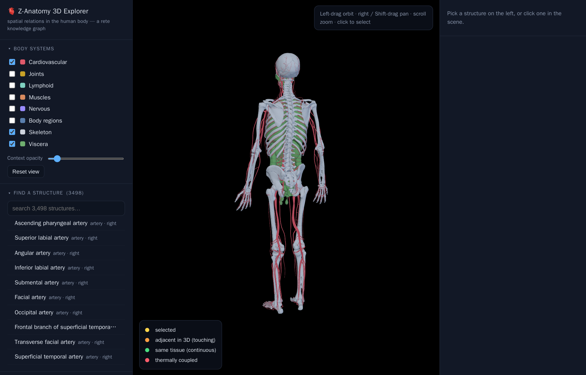

# Z-Anatomy — the human body as a 3D knowledge graph

**[▸ Open the 3D body →](anatomy.html)** — a three.js explorer over the
`z-anatomy` knowledge graph: pick any bone, muscle, organ or nerve and see its
real 3D neighbours — the structures touching it, sharing its tissue, or
thermally coupled to it — plus the diseases and phenotypes located there.

<figure class="fig-center">
  
  <figcaption>The explorer renders the skeleton, cardiovascular system and viscera together in 3D, colour-coding a picked structure's neighbours by how they relate to it.</figcaption>
</figure>

## What you see

The centre pane is a real 3D scene, not an illustration: left-drag to orbit,
right-drag (or Shift-drag) to pan, scroll to zoom, click any mesh to select it.
The left sidebar toggles body systems — Skeleton, Cardiovascular, Viscera,
Muscles, Nervous, Lymphoid, Joints, Body regions — loading each one's model
on demand (an instant bounding-box placeholder appears while the real mesh
streams in). Below that, **Find a structure** searches by name over 3,498
anatomical structures; click a result to select it, frame the camera on it,
and see its relations light up. The right panel lists whatever's selected —
its tissue, side, a short description, and any related Disease Ontology
conditions or HPO phenotypes located there.

## Every relation is a materialised edge

Each structure is a graph node with real 3D geometry — a point and a
bounding box, in millimetres, carried over from the original Z-Anatomy
meshes. The colours in the legend (adjacent in 3D, same tissue, thermally
coupled) aren't drawn by hand: they're computed once from that geometry by
**geo3**, rete's extension of GeoSPARQL into three dimensions
(`geof3:distance3D`, `geo3:adjacent3D`, `geo3:thermallyCoupledWith`…), and
stored as ordinary triples. So "what touches the stomach" or "what's within
60 mm of the liver" isn't a spatial-query feature bolted onto the viewer —
it's the same graph pattern any SPARQL query would match.

## Select by query

The **Select by query** panel runs that idea live: ready examples — all
bones, left-side viscera, structures within 60 mm of the liver via
`geof3:distance3D`, neighbours in contact with the stomach, organs with a
related cancer and its ICD-10 code — are real SPARQL against
`z-anatomy.rete`, executed in-browser (the query engine and graph load
lazily, once) and highlighted straight onto the model. There's also a box to
write your own SPARQL from scratch; matches populate the results table below
the scene and clicking a row selects that structure in 3D.

## The same data, queryable

The explorer is just one lens on a regular playground dataset. Open
[`z-anatomy`](playground.html#dataset=z-anatomy&load=lazy) to run SPARQL
directly — the same partonomy, geometry, and materialised 3D relations, with
no 3D rendering in the way.
