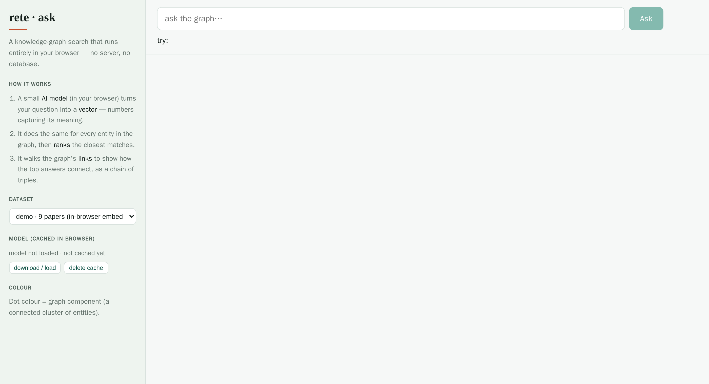

# Ask the graph — browser graphRAG

**[▸ Launch "ask the graph"](ask-browser.html)** — a knowledge-graph search that
runs *entirely in your browser*: no server, no database, no API key. You type a
question in plain language; it finds the most relevant entities in the graph and
shows how they connect.

It's the "simple file, remote; logic in the browser" idea taken to its
conclusion — the embedding model and the graph both live client-side, and the
ranking is plain cosine similarity over vectors computed on the fly.

<figure class="fig-center">
  
  <figcaption>Ask a question in natural language; the page embeds it in-browser, ranks the graph's entities by meaning, and walks their links to show how the top answers connect.</figcaption>
</figure>

## How it works

1. **A small AI model, in your browser, turns your question into a vector.** The
   page loads a multilingual sentence-embedding model with
   [transformers.js](https://github.com/huggingface/transformers.js) (WebGPU when
   available, falling back to WASM) and caches it locally, so the second visit is
   instant. The model never leaves your machine.
2. **It embeds every entity in the graph and ranks the closest matches** by
   cosine similarity to the question vector — a tiny in-browser vector search,
   no vector database.
3. **It walks the graph's links** to show how the top answers connect, as a chain
   of triples and an ego-network sketch — so an answer is a *path through the
   graph*, not just a list.

The graph is a remote `.rete` (or an in-browser embed for the bundled demo); the
entity vectors travel alongside it as a small sidecar. The page fetches only what
it needs and does the rest locally.

## Datasets

The selector offers a bundled **demo** (a handful of papers embedded in the
page), and remote **Wikidata** slices (100 MB / 1 GB) served over HTTP range from
the project's storage. Pick one, let the model warm up once, and ask away.

This page is part of the
[graph-map / lance-rag experiments](graph-map.html); the model + vector approach
(transformers.js in the browser, vectors as a sidecar to the `.rete`) is written
up there. For the query engine itself, see [SPARQL support](sparql.html) and
[Browser / WASM](browser.html).
