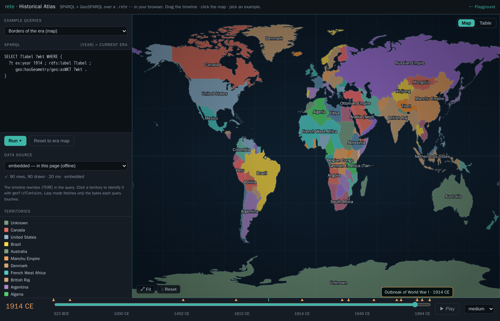
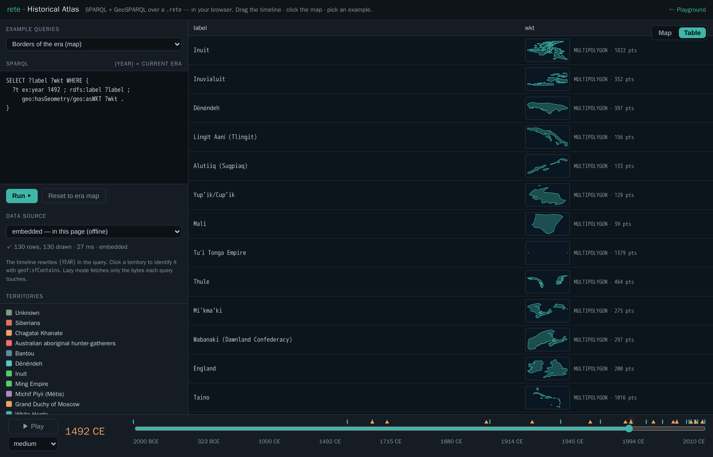
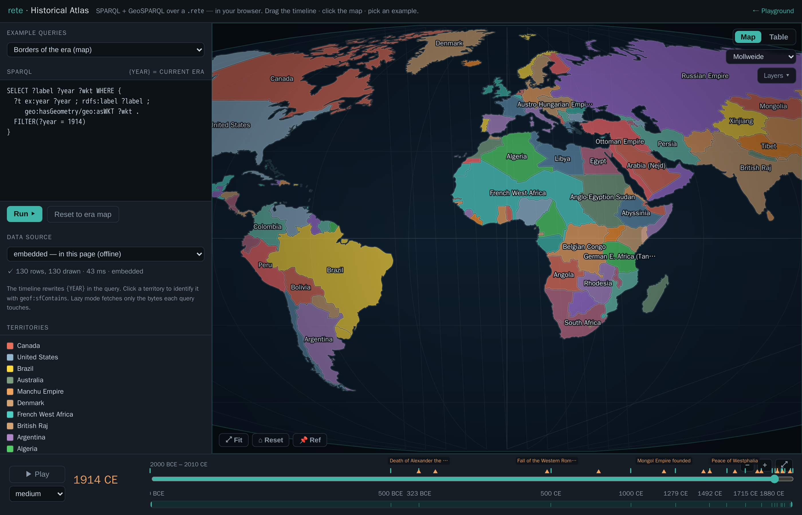

# Historical Atlas — SPARQL + GIS over time

**[▸ Launch the atlas](atlas-app.html)** — a single, fully static HTML page. No
server, no database, no map tiles, no build step: the whole thing runs in your
browser over a `.rete` file through the WebAssembly engine — either the copy
**embedded in the page** (offline) or the same file **streamed from remote
storage** by HTTP range.

It is **half SPARQL, half GIS**: a query editor on the left, a world map in the
centre, and a **temporal timeline** along the bottom. Pick one of the bundled
example queries, drag the timeline and the borders of the world **cross-fade** to
that era, hit **▶ Play** to sweep through history, or click anywhere on the map
and it names the territory under your cursor. The map is a dependency-free canvas
— a curated palette, an ocean gradient, decluttered on-map labels, hover/selection
highlighting, **zoom-to-fit** (and keyboard timeline nav) — drawn entirely from
query results.

<figure class="fig-center">
  
  <figcaption>The atlas at <b>1914 CE</b> — every border polygon comes from a GeoSPARQL query over the <code>history.rete</code>, drawn on a dependency-free canvas. Left: the example picker, the live query, the data-source selector, and the territory legend. Bottom: the era timeline, with historical-event markers (hover for a tooltip).</figcaption>
</figure>

## What you're looking at

The dataset is `history.rete` — world territorial borders at **eighteen snapshots
from 2000 BCE to 2010 CE** ([aourednik/historical-basemaps](https://github.com/aourednik/historical-basemaps),
GPL-3.0). Each border is stored as a GeoSPARQL `geo:wktLiteral` polygon with an
integer `ex:year`, so a snapshot is just `FILTER(?year = …)` and the geometry is
whatever your query binds to `?wkt`.

## How it works

1. **The map is driven by SPARQL.** The editor holds a query; *every row it
   returns that binds `?wkt`* is parsed (a tiny in-page WKT reader) and drawn —
   so you can swap in any query: a bbox `geof:sfIntersects`, a `geof:distance`
   ranking, a `geof:envelope`, a `FILTER` on the label, anything. The **example
   picker** ships ten ready-made queries, including several that ask **time ×
   place** questions: *Who ruled Paris? — every era* (one `geof:sfContains` point,
   no year filter, ordered through history), *Transcontinental — touches Europe
   AND Asia* (two `sfIntersects`), *Within 2500 km of Rome*, and *Territories per
   era* (a `GROUP BY ?year` count over all of time).
2. **The timeline is the temporal control — and it adapts to the data.** It runs
   year-by-year from 2000 BCE to 2010 CE; the **eighteen `ex:year` snapshots** and a
   row of **labelled historical-event markers** (death of Alexander, fall of
   Constantinople, 1789, 1914, the fall of the USSR…) sit on the track — hover for
   the full name, click to jump (arrow keys nudge ±1/±10 years; Space toggles play).
   Because the data is discrete, **▶ Play steps era to era** (each press visibly
   cross-fades to the next snapshot; the **speed** select is the dwell per era).
   **Zoom** the axis with `＋`/`－`/`⤢`, or drag the **context strip** beneath it —
   move the window to pan, drag its edges to zoom into a span (the dense modern eras
   spread out as you zoom in).
3. **Changes are highlighted as they happen.** When the era changes, the map
   **cross-fades** and flags the difference: territories that **appear** glow
   green (and pulse briefly once they've settled), ones that **disappear** glow
   red as they fade out, and the status line tallies the delta (e.g. `+87 −125`).
4. **Two views of every result.** **Map** draws the polygons; **Table** shows the
   raw result rows — and any cell holding a `geo:wktLiteral` renders an inline
   **geometry thumbnail** (its kind, vertex count, lon/lat extent, and faint
   equator / prime-meridian guides) with **view** (the raw WKT in a panel) and
   **copy** buttons. So a `geof:distance` ranking reads as an ordered list and a
   borders query reads as a column of little shapes you can inspect.
5. **Re-project and toggle layers.** A projection dropdown re-draws the whole map
   in **Equirectangular, Web Mercator, Mollweide, or Sinusoidal** (the graticule
   curves and the land is clipped to the world's shape; click-to-identify keeps
   working through each projection's inverse). A **Layers** menu toggles the fill,
   labels, graticule, glow, and event markers.
6. **Click to identify — with metadata.** A click runs
   [`geof:sfContains`](geosparql.html) for the current era against every border
   polygon and opens a panel for the territory under the point — its name, year,
   and the rest of its properties (`partOf`, `subjectTo`, type…) straight from the
   graph. Clicking North Africa in 1000 CE returns *Fatimid Caliphate*; French West
   Africa in 1914 shows *partOf France · subjectTo France*.
7. **Pin a reference era to compare.** **📌 Ref** pins the current borders as a
   translucent amber overlay; navigate to any other era and the two are
   superimposed, so you can see directly how the map changed between them.
8. **Pick where the data lives.** The data-source selector runs the *same*
   queries three ways: **embedded** (the `.rete` baked into the page, fully
   offline), **remote · lazy** (the file stays on remote storage and each query
   faults in only the byte ranges it touches, over a Web Worker), or
   **remote · cached** (download the file once, then query locally). It's the
   "simple file, remote; logic in the browser" story made switchable.

<figure class="fig-center">
  
  <figcaption>The <b>Table</b> view of the borders query at 1492 CE — every <code>geo:wktLiteral</code> cell renders an inline <b>geometry thumbnail</b> (kind + vertex count + lon/lat extent) with view/copy buttons, so the result set reads as a column of little shapes, not opaque WKT strings.</figcaption>
</figure>

<figure class="fig-center">
  
  <figcaption>The same map and queries re-projected to <b>Mollweide</b> (equal-area) — the projection dropdown also offers Web Mercator and Sinusoidal; the graticule curves and click-to-identify still works through each projection's inverse.</figcaption>
</figure>

Everything is computed by the same Rust engine that powers the CLI, compiled to
WebAssembly — see [GeoSPARQL](geosparql.html) for the spatial functions and
[Browser / WASM](browser.html) for how the engine runs client-side (including
the lazy HTTP-range reader).

## Build it yourself

The page is assembled by inlining the no-modules WASM engine and the embedded
`.rete` into a template (the same offline-only pattern as the playground); the
remote `lazy`/`cached` modes point at the same file served by HTTP range:

```sh
# 1. the embedded dataset (simplified to an in-browser-sized ~1.5 MB file)
python3 scripts/geo_to_rete.py basemaps \
  --years bc2000,bc500,bc323,500,1000,1279,1492,1600,1715,1815,1880,1900,1914,1938,1945,1960,1994,2010 \
  --prec 3 --min-bbox 0.12 --max-per-year 130 -o dev/geo/history.nt
rete build dev/geo/history.nt -o web/history.rete

# 2. the browser engine, then the page
wasm-pack build crates/rete-wasm --target no-modules --out-dir ../../web/pkg-nomodules
python3 scripts/build_atlas.py            # → docs/atlas-app.html
```
