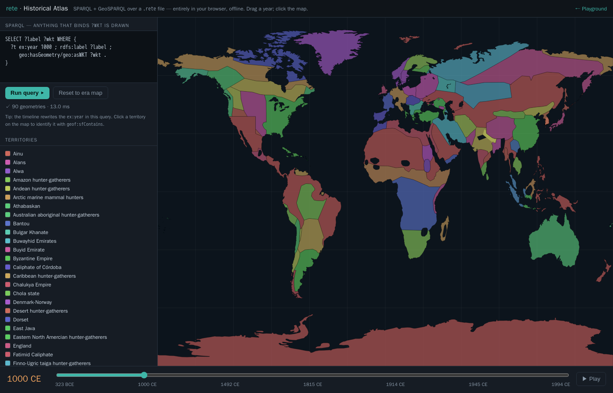

# Historical Atlas — SPARQL + GIS over time

**[▸ Launch the atlas](atlas-app.html)** — a single, fully static HTML page. No
server, no database, no map tiles, no network: the whole thing runs in your
browser over an embedded `.rete` file through the WebAssembly engine.

It is **half SPARQL, half GIS**: a query editor on the left, a world map in the
centre, and a **temporal timeline** along the bottom. Drag the timeline and the
borders of the world redraw for that era; click anywhere and it names the
territory under your cursor.

<figure class="fig-center">
  
  <figcaption>The atlas at <b>1000 CE</b> — every border polygon comes from a GeoSPARQL query over the embedded <code>history.rete</code>, drawn on a dependency-free canvas. Left: the live query + result count + territory legend. Bottom: the era timeline.</figcaption>
</figure>

## What you're looking at

The dataset is `history.rete` — world territorial borders at seven snapshots
from **323 BCE to 1994 CE** ([aourednik/historical-basemaps](https://github.com/aourednik/historical-basemaps),
GPL-3.0). Each border is stored as a GeoSPARQL `geo:wktLiteral` polygon with an
integer `ex:year`, so a snapshot is just `FILTER(?year = …)` and the geometry is
whatever your query binds to `?wkt`.

## How it works

1. **The map is driven by SPARQL.** The editor holds a query; *every row it
   returns that binds `?wkt`* is parsed (a tiny in-page WKT reader) and drawn —
   so you can swap in any query: a bbox `geof:sfIntersects`, a `geof:distance`
   ranking, a `FILTER` on the label, anything.
2. **The timeline is the temporal control.** Its stops are the distinct
   `ex:year` values (discovered at load with `SELECT DISTINCT ?y …`). Dragging it
   rewrites the year in the query and redraws that era; **▶ Play** animates
   through history.
3. **Click to identify.** A click runs
   [`geof:sfContains`](geosparql.html) for the current year against every border
   polygon and reports the territory the point fell inside — e.g. clicking North
   Africa in 1000 CE returns *Fatimid Caliphate*, Paris in 1914 returns *France*.

Everything is computed by the same Rust engine that powers the CLI, compiled to
WebAssembly — see [GeoSPARQL](geosparql.html) for the spatial functions and
[Browser / WASM](browser.html) for how the engine runs client-side.

<figure class="fig-center">
  
  <figcaption>The same atlas at <b>1914 CE</b> — drag the timeline and the polygons (and the click-to-identify answers) follow the year.</figcaption>
</figure>

## Build it yourself

The page is assembled by inlining the no-modules WASM engine and the embedded
`.rete` into a template (the same offline-only pattern as the playground):

```sh
# 1. the embedded dataset (simplified for an in-browser-sized file)
python3 scripts/geo_to_rete.py basemaps \
  --years bc323,1000,1492,1815,1914,1945,1994 --prec 2 --min-bbox 0.3 \
  --max-per-year 90 -o dev/geo/history.nt
rete build dev/geo/history.nt -o web/history.rete

# 2. the browser engine, then the page
wasm-pack build crates/rete-wasm --target no-modules --out-dir ../../web/pkg-nomodules
python3 scripts/build_atlas.py            # → docs/atlas-app.html
```
