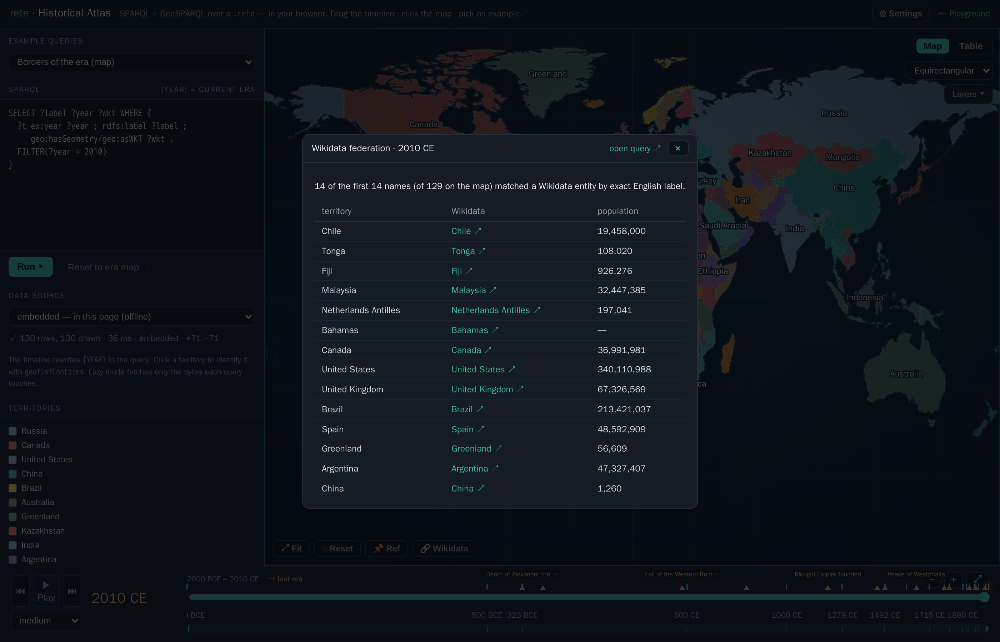
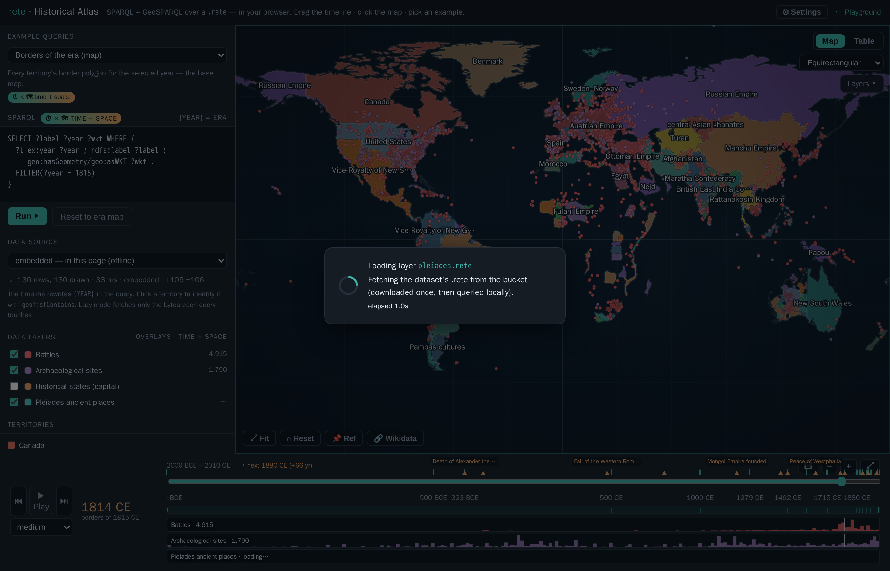
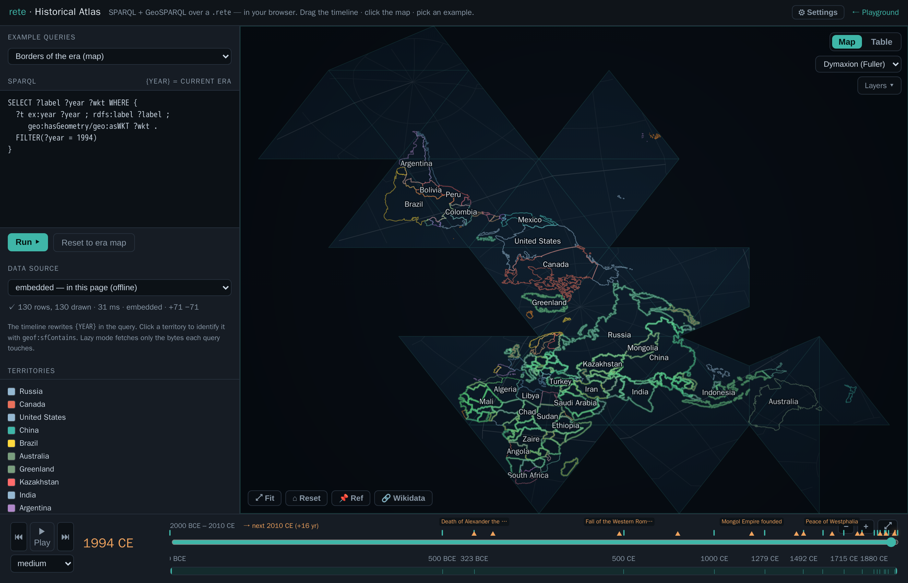
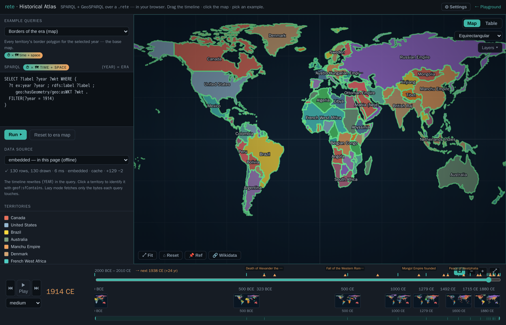

# Historical Atlas — SPARQL + GIS over time

**[▸ Launch the atlas](atlas-app.html)** — a single, fully static HTML page. No
server, no database, no map tiles, no build step: the whole thing runs in your
browser over a `.rete` file through the WebAssembly engine — either the copy
**embedded in the page** (offline) or the same file **streamed from remote
storage** by HTTP range.

It is **half SPARQL, half GIS**: a query editor on the left, a world map in the
centre, and a **temporal timeline** along the bottom. Pick one of the bundled
example queries, drag the timeline and the borders of the world **cross-fade** to
that era, hit **▶ Play** to sweep through history, or click anywhere on the map
and it names the territory under your cursor. The map is a dependency-free canvas
— a curated palette, an ocean gradient, decluttered on-map labels, hover/selection
highlighting, **cursor-locked wheel zoom** (to 64×) with a **HUD** showing the zoom
level, the viewport's corner coordinates and a live cursor read-out, **zoom-to-fit**
(and keyboard timeline nav) — drawn entirely from query results.

<figure class="fig-center">
  
  <figcaption>The atlas at <b>1914 CE</b> — every border polygon comes from a GeoSPARQL query over the <code>history.rete</code>, drawn on a dependency-free canvas. Left: the example picker, the live query, the data-source selector, and the territory legend. Bottom: the era timeline, with historical-event markers (hover for a tooltip).</figcaption>
</figure>

## What you're looking at

The dataset is `history.rete` — world territorial borders at **eighteen snapshots
from 2000 BCE to 2010 CE** ([aourednik/historical-basemaps](https://github.com/aourednik/historical-basemaps),
GPL-3.0). Each border is stored as a GeoSPARQL `geo:wktLiteral` polygon with an
integer `ex:year`, so a snapshot is just `FILTER(?year = …)` and the geometry is
whatever your query binds to `?wkt`.

## How it works

1. **The map is driven by SPARQL.** The editor holds a query; *every row it
   returns that binds `?wkt`* is parsed (a tiny in-page WKT reader) and drawn —
   so you can swap in any query: a bbox `geof:sfIntersects`, a `geof:distance`
   ranking, a `geof:envelope`, a `FILTER` on the label, anything. The **example
   picker** ships ten ready-made queries, including several that ask **time ×
   place** questions: *Who ruled Paris? — every era* (one `geof:sfContains` point,
   no year filter, ordered through history), *Transcontinental — touches Europe
   AND Asia* (two `sfIntersects`), *Within 2500 km of Rome*, and *Territories per
   era* (a `GROUP BY ?year` count over all of time). Each example carries a
   plain-language description and a **time / space tag**, and the SPARQL header
   shows a live **⏱ × 🗺 time + space** badge whenever a result carries both a
   year-like column and a geometry — so you can see at a glance what a query
   *outputs*, not just what it says.
2. **The timeline is the temporal control — and it adapts to the data.** It runs
   year-by-year from 2000 BCE to 2010 CE; the **eighteen `ex:year` snapshots** and a
   row of **labelled historical-event markers** (death of Alexander, fall of
   Constantinople, 1789, 1914, the fall of the USSR…) sit on the track — hover for
   the full name, click to jump (arrow keys nudge ±1/±10 years; Space toggles play).
   Because the data is discrete, **▶ Play steps era to era** (each press visibly
   cross-fades to the next snapshot; the **speed** select is the dwell per era), and
   **⏮ / ⏭** jump one snapshot at a time with a *"→ next 1492 CE (+213 yr)"* readout.
   **Zoom** the axis with `＋`/`－`/`⤢`, with the mouse wheel (vertical = zoom,
   horizontal = pan), or by dragging the **context strip** beneath it — move the
   window to pan, drag its edges to zoom (the dense modern eras spread out as you
   zoom in). A **🎞 previews** toggle drops a **filmstrip of mini-maps** under the
   track — a thumbnail of the world's borders at each snapshot, decluttered so
   close eras collapse to the first until you zoom in.
3. **Changes are highlighted as they happen.** When the era changes, the map
   **cross-fades** and flags the difference: territories that **appear** glow
   green (and pulse briefly once they've settled), ones that **disappear** glow
   red as they fade out, and the status line tallies the delta (e.g. `+87 −125`).
4. **Two views of every result.** **Map** draws the polygons; **Table** shows the
   raw result rows — and any cell holding a `geo:wktLiteral` renders an inline
   **geometry thumbnail** (its kind, vertex count, lon/lat extent, and faint
   equator / prime-meridian guides) with **view** (the raw WKT in a panel) and
   **copy** buttons. So a `geof:distance` ranking reads as an ordered list and a
   borders query reads as a column of little shapes you can inspect.
5. **Re-project and toggle layers.** A projection dropdown re-draws the whole map
   in **Equirectangular, Web Mercator, Mollweide, Sinusoidal, or the Dymaxion
   (Fuller) icosahedral net** (the graticule curves and the land is clipped to the
   world's shape; click-to-identify keeps working through each projection's
   inverse — even Dymaxion's per-face gnomonic inverse). A **Layers** menu toggles
   the fill, labels, graticule, glow, and event markers.
6. **Click to identify — with metadata.** A click runs
   [`geof:sfContains`](geosparql.html) for the current era against every border
   polygon and opens a panel for the territory under the point — its name, year,
   and the rest of its properties (`partOf`, `subjectTo`, type…) straight from the
   graph. Clicking North Africa in 1000 CE returns *Fatimid Caliphate*; French West
   Africa in 1914 shows *partOf France · subjectTo France*.
7. **Pin a reference era to compare.** **📌 Ref** pins the current borders as a
   translucent amber overlay; navigate to any other era and the two are
   superimposed, so you can see directly how the map changed between them.
8. **Pick where the data lives.** The data-source selector runs the *same*
   queries three ways: **embedded** (the `.rete` baked into the page, fully
   offline), **remote · lazy** (the file stays on remote storage and each query
   faults in only the byte ranges it touches, over a Web Worker), or
   **remote · cached** (download the file once — with a progress bar — then query
   locally). It's the "simple file, remote; logic in the browser" story made
   switchable. Slow operations (a lazy query, the cached download) show a **loader**
   that explains what's happening; identical queries are **cached** (re-running is
   instant), and a **⚙ Settings** modal inspects/clears the query cache and the
   cached `.rete`.
9. **Federate with Wikidata.** Engine-level `SERVICE` isn't built, so federation is
   done **client-side**: the identify panel's **🔎 Wikidata** button looks an entity
   up by name, and **🔗 Wikidata** runs a real federated SPARQL query — it feeds the
   era's territory names as `VALUES` into a query against
   [query.wikidata.org](https://query.wikidata.org), joins the matches back, and
   shows each territory's Wikidata entity + population (works best on modern eras;
   it's online-only and fuzzy on historical names).
10. **Stack data-layer overlays — across many providers, with real lifespans.**
    Beyond the borders, you can switch on **83 extra datasets** as **overlays**,
    including a five-layer **Antarctica** set — territorial-claim sectors as dated
    wedges (British 1908 → Argentine 1942), research stations (founded→present),
    people who died on the ice (Scott's party, 1912), Historic Sites & Monuments
    (Amundsen's *Polheim* tent, Mawson's huts), and the ~20k-feature **SCAR
    Composite Gazetteer** (the authoritative Antarctic place-name map) — plus the
    other **seven sources**: **Wikidata** (CC0), **DBpedia** (conflicts and
    power plants — the same GeoSPARQL shape from a *second* SPARQL endpoint),
    **OpenHistoricalMap** (CC0; OSM features dated by their `start_date`/`end_date`
    tags, fetched via Overpass — and drawn as their **real geometry**: historical
    boundaries as polygons, routes as lines, places as dots), **Nomisma.org**
    (CC-BY; ~10k ancient coin *types* placed at their mints, deep into BCE),
    **FactGrid** (CC0; an *independent* historical Wikibase with its own property
    space), **Theographic** (CC-BY-SA; biblical events located and dated), and
    **Samian ware** (Roman terra-sigillata potters at their production centres).
    The base four are **Battles**, **Archaeological sites**, **Historical states**
    and **Pleiades ancient places**. Crucially, things that *persist* — buildings,
    institutions, polities, OHM features — are modelled as a **lifespan
    `[startYear, endYear]`** (founded → demolished/dissolved/closed, or to "present"
    when still standing) and shown across that whole span, while point-in-time
    **events** keep a single year. The Wikidata themes (CC0) span *conflict*
    (military operations,
    sieges, massacres, terrorist attacks, coups, revolutions, assassinations,
    nuclear explosions), *disasters* (earthquakes, volcanic eruptions, tsunamis,
    floods, wildfires, explosions, aviation & rail accidents, epidemics, meteorite
    falls, shipwrecks, landslides), *built heritage* (castles, forts,
    fortifications, palaces, cathedrals, churches, monasteries, abbeys, mosques,
    synagogues, temples, towers, lighthouses, city gates, bridges, dams, aqueducts,
    canals, windmills, amphitheatres, pyramids, megaliths, monuments, memorials),
    and *institutions & industry* (universities, museums, libraries, hospitals,
    theatres, observatories, stadiums, prisons, mines, factories, power stations,
    breweries, shipyards, airports, railway stations, cemeteries, gardens,
    botanical gardens, World Heritage Sites), as well as treaties, expeditions and
    polities. Each is a separate `.rete` fetched once from the bucket, queried
    locally, and dotted on the map in its own colour, filtered to the scrub year
    (events within a window of the playhead; places active across their
    `[startYear,endYear]`). Each active layer gets a **histogram track** beneath the
    timeline — like a clip in a video editor — showing *when* its data is
    concentrated, with a playhead. Every theme is reproducible from one
    query/recipe each — see `scripts/fetch_wikidata_themes.sh` (Wikidata, instant
    `emit` + interval `emiti`), `scripts/fetch_dbpedia_themes.sh` (DBpedia),
    `scripts/fetch_ohm.sh` + `scripts/ohm_overpass_to_nt.py` (OpenHistoricalMap),
    `scripts/fetch_atlas_extra.sh` (Nomisma / FactGrid / Getty TGN SPARQL), and
    `scripts/fetch_dumps_extra.sh` + `scripts/{theographic,samian}_to_nt.py`
    (the GitHub-dump providers). Because a layer *is* a SPARQL query, the **＋**
    button lets you **author your own** — name it, pick a colour and instant/interval
    kind, point it at the embedded borders (offline) or any bucket `.rete`, and write
    the `SELECT … ?wkt`. The layer list is scrollable and **drag-to-reorder** (which
    sets draw order), and **clicking any overlay feature** opens an info card with its
    label, date/span, layer, coordinates and source IRI. Your scene — year,
    projection, active and custom layers, view — is **remembered in `localStorage`**
    across reloads, and **🔗 Share** copies a link that encodes the whole view in the
    URL hash (`#s=…`), so a custom-layer setup is reproducible by anyone who opens it
    (the restore path hard-sanitises the incoming state). **📑 Views** saves, loads
    and deletes **named scenes**; **Shorten link** turns the (long) state link into a
    `da.gd` short URL (using `?s=` so the redirect keeps the state, since shorteners
    drop the `#` fragment); and **Reset session** (in ⚙ Settings) clears the saved
    state back to defaults while keeping your named views.

<figure class="fig-center">
  
  <figcaption>Client-side federation: the era's territory names are fed as <code>VALUES</code> into a SPARQL query run against Wikidata's public endpoint, then joined back — each territory linked to its Wikidata entity with population. (Engine-side <code>SERVICE</code> is on the roadmap; this is the browser doing the join.)</figcaption>
</figure>

<figure class="fig-center">
  
  <figcaption>Data-layer overlays — Battles (red) and Archaeological sites (purple) from separate <code>.rete</code> files dotted over the 1815 borders, each with a <b>histogram track</b> beneath the timeline (the "video-editor layer" view) showing when its events cluster. Toggle layers on/off; points follow the scrub year.</figcaption>
</figure>

<figure class="fig-center">
  
  <figcaption>The <b>Table</b> view of the borders query at 1492 CE — every <code>geo:wktLiteral</code> cell renders an inline <b>geometry thumbnail</b> (kind + vertex count + lon/lat extent) with view/copy buttons, so the result set reads as a column of little shapes, not opaque WKT strings.</figcaption>
</figure>

<figure class="fig-center">
  
  <figcaption>The same map and queries re-projected to <b>Mollweide</b> (equal-area) — the projection dropdown also offers Web Mercator and Sinusoidal; the graticule curves and click-to-identify still works through each projection's inverse.</figcaption>
</figure>

<figure class="fig-center">
  
  <figcaption>The <b>Dymaxion / Fuller</b> projection — an unfolded icosahedron (ported from d3-geo-polygon's <code>geoAirocean</code>). Each point is gnomonically projected onto its icosahedral face; territory edges are broken at the net's cut seams, and clicking still identifies the country via the exact per-face inverse.</figcaption>
</figure>

<figure class="fig-center">
  
  <figcaption>The <b>🎞 preview filmstrip</b> — a thumbnail of the world at each snapshot along the timeline (each a tiny SPARQL query rendered to a mini-canvas), decluttered so close eras collapse until you zoom in.</figcaption>
</figure>

Everything is computed by the same Rust engine that powers the CLI, compiled to
WebAssembly — see [GeoSPARQL](geosparql.html) for the spatial functions and
[Browser / WASM](browser.html) for how the engine runs client-side (including
the lazy HTTP-range reader).

## Build it yourself

The page is assembled by inlining the no-modules WASM engine and the embedded
`.rete` into a template (the same offline-only pattern as the playground); the
remote `lazy`/`cached` modes point at the same file served by HTTP range:

```sh
# 1. the embedded dataset (simplified to an in-browser-sized ~1.5 MB file)
python3 scripts/geo_to_rete.py basemaps \
  --years bc2000,bc500,bc323,500,1000,1279,1492,1600,1715,1815,1880,1900,1914,1938,1945,1960,1994,2010 \
  --prec 3 --min-bbox 0.12 --max-per-year 130 -o dev/geo/history.nt
rete build dev/geo/history.nt -o web/history.rete

# 2. the browser engine, then the page
wasm-pack build crates/rete-wasm --target no-modules --out-dir ../../web/pkg-nomodules
python3 scripts/build_atlas.py            # → docs/atlas-app.html
```
