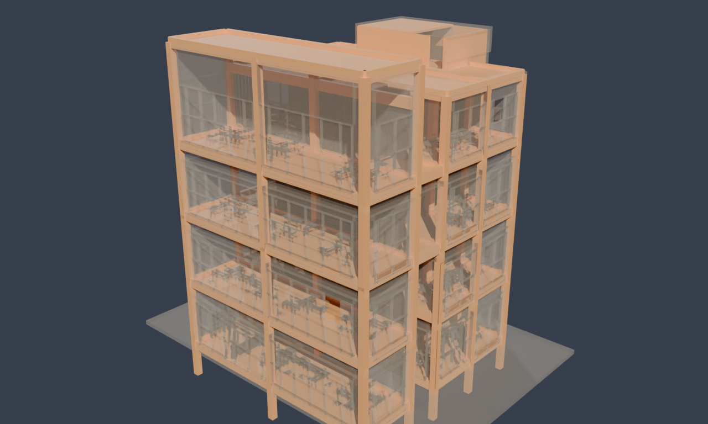

# Architecture vs Structure — one building, two BIM models

**[▸ Open the paired 3D viewer →](bim-pair.html)** — the same building, modelled
twice by one team of the TUM *BIM Project* course: an **architectural** model
(the envelope — walls, curtain walls, doors, windows, furniture) and a
**structural** model (the load-bearing skeleton — beams, columns, slabs). Toggle
between them, or overlay the skeleton inside a translucent envelope. **Pick a
different project** from the selector, **download either raw IFC**, or **run
SPARQL over all 224 models** — the ⌕ button opens a query panel on the corpus.

The models are **Draco-compressed** and streamed from the cloud (the three.js
community's standard for web-delivered geometry): the architectural GLBs shrink
~6–15× — e.g. 47 MB → 3 MB — so the viewer stays snappy even on a phone.

<figure class="fig-center">
  
  <figcaption>One building, two disciplines: the architectural envelope (2,076 parts) and the structural frame (149 parts), from Project 0 of the GNI BIM corpus.</figcaption>
</figure>

## Why two models

In real BIM practice the architect and the structural engineer each build their
own model of the same building, in their own tool, carrying their own subset of
the components. The GNI *BIM Project* course reproduces that: seven of nine teams
delivered a paired **architectural + structural** IFC of one building. This viewer
puts that pair side by side. In the **Both** overlay the structural frame sits
inside a translucent architectural envelope — you can see exactly how the beams,
columns and slabs carry the walls and floors above them.

The contrast is stark and typical: Project 0's architectural model has **2,132
elements** (walls, curtain walls, furnishing, openings) against the structural
model's **149** (beams, columns, slabs) — the envelope is ~14× denser than the
skeleton. Across all seven pairs the architectural models average ~5,600 elements,
the structural ones ~415.

## The whole corpus, queryable

This one pair is a window onto a much larger dataset. The full **[GNI BIM
corpus](playground.html#dataset=gni-bim&load=lazy)** — 224 anonymized IFC models
from TUM's Georg Nemetschek Institute — is a queryable rete graph: each model with
its discipline, IFC schema, and a per-class element tally. Ask how 208 students
modelled the *same* building (element counts range from 130 to 5,689), compare
architecture vs structure across every project, or rank the 42 IFC element classes
across the corpus. It is the **wide** companion to the single, deep
[FZK-Haus](building-guide.html) building.

Models: TUM GNI BIM Dataset (Wang, Fuchs, Wu, Esser, Wrabel & Borrmann), CC BY
4.0. Viewer and graph by [rete](https://github.com/caviri/rete).
