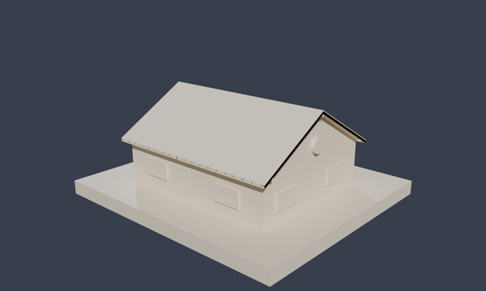

# FZK-Haus — a building as a 3D knowledge graph

**[▸ Open the 3D building →](building.html)** — a three.js explorer over the
`fzk-haus` knowledge graph: pick any wall, door, window, slab or room and see
where it sits — its floor, the rooms it encloses, the rooms next to it, and
everything within reach in 3D — with real SPARQL and **geo3** (GeoSPARQL → 3D)
running in the browser against the `.rete`.

<figure class="fig-center">
  
  <figcaption>The explorer renders every IFC element of the house in 3D and colour-codes a picked element's relations — the rooms it encloses, the rooms adjacent to it, and the results of a spatial query.</figcaption>
</figure>

## From CAD to graph

The model is **AC20-FZK-Haus**, an openly-licensed IFC4 sample building (a small
detached house) published by KIT for the IBPSA Project 1. IFC (ISO 16739) is the
open BIM exchange format, and it is already semantic: it carries *typed
elements* (walls, doors, windows, slabs, stairs…), *spatial structure*
(site → building → storey → space), and *relationships* (which elements bound a
room, which openings a wall hosts). We parse it with
[IfcOpenShell](https://ifcopenshell.org) and lift it into three layers of RDF:

- **[BOT](https://w3id.org/bot)** — the W3C Building Topology Ontology — for the
  spatial breakdown: `bot:Site`, `bot:Building`, `bot:Storey`, `bot:Space`,
  `bot:Element`, tied together by `bot:hasStorey`, `bot:hasSpace`,
  `bot:containsElement`, `bot:adjacentElement`.
- **`cad:`** for the IFC specifics: `cad:ifcClass`, `cad:material`,
  `cad:boundsSpace` (space boundaries), `cad:adjacentSpace`, `cad:fillsWall`.
- **geo3** for geometry: every element carries a 3D point and an
  axis-aligned bounding box, in metres, in the building's own coordinate frame.

## What you see

The centre pane is a real 3D scene: left-drag to orbit, right-drag (or
Shift-drag) to pan, scroll to zoom, click any element to select it. The left
sidebar toggles element types — Walls, Slabs, Windows, Doors, Stairs, Railings,
Beams, structural Members, and the room volumes — each with a live count, plus a
**Storeys** filter to isolate a floor. **Find an element** searches every element
and room by name. The right panel describes whatever is selected: its IFC type,
floor, material, and its topological neighbours — for a room, the rooms adjacent
to it and the elements that enclose it; for a wall, the rooms it encloses.
Clicking a related item jumps to it.

## Every relation is a materialised edge

The colours in the legend aren't drawn by hand. Room adjacency comes from the
IFC space boundaries (`cad:boundsSpace` → `cad:adjacentSpace`); "what's near the
staircase" is computed by **geo3**, rete's extension of GeoSPARQL into three
dimensions (`geof3:distance3D`, and the same `geo3:box` / `geo3:asWKT3D` geometry
the anatomy explorer uses) — the *identical engine*, now finding relations
between the physical parts of a building instead of an organism.

## Select by query

The **Select by query** panel runs that idea live. Ready examples — the rooms on
each floor, the building's element inventory, the rooms adjacent to the living
room, the walls that enclose the kitchen, the ten elements nearest the staircase
via `geof3:distance3D`, and how many walls enclose each room — are real SPARQL
against `fzk-haus.rete`, executed in-browser (the query engine and graph load
lazily, once) and highlighted straight onto the model. There's also a box to
write your own SPARQL; matches populate the results table below the scene and
clicking a row selects that element in 3D. Room labels are language-tagged, so
match them as `"Wohnen"@en`.

## The same data, queryable

The explorer is one lens on a regular playground dataset. Open
[`fzk-haus`](playground.html#dataset=fzk-haus&load=lazy) to run SPARQL directly —
the same spatial structure, topology, and 3D geometry, with no rendering in the
way.
