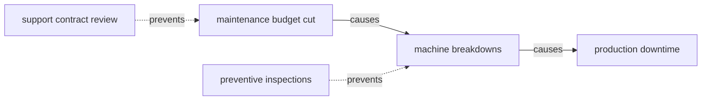

# Experiment — fallacy graphs from a conversation

An agent connected to the [rete MCP server](agents.md) can now **author**
knowledge graphs, not just read them: search existing vocabularies, draft
an ontology, lint it until clean, build a real `.rete`, and validate it —
all inside one chat. This page documents the flow with a worked example:
**annotating the fallacies in a spoken conversation**. Everything below ran
verbatim against the server (the outputs are real).

The tools involved: `suggest_vocabulary` → `check_ontology` → `build_rete`
→ `sparql_query` / `validate_shacl`.

## The scenario

Someone sends a voice note of a budget debate. The host app (ChatGPT does
this natively) transcribes it. This is the input to everything below — the
same shape you would use in a fine-tuning dataset or hand to the agent
directly:

```json
{
  "conversation_id": "budget-debate-2026-07-18",
  "source": "voice note, auto-transcribed",
  "participants": ["Bruno", "Ana"],
  "messages": [
    {
      "turn": 1,
      "speaker": "Bruno",
      "text": "Look, I've gone through the incident reports from the last two quarters, and the picture is pretty clear to me: ever since we cut the maintenance budget in January, machine breakdowns have grown by roughly forty percent, and every one of those breakdowns translates directly into production downtime that we end up paying for twice over. We should raise the maintenance budget back to where it was, at the very least."
    },
    {
      "turn": 2,
      "speaker": "Ana",
      "text": "Honestly, I don't think we can trust Bruno with anything budget-related in the first place — everyone in this room knows he failed economics twice at university, and now he wants to lecture us about cost structures and quarterly figures as if he were the finance director. I don't see why we should take the numbers he waves around at face value."
    },
    {
      "turn": 3,
      "speaker": "Bruno",
      "text": "My academic record from fifteen years ago has nothing to do with what the incident reports say — the data comes straight from the plant's logging system, not from me. And I'll add one more thing: when we still ran preventive inspections every six weeks, breakdowns of this kind almost never happened, which is exactly why I think cutting that program was the real mistake."
    },
    {
      "turn": 4,
      "speaker": "Ana",
      "text": "What I'm proposing is more modest and, I think, more responsible: before we commit to any budget increase, let's review the support contracts we already pay for, because if the vendors honored the response times they signed, a good part of that downtime would simply not exist, and we would be spending the new budget on a problem that a phone call could prevent."
    },
    {
      "turn": 5,
      "speaker": "Bruno",
      "text": "So what Ana wants is to freeze every investment indefinitely, drown the team in paperwork about contracts, and let the factory literally fall apart around us while we wait for lawyers to finish reading the fine print. That's what her plan amounts to, and I don't think anyone here wants to explain that to the clients whose orders arrive late."
    },
    {
      "turn": 6,
      "speaker": "Ana",
      "text": "That is not what I said and you know it — reviewing contracts takes two weeks, not an eternity. I'm happy to pair it with something concrete: let's bring back the preventive inspections on the critical line while the review runs, because inspections demonstrably prevent the breakdowns you're worried about, and then we decide the budget question with real information on the table."
    }
  ]
}
```

Two fallacies hide in there: an *ad hominem* in turn 2 (Ana attacks
Bruno's old grades, not his incident data) and a *straw man* in turn 5
(Bruno refutes a "freeze everything" plan Ana never proposed). The same
transcript also carries the causal claims used in the
[causal-diagram section](#causal-diagrams-from-the-same-conversation)
below — budget cut → breakdowns → downtime, contract review and
inspections as preventers. The goal: a queryable, validated graph of that
structure.

## 1. Discover before minting

`suggest_vocabulary("argument fallacy premise")` searches
[Linked Open Vocabularies](https://lov.linkeddata.es) and surfaces the
**Argument Interchange Format** (AIF) — so the ontology anchors to it
instead of reinventing "argument":

## 2. Draft the ontology, lint until clean

The agent drafts Turtle and calls `check_ontology`. A deliberately broken
draft shows what the linter catches:

```json
{"ok": false, "issues": [
  {"severity": "warning", "message": "…fallacy#Utterancia is used as rdfs:domain/rdfs:range but never declared in this document…"},
  {"severity": "error",   "message": "…fallacy#text is declared BOTH owl:ObjectProperty and owl:DatatypeProperty"},
  {"severity": "warning", "message": "…fallacy#Fallacy has no rdfs:label — agents and humans will see a bare IRI"}
]}
```

The battery: strict parse, domains/ranges over undeclared classes,
dangling `subClassOf` targets, missing labels/comments, object+datatype
clashes, subclass cycles, and an **OWL 2 QL rewriter smoke test**. The
fixed ontology (abridged — full version in the collapsible below) comes
back `{"ok": true, "profile": {"classes": 7, "properties": 4, "reasoner": "ok"}}`:

```ttl
@prefix aif: <http://www.arg.dundee.ac.uk/aif#> .
@prefix fal: <https://w3id.org/rete/fallacy#> .

fal:Utterance a owl:Class ; rdfs:subClassOf aif:I-node ; rdfs:label "Utterance" .
fal:Fallacy   a owl:Class ; rdfs:label "Fallacy" .
fal:AdHominem a owl:Class ; rdfs:subClassOf fal:Fallacy ; rdfs:label "Ad hominem" ;
  rdfs:comment "Attacks the speaker instead of the claim." .
fal:StrawMan  a owl:Class ; rdfs:subClassOf fal:Fallacy ; rdfs:label "Straw man" .

fal:saidBy  a owl:ObjectProperty  ; rdfs:domain fal:Utterance ; rdfs:range fal:Speaker .
fal:text    a owl:DatatypeProperty ; rdfs:domain fal:Utterance ; rdfs:range xsd:string .
fal:quotes  a owl:ObjectProperty  ; rdfs:domain fal:Fallacy ; rdfs:range fal:Utterance ;
  rdfs:comment "The utterance that commits the fallacy." .
fal:attacks a owl:ObjectProperty  ; rdfs:domain fal:Fallacy ; rdfs:range fal:Utterance ;
  rdfs:comment "The utterance the fallacious move targets." .
```

## 3. Instances with provenance

Each intervention becomes an `Utterance` (text + speaker); each annotation
a `Fallacy` node pointing at what it quotes and what it attacks:

```ttl
ex:u1 a fal:Utterance ; fal:saidBy ex:bruno ; fal:text "We should raise the maintenance budget…" .
ex:u2 a fal:Utterance ; fal:saidBy ex:ana   ; fal:text "We can't trust Bruno — he failed economics twice." .

ex:f1 a fal:AdHominem ; fal:quotes ex:u2 ; fal:attacks ex:u1 .
ex:f2 a fal:StrawMan  ; fal:quotes ex:u4 ; fal:attacks ex:u3 .
```

## 4. Build a real, queryable file

`build_rete(ontology + instances, card={title: "Fallacy analysis — Ana &
Bruno budget debate", …}, examples=[…])` returns in under a second:

```json
{"dataset": "generated/f2fd70100e1a0a52.rete", "url": "/generated/f2fd70100e1a0a52.rete",
 "bytes": 5609, "quads": 65, "content_hash": "…"}
```

That 5.6 KB file is a complete `.rete` — dictionary, indexes, pyramid,
Dataset Card with the embedded example queries — served at an ephemeral
URL, range-readable by every client and the playground, and **immediately
usable by the other tools** via its dataset key.

## 5. Query it — the reasoning payoff

No instance is typed `fal:Fallacy` directly, only as subclasses. Plain vs
reasoned, same query:

```sparql
SELECT (COUNT(DISTINCT ?f) AS ?n) WHERE { ?f a fal:Fallacy }
# reason=false → 0        reason=true → 2
```

(Note the `DISTINCT`: query rewriting derives `ex:f1` three ways — via the
subclass AND via the domains of `quotes` and `attacks` — and a bare COUNT
counts every derivation.) And the analysis query that the file itself
carries as an example:

```
Ana   → fal:AdHominem
Bruno → fal:StrawMan
```

## 6. SHACL as the annotation contract

"Every annotated fallacy must cite the utterance that commits it and the
one it attacks":

```ttl
[] a sh:NodeShape ;
  sh:targetClass fal:AdHominem ; sh:targetClass fal:StrawMan ; sh:targetClass fal:FalseDilemma ;
  sh:property [ sh:path fal:quotes  ; sh:minCount 1 ;
    sh:message "every annotated fallacy must cite the utterance that commits it" ] ;
  sh:property [ sh:path fal:attacks ; sh:minCount 1 ] .
```

`validate_shacl` → `conforms: true`. Tighten the contract (require a
`fal:severity` the annotations don't carry) and it reports exactly the two
expected violations — the loop an agent uses to keep its own annotations
honest.

## Causal diagrams from the same conversation {#causal-diagrams-from-the-same-conversation}

The `causal_diagram` tool runs the sibling flow for **cause-and-effect
structure**: the agent extracts claims from the transcript —
`{cause, effect, relation, quote, speaker, confidence}` — and one call
returns three artifacts (this ran verbatim against the server):

- **Mermaid** — rendered inline by chat UIs and these docs:



- a **Graphviz SVG** (`svg_data_uri`, ~5 KB) for embedding anywhere, and
- a **CauseNet-aligned `.rete`** (71 quads): every claim is a `cz:Claim
  ⊑ cn:CausalRelation` reusing `cn:cause`/`cn:effect`, with the quote and
  speaker as provenance. Reasoned queries see the conversation's claims AS
  CauseNet relations (`?x a cn:CausalRelation` → 4), and the file embeds a
  **federated example** that joins the conversation's factors against the
  11 M web-mined relations of the [`causenet` dataset](playground-guide.md)
  via `SERVICE` — "does the web's causal knowledge agree with this
  meeting?".

## Same tooling, other conversations

Nothing here is fallacy-specific — the pattern is *speech → ontology →
instances → validated graph*:

- **meeting minutes** → decisions, owners, deadlines, dissent;
- **oral-history interviews** → people/places/events, federable with the
  historical datasets already in the catalog;
- **spoken symptom descriptions** → instances against a lightweight
  clinical vocabulary;
- **full debate argument maps** — AIF proper, with rebuttals and support
  edges.

Generated files are ephemeral (they live until the next Space restart) —
ask for `include_base64` to keep the file, or graduate it through the
[publish workflow](dataset-cards.md) when it deserves a permanent home.
