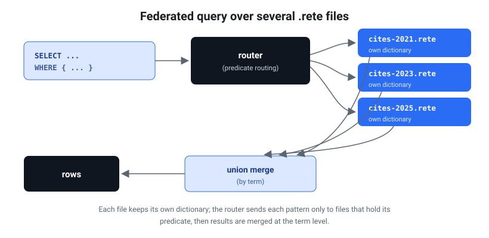

# Federated queries across several `.rete` files

`rete federate` runs **one SPARQL query across many `.rete` sources** — local
file paths and/or `http(s)://` URLs, mixed freely — and merges the results. It is
the answer to "my data is sharded into several files; query them as one."

```sh
rete federate <source…> --query "<SPARQL>" [--json] [--no-route]
```

This is an honest **prototype**: it does *union* federation, not distributed
joins. Read [Limitations](#limitations) before relying on it.

## Why federation works at the term level

<figure class="fig-right">
  
  <figcaption>Each file keeps its own dictionary; the router sends each pattern only to files holding its predicate, then results merge at the term level.</figcaption>
</figure>

Every `.rete` file carries its **own dictionary** — the integer IDs that encode
terms are local to one file. ID `42` in `cites-2021.rete` and ID `42` in
`cites-2024.rete` are unrelated. So you **cannot** merge files by combining their
integer indexes.

Federation therefore works at the **term (string) level**: the query is
evaluated independently on each file with the existing single-file engine, and
the **term-level result rows are merged**. This is exactly correct for
**sharded datasets where each file independently yields complete result rows** —
the citation data below, sharded by citing year, is precisely this shape: each
`cites` edge (and its `date`/`type`) lives wholly within one year-shard, so each
shard produces whole, self-contained answer rows.

## Merge semantics

| Query form  | Merge across sources                              |
|-------------|---------------------------------------------------|
| `SELECT`    | **Union** of solution rows, **deduped** (identical rows collapse), stable order (source order, then within-source order). |
| `ASK`       | **Logical OR** — true if any source matches.      |
| `CONSTRUCT` | **Union** of constructed triples, **deduped**.    |

Dedup is over the projected variables for `SELECT *` it is over all bound
variables. A row that appears in two shards (e.g. a node that cites the target
and shows up in two files) is reported once.

## Routing / pruning (default on)

Before evaluating, `federate` reads each source's **predicate set** cheaply from
its pyramid **summary** — the (large) triple **index is never touched** (the same
"summary first" path used by `rete predicates` and `rete summary-url`). It also
extracts the **concrete predicate IRIs** the query constrains on (from the parsed
query's basic graph patterns and property paths). A source whose predicate set is
**disjoint** from the query's predicates **cannot contribute a row** and is
**skipped**.

- `--no-route` disables pruning and queries **every** source.
- A query that pins **no** concrete predicate (every pattern uses a variable
  predicate, e.g. `?s ?p ?o`) cannot be routed — all sources are queried.
- A source with no summary cannot be inspected, so it is **never** pruned.

For local files routing reads a few hundred bytes per source; for URLs it issues
a handful of HTTP **range** requests (header + dictionary + summary) — never the
whole file.

Per-source diagnostics (rows contributed + time), the queried-vs-pruned tally,
and the list of pruned sources are written to **stderr** the merged results go to
stdout.

## Limitations

This is a deliberately honest prototype — it is correct for sharded data and
clear about what it does **not** do.

- **Union only, no cross-file joins.** A solution that needs a triple from file A
  joined with a triple from file B (e.g. `?x` from one shard joined to `?y` from
  another) will **not** be found. Each shard is queried in isolation. Cross-file
  joins need a term-level federated BGP engine that ships intermediate bindings
  between sources — future work.
- **Aggregates and `LIMIT` are per source, then unioned.** A federated
  `SELECT (COUNT(*) AS ?n)` returns **one count per source** (unioned), not a
  global sum and `LIMIT 5` over two shards can return up to **10** rows (5 from
  each). This keeps the prototype honest rather than silently wrong. Sum / cap
  client-side, or wait for a future `--reduce` that folds per-source aggregates.
- **`GROUP BY`** is likewise evaluated per source then unioned, so the same group
  key can appear once per shard.

## Real example — OpenCitations, sharded by citing year

The repo ships a real dataset: citations **of the AlphaFold paper**
(`<https://doi.org/10.1038/s41586-021-03819-2>`), sharded by citing year into
`data/opencitations/cites-<year>.rete`. Each shard uses
`<http://purl.org/spar/cito/cites>`, `<http://purl.org/dc/terms/date>`, and
`rdf:type`. (Regenerate with `python3 scripts/fetch_opencitations.py`, then
`for f in data/opencitations/*.nt; do rete build "$f" -o "${f%.nt}.rete"; done`.)

### Federated SELECT across two year-shards

```sh
rete federate data/opencitations/cites-2021.rete data/opencitations/cites-2024.rete \
  --query 'SELECT ?citing WHERE {
             ?citing <http://purl.org/spar/cito/cites>
                     <https://doi.org/10.1038/s41586-021-03819-2> } LIMIT 5'
```

```
  data/opencitations/cites-2021.rete: 5 row(s) in 3.6ms
  data/opencitations/cites-2024.rete: 5 row(s) in 15.6ms
10 solution(s)
federated 2 source(s): 2 queried, 0 pruned (routing on); 10 merged result(s)
?citing=<https://doi.org/10.1001/jama.2021.15728>
?citing=<https://doi.org/10.1002/2211-5463.13301>
?citing=<https://doi.org/10.1002/2211-5463.13316>
?citing=<https://doi.org/10.1002/advs.202102592>
?citing=<https://doi.org/10.1002/advs.202103807>
?citing=<https://doi.org/10.1001/jamadermatol.2024.1126>
?citing=<https://doi.org/10.1001/jamaophthalmol.2024.3829>
?citing=<https://doi.org/10.1002/1873-3468.14811>
?citing=<https://doi.org/10.1002/1873-3468.14823>
?citing=<https://doi.org/10.1002/1873-3468.14836>
```

Note the **per-source `LIMIT`** caveat in action: `LIMIT 5` yielded 5 rows from
*each* shard, so the union holds 10. The first five are 2021 citers, the last
five 2024 citers.

### Routing in action — a predicate-disjoint shard is pruned

Add a source that uses a different predicate (here a shard whose only predicate
is `rdfs:label`, not `cito:cites`). The `cites` query prunes it without ever
reading its index:

```sh
rete federate data/opencitations/cites-2021.rete other-demo.rete data/opencitations/cites-2024.rete \
  --query 'SELECT ?citing WHERE {
             ?citing <http://purl.org/spar/cito/cites>
                     <https://doi.org/10.1038/s41586-021-03819-2> } LIMIT 3'
```

```
  data/opencitations/cites-2021.rete: 3 row(s) in 3.4ms
  data/opencitations/cites-2024.rete: 3 row(s) in 15.8ms
6 solution(s)
federated 3 source(s): 2 queried, 1 pruned (routing on); 6 merged result(s)
  pruned (predicate-disjoint): other-demo.rete
…
```

`--no-route` would instead query all three (the label-only shard contributing 0
rows). For year-shards that all share `cito:cites`, routing keeps every shard —
pruning helps when sources are **heterogeneous** (different predicates per file),
which is the common federation case.

### ASK federation (logical OR)

```sh
rete federate data/opencitations/cites-2017.rete data/opencitations/cites-2024.rete \
  --query 'ASK { ?x <http://purl.org/spar/cito/cites>
                    <https://doi.org/10.1038/s41586-021-03819-2> }'
# → true   (at least one shard has a citation)
```

### URL sources

Sources may be `http(s)://` URLs of `.rete` files hosted on S3, GitHub, or any
CDN that honors HTTP **Range** requests — mix them with local paths freely:

```sh
rete federate \
  https://example.org/cites-2021.rete \
  data/opencitations/cites-2024.rete \
  --query 'SELECT ?citing WHERE { ?citing <http://purl.org/spar/cito/cites>
                                          <https://doi.org/10.1038/s41586-021-03819-2> }'
```

Each URL is opened with range reads (header → dictionary → index → pyramid),
never a full download both routing and evaluation fetch only the bytes they need.
