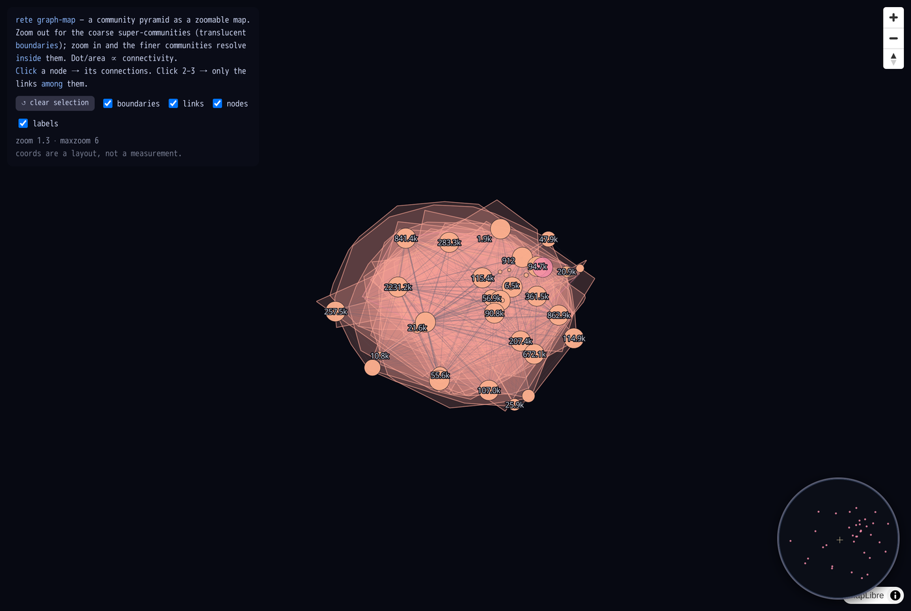
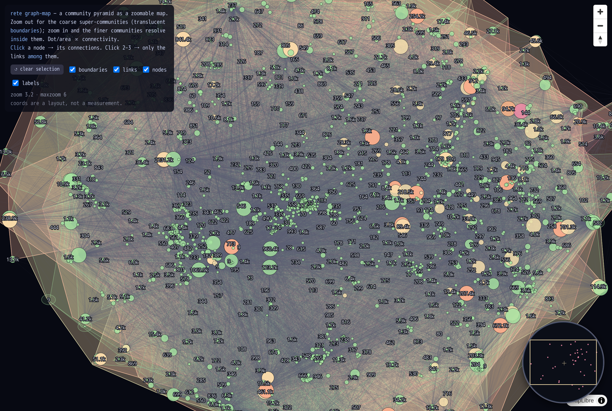
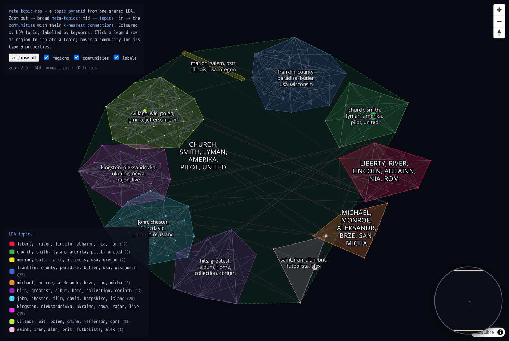
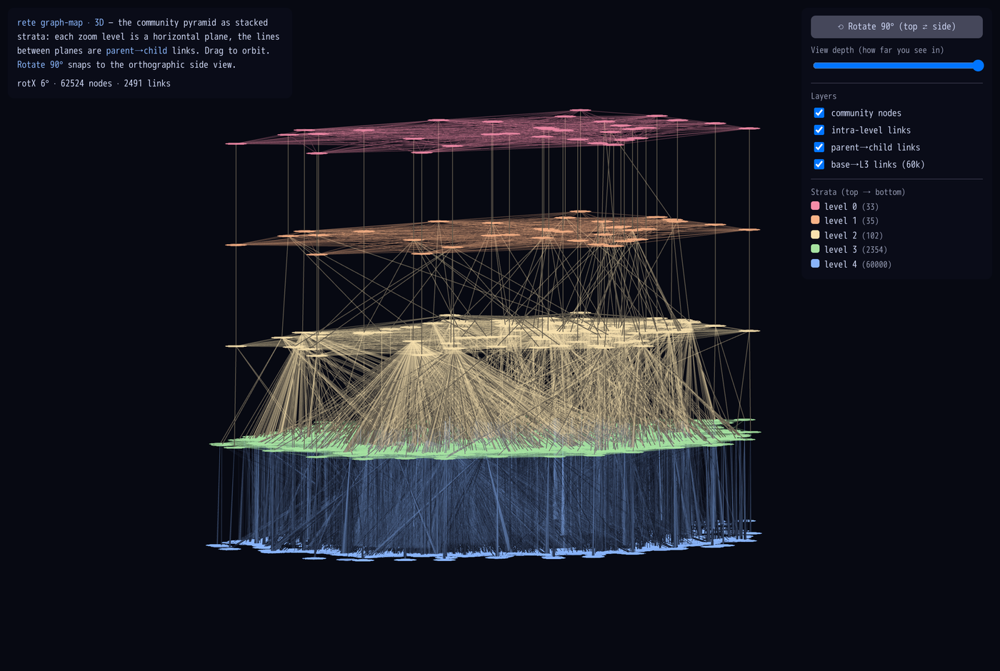
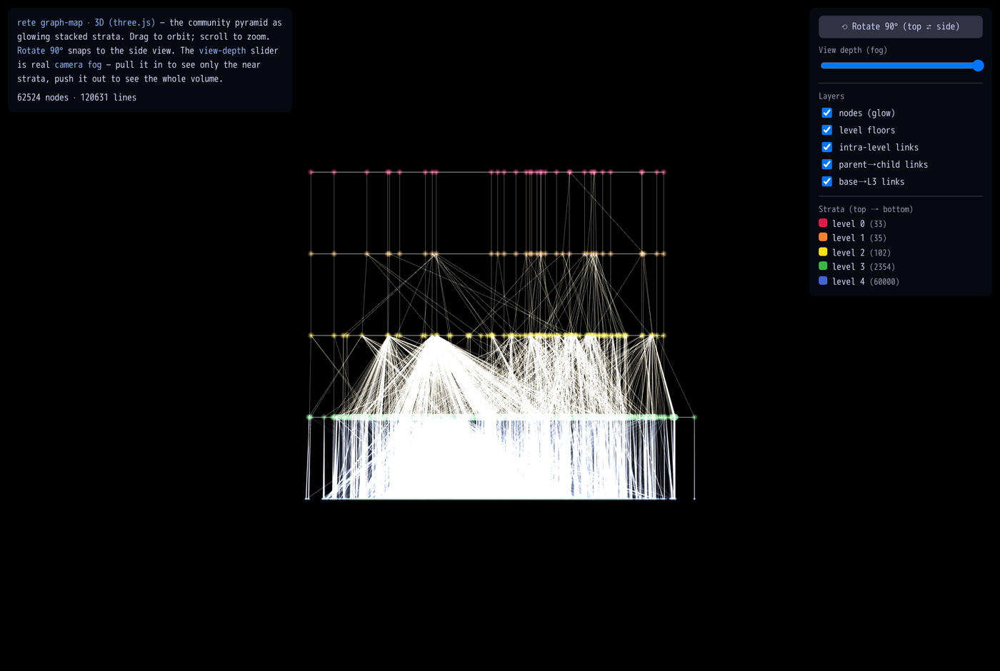

# Graph-map & topic-map (experiment)

> **Side experiment, not part of the core tool.** Everything here only *reads* a
> `.rete` (and the community pyramid already inside it) and emits a standalone
> [PMTiles](https://github.com/protomaps/PMTiles) archive + a static viewer. The
> format and CLI are untouched. Code: [`experiments/graph-map/`](https://github.com/caviri/rete/tree/main/experiments/graph-map).

A `.rete` file already carries a **Louvain community pyramid** — a multi-level
clustering of the graph. This experiment turns that into a **slippy map**: pan
and zoom a graph like a web map, where each zoom band is a coarser/finer level
of the hierarchy. Two complementary lenses ship:

| | **structural graph-map** | **semantic topic-map** |
|---|---|---|
| groups by | **link topology** (community pyramid) | **text similarity** (community literals) |
| colour | level / connectivity | **LDA topic** |
| label | size / connectivity | **top words** |
| answers | "how is it wired?" | "what is it about?" |

Both deliver as a single HTTP **range-readable** `.pmtiles` rendered by MapLibre
GL in the browser — the same publish-and-query-by-byte-range story as `.rete`
itself: no server, no full download.

> **Open the live viewers** (tiles range-read from the HF Space):
> [structural map](graph-map/viewer.html) ·
> [topic map (pyramidal LDA)](graph-map/viewer-topics.html) ·
> [3D side-elevation — deck.gl](graph-map/viewer-3d.html) ·
> [3D — three.js + fog](graph-map/viewer-3d-three.html)
>
> A different browser lens on the same graphs — [**ask the graph**](ask-the-graph.html),
> a transformers.js graphRAG search — has its own page now.

## Why a map at all

Force-directed pictures of a big graph collapse into a hairball. A map fixes
that with **levels of detail**: zoomed out you see a handful of coarse regions
(the "continents"); as you zoom in, finer structure resolves — exactly how a
web map goes country → city → street. rete's pyramid *is* that level hierarchy,
so the mapping is direct. (Prior art: GMap, *"Visualizing Graphs and Clusters
as Maps"*.)

---

## 1. Structural graph-map — the community pyramid

Nodes are rete's pyramid communities; the most-connected hubs dominate when
zoomed out. Each super-community is drawn as a translucent **convex-hull
boundary**, with its finer child communities rendering *inside* it as you zoom.

**Pipeline** ([`build_map.py`](https://github.com/caviri/rete/blob/main/experiments/graph-map/build_map.py)):

```
rete summary <file>            → weighted community graph (pyramid round 0)
igraph multilevel Louvain      → coarser super-communities (extra zoom levels)
igraph DRL layout              → 2D coords for the base communities
size-weighted centroids upward → coords for every coarser level
convex hulls + GeoJSON         → tippecanoe → graphmap.pmtiles
```

On the 12M-triple Wikidata slice that becomes 4 zoom bands — 38 → 103 → 2,198
super-communities over 60,000 base communities (a 12 MB `.pmtiles`).


*Zoomed out: coarse super-communities as translucent hulls, sized by connectivity.*


*Zoomed in: finer pyramid communities resolve inside their parent boundary.*

**In the viewer** ([`viewer.html`](https://github.com/caviri/rete/blob/main/experiments/graph-map/viewer.html)):
zoom-out shows the whole graph as a small island; **hover** a node for level /
size / sub-community count; **click** a node to highlight all its links, then a
2nd/3rd to show only the links *among* the selected set. A **round minimap**
(bottom-right) shows the whole graph with a viewport box; a **clear** button and
**layer toggles** (boundaries / links / nodes / labels) control what's drawn.

---

## 2. Semantic topic-map — communities by LDA topic

The structural map says how the graph is *wired*; this says what each cluster is
*about*. rete supplies the two hard parts — the Louvain partition **and** the
per-community text — and LDA is the standard downstream step (see
[Topic modeling](topic-modeling.html)). Communities are laid out by **text
similarity**, coloured by their dominant **LDA topic**, and labelled by top
words; a **legend** maps each colour to its topic keywords.

**Pipeline** ([`build_topic_map.py`](https://github.com/caviri/rete/blob/main/experiments/graph-map/build_topic_map.py)):

```
rete communities --json --profile        → communities w/ members, text, profile
CountVectorizer + LatentDirichletAllocation (scikit-learn) → topic per community
TruncatedSVD(2) over TF-IDF               → 2D text-similarity layout
per-topic convex hulls + GeoJSON          → tippecanoe → topicmap.pmtiles
```

- **z0** — one translucent hull per LDA topic (the legend colours), labelled
  with that topic's keywords.
- **z1+** — the communities inside, coloured by topic, labelled by top words.
  **Hovering** a community shows what it *is* — its dominant `rdf:type` and its
  characteristic **properties** (top predicates), both straight from
  `rete communities --profile`. A **legend** lists every topic's keywords;
  clicking a topic (or its region) isolates it, and **layer toggles** + a
  **show-all** button control the view.

Run on the **1 GB Wikidata bundle** (120 M triples → 140 communities of ≥5
members, 10 LDA topics), real themes separate cleanly — e.g. rivers
(*river, abhainn, ruda*), villages (*india, gujarat, village, dorf*),
settlements (*pierre, saint, selo, oleksandrivka*), people (*michael, richard,
robert, actor*), British footballers (*brit, futbolista, britanski*), and
Wikimedia disambiguation pages.


*Topic regions coloured by LDA topic; the legend lists each topic's keywords.
Click a region or legend row to isolate one topic.*

> **Data note.** Topic modelling wants a *densely linked* graph with rich text.
> The Wikidata *truthy* slice is link-sparse, so most communities are small;
> the 1 GB tier still surfaces a handful of large, coherent ones. A citation
> network (dense links + abstracts) is the canonical fit — see
> [Topic modeling](topic-modeling.html).

---

## 3. 3D side-elevation — the pyramid as stacked strata

A button to **rotate the map 90°** and see it from the side: each zoom level
becomes a **horizontal plane** stacked in 3D, and the lines between planes are
the **parent→child** links of the community hierarchy. Built with
[deck.gl](https://deck.gl)'s orthographic `OrbitView` (MapLibre is 2D-only), so
it's a true projection you can orbit by dragging.


*Level 0 (coarse super-communities) on top down to the 60k base communities as
the bottom plane; tan lines are parent→child links between strata.*

**In the viewer** ([`viewer-3d.html`](https://github.com/caviri/rete/blob/main/experiments/graph-map/viewer-3d.html)):

- **Rotate 90°** snaps between the top-down view and the orthographic side view.
- A **view-depth slider** controls how far *into* the stack you can see (a
  clipping plane sweeping along the depth axis) — peer at the front strata or
  reveal the whole volume.
- **Layer toggles** for nodes / **level-floor hulls** / **size labels** /
  intra-level links / parent→child links / **base→L3 links** (the 60k base
  communities tethered to their level-3 parents), and a per-level legend.

There are **two implementations** of the 3D view:

- [`viewer-3d.html`](https://github.com/caviri/rete/blob/main/experiments/graph-map/viewer-3d.html)
  — **deck.gl** orthographic `OrbitView`: data-layer abstractions + built-in
  picking/tooltips; the depth slider is an alpha cutoff along the depth axis.
- [`viewer-3d-three.html`](https://github.com/caviri/rete/blob/main/experiments/graph-map/viewer-3d-three.html)
  — a **three.js** prototype: glowing points, and the depth slider is
  **real camera fog** (`FogExp2`) so "how far you can see" is physically correct
  — pull it in to fade out the far strata, push it out to see the whole volume.


*The three.js prototype: glowing stacked strata with camera-fog depth.*

---

## Run it

Both maps share a standalone toolchain image (tippecanoe + python-igraph +
scikit-learn + pmtiles) and call the rete binary already built at
`target/release/rete`.

```sh
docker build -t rete-graphmap -f experiments/graph-map/Dockerfile experiments/graph-map

# structural map
docker run --rm -v "${PWD}:/work" -w /work rete-graphmap \
  data/wikidata-100MB/wikidata.rete -o experiments/graph-map/out

# topic map (LDA)
docker run --rm -v "${PWD}:/work" -w /work --entrypoint python rete-graphmap \
  experiments/graph-map/build_topic_map.py data/wikidata-100MB/wikidata.rete \
  --topics 12 -o experiments/graph-map/out
```

View with the Range-capable static server (PMTiles needs `206` responses):

```sh
python experiments/graph-map/serve.py 8000
#  http://localhost:8000/viewer.html          (structural map + minimap)
#  http://localhost:8000/viewer-topics.html   (LDA topics + legend)
#  http://localhost:8000/viewer-3d.html        (3D stacked-strata side view, deck.gl)
#  http://localhost:8000/viewer-3d-three.html   (3D prototype, three.js + camera fog)
```

The 3D viewer reads `graphmap-3d.json` (node positions per level + intra-level
edges + parent→child links), which `build_map.py` emits alongside the
`.pmtiles`.

See [`experiments/graph-map/README.md`](https://github.com/caviri/rete/blob/main/experiments/graph-map/README.md)
for all flags (`--max-base`, `--footprint`, `--topics`, `--maxzoom`, …).

## Caveats (it's an experiment)

- **Layout is the cost, not the tiling.** DRL handles ~100k base communities;
  past that, `--max-base` keeps the most-connected ones.
- **Coordinates are a layout, not a measurement** — proximity ≈ relatedness,
  axes mean nothing.
- **`rete communities` recomputes Louvain**, so the topic map's partition is not
  byte-identical to the stored pyramid `summary` uses; the two maps are
  complementary views, not the same nodes.
