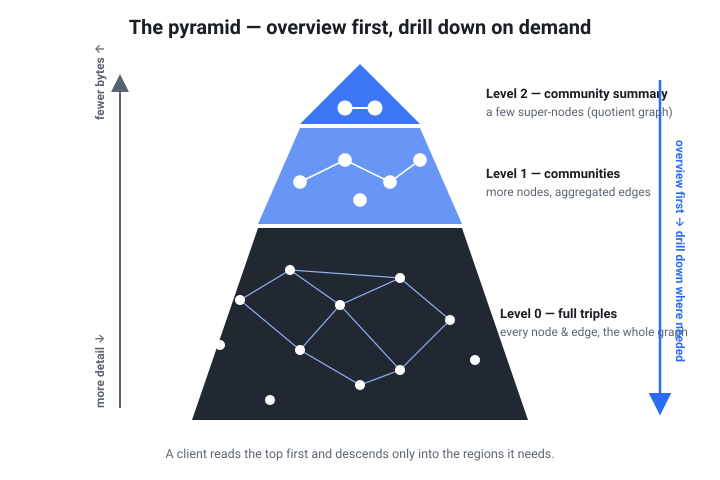

# rete

**A single-file, range-queryable RDF graph format — put it on a URL, run SPARQL, no server.**

[`github.com/caviri/rete`](https://github.com/caviri/rete) · crate **v0.1.0** · on-disk format **v0.4** (clean break — rebuild older files)

`rete` packs an RDF graph (or a full dataset of named graphs) into one immutable
`.rete` file with its own dictionary, permutation indexes, and a pyramidal
community summary. Drop the file on S3, GitHub, or any HTTP host that honors
`Range` requests, hand a client the URL, and query it in place — fetching only
the bytes a query needs. The same engine compiles to WebAssembly, so the browser
queries the file directly with no backend.

Think **Parquet / SQLite-over-HTTP / PMTiles**, but for RDF + SPARQL.



*The pyramid: read a coarse summary first, then drill into detail only where a query needs it.*

## Why

- **No database server.** The file *is* the database. Publish once to static
  hosting; clients query by URL.
- **Bounded, progressive reads.** A query touches a handful of byte ranges, never
  a linear scan. The coarse "overview" graph can be fetched first (≈25 % of a
  file, 3 ranges) before drilling into detail — PMTiles-style zoom, for graphs.
- **Real SPARQL.** SELECT / ASK / CONSTRUCT / DESCRIBE over BGPs, joins, OPTIONAL,
  UNION, MINUS, FILTER, VALUES, property paths, GROUP BY / aggregates, and named
  graphs — evaluated against the file.
- **In the browser.** `rete-wasm` runs the identical engine client-side; the demo
  page loads the overview over HTTP ranges and runs SPARQL with no server.
- **Safe on untrusted input.** A truncated or corrupt file from an arbitrary URL
  yields an error, never a panic (fuzz-tested).

## 60-second tour

```sh
# Build a file from N-Triples (or .nq / .ttl; merge several; or read stdin):
rete build examples/social.nt -o social.rete

# Query a triple pattern, a BGP, or full SPARQL:
rete query  social.rete --predicate '<http://ex/knows>'
rete why    social.rete --predicate '<http://ex/knows>'   # result provenance
rete sparql social.rete "PREFIX e: <http://ex/> SELECT ?p ?age WHERE { ?p e:age ?age . FILTER(?age > 27) }"

# Query straight from a URL — fetches only the byte ranges needed (http or https):
rete query-url https://my-bucket.s3.amazonaws.com/social.rete --object '<http://ex/Alice>'

# Look at the coarse graphs without reading the index:
rete summary social.rete    # structural (Louvain communities)
rete schema  social.rete    # semantic (by rdf:type)
```

## Documentation

### Start here

- **[Graph data 101](intro.md)** — new to graphs/RDF? A beginner's tour, framed by the questions you can ask.
- **[Getting started](getting-started.md)** — install (Docker-only), build, query, deploy.
- **[Real-world scenario](scenario.md)** — publish a queryable SBOM to a URL; curl examples.

### Explore in the browser

- **[Playground](playground-guide.md)** — the flagship demo: 40+ real datasets queried live over HTTP ranges, with SPARQL + SQL + semantic search, media viewers, and AI helpers. [Launch it →](playground.html)
- **[Plaza — dataset gallery](plaza/index.html)** — browse published datasets as live cards.
- **[Historical atlas](atlas.md)** — SPARQL + GIS: border polygons, timeline, five projections.
- **[2D match replay](pitch.html)** — a football match replayed on a canvas pitch from a spatiotemporal `.rete` (player + ball positions, 5 fps; pick any match). [Launch it →](pitch.html)
- **[Subtitle timeline](subtitles.html)** — one film subtitled in 20 languages; scrub the timeline and watch a line of dialogue appear in every language at once. [Launch it →](subtitles.html)
- **[Ask the graph](ask-the-graph.md)** — graphRAG search over a `.rete`, entirely in the browser.
- **[Wikidata lazy explorer](explore-100mb.html)** — range-read a 100 MB / 1 GB Wikidata file in place.
- **[Graph-map, topic-map & 3D (experimental)](graph-map.md)** — the community pyramid as a slippy map.

### Guides

- **[CLI reference](cli.md)** — every `rete` subcommand.
- **[SPARQL support](sparql.md)** — exactly what the engine evaluates, including `SERVICE` federation.
- **[GeoSPARQL](geosparql.md)** — geometry filters + time: "which territory contained this point in year Y?"
- **[SHACL validation](shacl.md)** — validate `.rete` graphs against SHACL Core shapes, locally or over a URL.
- **[Reasoning & coherence](reasoning.md)** — prototype OWL RL / RDFS reasoner; find incoherent points.
- **[Federated queries](federation.md)** — query several `.rete` files (local paths and/or URLs) as one.
- **[Semantic zoom](semantic-zoom.md)** — the schema pyramid: overview first, drill into detail.
- **[Compatibility & Cypher](compatibility.md)** — RDF interop, validation paths, and the Cypher subset.

### Publish & share

- **[Dataset Cards](dataset-cards.md)** — self-describing metadata embedded in the file.
- **[Hosting your .rete](hosting.md)** — put the file on R2, Zenodo, GitHub Pages, or S3 and query it by URL.
- **[Media & SQL companions](media-companions.md)** — images, IIIF, 3D and audio in query results; Parquet/SQLite companions.

### Graph analysis

- **[Topic modeling (LDA)](topic-modeling.md)** — label each community's theme: `rete communities` + scikit-learn LDA.
- **[Multi-criteria communities](multi-criteria.md)** — partition the same graph by different relations/attributes; combine criteria.

### Development

- **[Architecture](architecture.md)** — workspace map, build/read/query pipelines, range model, and extension points.
- **[Format specification](SPEC.md)** — the on-disk byte layout, for implementers.
- **[WASM & JavaScript API](browser.md)** — the browser bindings: query, remote reads, caching.
- **[Parallel in the browser (experimental)](parallel-browser.md)** — Web Worker reachability + shared-memory threads.
- **[Tables, VKG & big builds](data-engineering.md)** — entity/property tables, virtual knowledge graphs, large ingestions.
- **[Benchmarks](BENCHMARK.md)** — sizing, the OpenCitations/Oxigraph comparison, and the LUBM-style suite.
- **[SPARQL 1.1 conformance](conformance.md)** — the W3C test-suite scorecard.

## Version & status

Developed in the open at [github.com/caviri/rete](https://github.com/caviri/rete).
The crates are **v0.1.0** (experimental); the on-disk format is **v0.4**, and each
version step is a clean break (readers accept only the current version), so rebuild
older files. The format is not yet stable across versions.
Everything is built and tested in Docker — see
[Getting started](getting-started.md).
