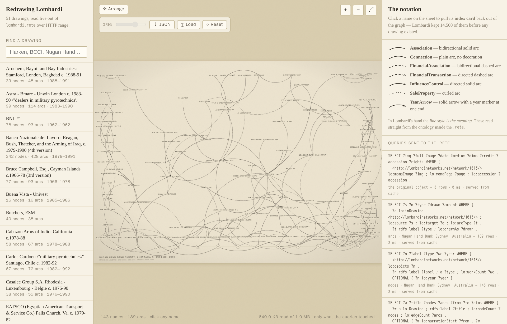

# Redrawing Lombardi — network drawings as a live graph

**[▸ Open the drawings →](lombardi.html)** — Mark Lombardi hand-inked networks
of banks, shell companies, arms deals and political scandal as diagrams of
names joined by curved lines. This page reads 51 of those drawings live out of
one `lombardi.rete` file over HTTP range and redraws each one in the browser —
nothing pre-rendered, every line comes back out of the graph.

<figure class="fig-center">
  
  <figcaption>The Nugan Hand Bank drawing redrawn live from the graph, with the sidebar of 51 drawings, the notation legend, and the query log all reading straight out of lombardi.rete.</figcaption>
</figure>

## Finding a drawing

Search the sidebar's 51 titles (`Harken`, `BCCI`, `Nugan Hand`…), each listed
with its node, arc and year-span counts, and pick one to have it redraw on the
sheet. In Lombardi's hand the *line style itself is the meaning*, so the
notation legend beside the drawing is drawn straight from the ontology inside
the `.rete` and lists only the arc types actually present in that sheet:
`Association` as a bidirectional solid arc, `FinancialTransaction` as a
directed dashed arc, `InfluenceControl` as a directed solid arc, `SaleProperty`
as a finely dotted curl with no arrowhead, `YearArrow` as a solid arrow into a
small ringed year marker along the timeline at the foot of the sheet. Click any
name to pull its **index card** — who it reaches, who reaches it, and which
other sheets it appears on — the browser's equivalent of the 14,500 real cards
Lombardi kept before he drew a single line.

## Tracing what he never recorded

For the 17 drawings MoMA holds, an **Arrange** control lays the photographed
original behind the redrawn names, with a slider that fades it in and out, so
you can drag each name onto where Lombardi actually placed it — a layer no
source ever captured, since Tolksdorf digitized who-connects-to-whom, never
coordinates. The traced positions download as JSON, **Load** reopens a saved
trace, and **Reset** throws it away for the automatic layout again.

## One graph, not 51

The 51 titles look like separate posters, but they aren't: Tolksdorf gave the
same actor the same node id wherever Lombardi drew it again, so hundreds of
people, banks and shells recur across sheets and the whole set joins into
**one** connected graph — following BCCI or a name like George H.W. Bush across
drawings is a graph walk, not a coincidence of spelling. Every panel on the
page is a live SPARQL query, and the "queries sent to the .rete" log makes the
cost of that visible: opening a drawing might read "640 KB read of 1.0 MB —
only what the queries touched," because a range read pulls only the bytes each
query needs, never the whole file.

## The same data, queryable

- [`lombardi`](playground.html#dataset=lombardi&load=lazy) — all 51 drawings as
  one graph, 70.4K triples: query who connects two scandals, which actors
  recur across sheets, or turn reasoning on to derive every typed arc.

Digitized node by node and arc by arc by **Robert Tolksdorf** (Freie
Universität Berlin) from Mark Lombardi's originals, published at
[lombardinetworks.net](https://lombardinetworks.net/) under
**CC BY-NC-SA 4.0** — this graph carries that licence and credit forward.
