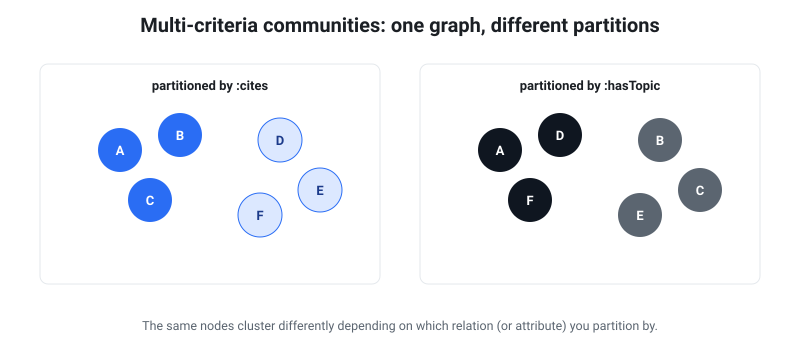

# Multi-criteria community splitting

<figure class="fig-right">
  
  <figcaption>The same nodes regroup depending on which relation (or attribute) you partition by — there is no single "correct" community.</figcaption>
</figure>

"What community is X in?" has no single answer — it depends on **which relation
(or attribute) you group by**. `rete` lets you partition the *same* graph by
different criteria and compare them. This page is a runnable example.

The data ([`examples/researchers.nt`](https://github.com/caviri/rete/blob/main/examples/researchers.nt))
has 8 researchers with three criteria that **deliberately disagree**:

- `ex:cites` — two dense citation clusters `{r1..r4}` and `{r5..r8}`.
- `ex:coauthor` — pairs that **cross** the citation clusters (`r1–r5`, `r2–r6`, …).
- `ex:organization` — an attribute (`OrgX` / `OrgY`).

```sh
rete build examples/researchers.nt -o researchers.rete
```

## Criterion 1 & 2 — structural, by a single relation (`--predicate`)

`rete communities --predicate <iri>` detects communities using **only** that
relation's edges, giving a criterion-specific partition:

```sh
rete communities researchers.rete --predicate '<http://ex/cites>'
#  community 0: r1, r2, r3 …      (citation cluster A)
#  community 1: r5, r6, r7 …      (citation cluster B)

rete communities researchers.rete --predicate '<http://ex/coauthor>'
#  community 0: r1, r5            (coauthorship crosses the citation clusters)
#  community 1: r2, r6
#  community 2: r3, r7
#  community 3: r4, r8
```

Same graph, same nodes — **different communities** depending on the relation.
Citation says "two camps"; coauthorship says "four cross-camp pairs". (With no
`--predicate`, detection uses *all* edges and yields a blended partition.)

## Criterion 3 — attribute, via SPARQL (free, overlapping-friendly)

Attribute groupings ("everyone at OrgX", "papers tagged biology") need no special
feature — they're a `GROUP BY`:

```sh
rete sparql researchers.rete \
  "PREFIX e: <http://ex/> SELECT ?org (COUNT(?r) AS ?n) WHERE { ?r e:organization ?org } GROUP BY ?org"
#  OrgX 4   ·   OrgY 4
```

Attribute criteria **handle overlap for free** (a node can have several tags) and
are fully queryable — no partition needed.

## Combining criteria

"Find groups coherent in *both* discipline and organization" is **consensus /
multi-view clustering** — a downstream analysis, exactly like the
[LDA pipeline](topic-modeling.md): `rete` supplies each criterion's partition
(and per-community [profiles](cli.md#coarse-graphs-no-index-read)), and a
consensus step combines them. Likewise, **overlapping** community detection (a
node in several communities — link communities, BigCLAM) is its own algorithm,
not Louvain's hard partition; `rete` would feed it the same way it feeds LDA.

## The one design constraint: physical tiling wants a single partition

The pyramid's **tiles** exist for byte locality / range-fetch, and that benefits
from *one* partition that minimizes edge cut. So the pragmatic split is:

- **One structural partition = the physical layout** — pick the dominant /
  most-queried relation (e.g. `cites`); this is what the on-disk pyramid uses.
- **All other criteria = logical groupings** — via `--predicate` (recomputed on
  demand), via SPARQL attributes, or downstream consensus. No physical cost,
  fully queryable, overlapping-friendly.

So: attribute criteria are already first-class (SPARQL/schema); multiple
*structural* criteria are a recompute-on-demand `--predicate` away; and combining
them is a downstream step `rete` feeds — with only one partition ever driving the
physical layout.
