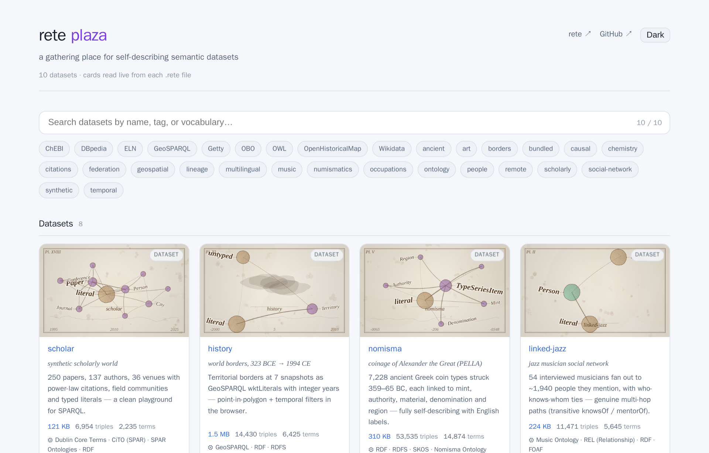

# Plaza — a gallery of self-describing datasets

**[▸ Open the gallery →](plaza/index.html)** — "a gathering place for
self-describing semantic datasets": a searchable grid of every published
`.rete` graph, each shown as a live-read card rather than a hand-written blurb.

<figure class="fig-center">
  
  <figcaption>Every card on this page is read live from its dataset's own `.rete` file — nothing here is typed by hand.</figcaption>
</figure>

## What it is

Plaza is not a catalog file someone maintains — it's a page that opens a list
of `.rete` files and asks each one to describe itself. Two small HTTP range
reads (the header, then the metadata section) pull back the dataset's
**Dataset Card**: its title, triple count, term count, the vocabularies it
uses, and a schema-pyramid sketch of its classes. That sketch is drawn on the
spot from the card's own class list, so it changes the moment the underlying
data does.

## How to use it

Type in the search box to filter by name, tag, or vocabulary, or click any of
the chip filters (ChEBI, Wikidata, GeoSPARQL, OWL, …) to narrow the grid to
datasets that actually use that vocabulary. Click a card to open its detail
view and explore further — the query panel, schema graph, and file links all
read from the same live card.

## The key idea

Because a `.rete` file carries its own card, a directory like this needs no
server and no maintained index — pointing the page at a list of files is
enough. That's the same [Dataset Cards](dataset-cards.html) mechanism the
[playground](playground.html) uses to show a dataset's stats before you load
it: the file *is* the catalog entry.
