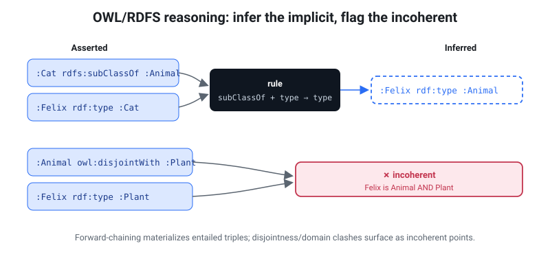

# Reasoning & coherence checking

rete reasons over an ontology **two complementary ways**:

- **Query rewriting — OWL 2 QL** ([jump](#reasoning-by-query-rewriting-owl-2-ql)):
  rewrite the *query* so its answer includes the entailed solutions, computed over
  the **raw data with no materialization**. Opt-in, lazy — it works over a remote
  file with no rebuild and fetches only the bytes the rewritten query touches — and
  the natural fit for ontology-mediated **query answering**.
- **Materialization — OWL RL / RDFS** (the rest of this page): forward-chain the
  entailed *triples* to a fixpoint, to either **bake** them into the file
  (`rete build --materialize`) or **coherence-check** it (`rete reason`).

Rule of thumb: reach for **query rewriting** to *answer queries* under an ontology
without touching the data; reach for **materialization** to *persist* inferences
or *detect contradictions*.

---

`rete reason` runs a **prototype forward-chaining OWL RL / RDFS reasoner** over a
file's default graph: it materializes the obvious RDFS/OWL entailments to a
fixpoint, then scans the closed graph for **incoherent points** — logical
contradictions such as an individual that belongs to two disjoint classes.

> **OWL RL in one paragraph.** OWL (the Web Ontology Language) lets you state
> *schema* axioms about your data — class hierarchies, property characteristics,
> disjointness, identity. A *reasoner* draws the logical consequences (e.g. "if
> `:a causes :b` and causation is transitive, then `:a causes :c`") and detects
> contradictions. OWL RL is the rule-based profile of OWL designed exactly for
> forward-chaining materialization over triples, which is what this implements.

> **Loading an OWL ontology.** An OWL ontology is just RDF triples. `rete build`
> ingests the two common RDF serializations directly — **Turtle** (`.ttl`) and
> **RDF/XML** (`.rdf` / `.owl`) — so `rete build my-ontology.owl -o onto.rete &&
> rete reason onto.rete` works with no conversion step. (OWL/XML and Functional
> Syntax are *not* RDF; convert them to RDF/XML first — see
> [Compatibility](compatibility.md).)

> **Scope — this is a prototype subset, NOT full OWL DL.** It covers the rules in
> the tables below by exact-string matching on canonical N-Triples tokens. It does
> not do equality reasoning beyond the checks listed, class expressions
> (`owl:Restriction`, intersections/unions), cardinality, datatype reasoning, or
> open-world consistency in the OWL DL sense. Use it as a lightweight coherence
> gate, not a certified entailment regime.

<figure class="fig-right">
  
  <figcaption>Forward-chaining materializes entailed triples (dashed); disjointness and domain clashes surface as <strong>incoherent points</strong>.</figcaption>
</figure>

## Usage

```sh
rete reason data.rete                       # report entailment count + incoherent points
rete reason data.rete --materialize          # also print base + inferred graph (N-Quads)
rete reason data.rete --materialize --format ttl
rete reason --url https://host/data.rete     # check a REMOTE file over HTTP range reads
rete reason data.rete --check                # terse one-line verdict (CI gate)
rete reason data.rete --verify-card          # re-check a build-time coherence stamp
```

`rete reason` **exits non-zero when any inconsistency is found**, and zero when
the graph is coherent — so it drops straight into CI as a coherence check. `--url`
reads a remote `.rete` lazily over HTTP ranges (like `rete sparql-url`), refusing an
incomplete result if a range fetch fails. `--check` prints a single verdict line for
scripts.

## Build-time materialization

`rete reason --materialize` *prints* the closed graph but doesn't change the file.
To **persist** the entailments — so they ship in the `.rete` and need no
query-time reasoning — materialize at build time:

```sh
rete build data.nt -o data.rete --materialize
```

This runs the same reasoner over the default graph during the build and stores the
inferred triples alongside the asserted ones (the index deduplicates any overlap).
After that, a plain triple/SPARQL query sees the entailed triples directly — e.g.
with `Class subClassOf Super` and `x a Class` asserted, `x a Super` is queryable
with no reasoner in the loop. The build **aborts** (non-zero) if the graph is
logically incoherent, so it never bakes a contradiction into a published file.

Trade-off: a materialized file is larger and fixes the entailments at build time
(re-build to re-materialize after the ontology changes); an un-materialized file
stays compact and you run `rete reason` on demand.

## Build-time coherence stamp

`rete build --reason` runs the reasoner once at build time and **stamps the verdict
into the Dataset Card** — so a remote reader learns the graph's coherence from the
index-free card (`rete card-url`, ~2 ranges) with **zero compute**, never fetching
the graph:

```sh
rete build data.nt -o data.rete --reason
rete card data.rete            # …includes a `coherence:` block
#   coherence:
#       verdict    : coherent
#       scope      : default · rules owl-rl-subset/v1 · not materialized
```

Unlike `--materialize`, `--reason` does **not** abort an incoherent graph — it
records `coherent: false` (with a `by_kind` histogram) honestly, so a known-bad
dataset can still publish its status. Combine `--reason --materialize` to both bake
the entailments and stamp the verdict.

The stamp is deterministic (sorted histogram, no free-text detail) so it folds into
the file's content hash without destabilizing it — two `--reason` builds of the same
input are byte-identical, and a build *without* `--reason` is byte-identical to
before the feature existed. To keep the stamp honest it carries a `rules` tag
(`rete_core::REASON_RULESET`); `rete reason --verify-card` recomputes the verdict and
**fails** if it drifted from the data or the rule set changed:

```sh
rete reason data.rete --verify-card
#   coherence card verified: coherent (0 inconsistency(ies), rules owl-rl-subset/v1)
```

So a CI pipeline can stamp coherence at build time and assert it never silently goes
stale — and a consumer can trust the card's verdict because it is cheap to re-verify.

## Entailment rules (materialized to a fixpoint)

| Rule | If the graph contains… | …then entail |
|------|------------------------|--------------|
| subClassOf transitivity | `c rdfs:subClassOf d` · `d rdfs:subClassOf e` | `c rdfs:subClassOf e` |
| type propagation | `x a c` · `c rdfs:subClassOf d` | `x a d` |
| subPropertyOf | `p rdfs:subPropertyOf q` · `x p y` | `x q y` |
| subPropertyOf transitivity | `p rdfs:subPropertyOf q` · `q rdfs:subPropertyOf r` | `p rdfs:subPropertyOf r` |
| domain | `p rdfs:domain c` · `x p y` | `x a c` |
| range | `p rdfs:range c` · `x p y` | `y a c` |
| inverseOf | `p owl:inverseOf q` · `x p y` | `y q x` (and the reverse direction) |
| SymmetricProperty | `p a owl:SymmetricProperty` · `x p y` | `y p x` |
| TransitiveProperty | `p a owl:TransitiveProperty` · `x p y` · `y p z` | `x p z` |

## Inconsistency rules (the incoherent points)

Detection runs **after** materialization, so entailed types count — a
disjointness violation that only shows up once `rdfs:subClassOf` has propagated is
still caught.

| `kind` | Triggered by |
|--------|--------------|
| `disjoint-classes` | `x a c` · `x a d` · `c owl:disjointWith d` (either direction) |
| `sameas-differentfrom` | `x owl:sameAs y` · `x owl:differentFrom y` (either direction) |
| `functional-property` | `p a owl:FunctionalProperty` · `x p y` · `x p z` · `y ≠ z` (and not `y owl:sameAs z`) |
| `owl-nothing` | `x a owl:Nothing` |

## Worked example: a causal model

`examples/causal.nt` is a small causal graph. It carries (1) a causal **cycle**
`a → b → c → a`, and (2) an **incoherent point**: a patient `:p` typed as both
`HealthyState` and `DiseaseState`, which are declared `owl:disjointWith`.

The two kinds of problem are found by two complementary tools:

**A causal cycle** is a *structural* fact about the data — find it with a SPARQL
property path:

```sh
rete sparql causal.rete "PREFIX e: <http://ex/> SELECT ?x WHERE { ?x e:causes+ ?x }"
#  ?x=<http://ex/a>
#  ?x=<http://ex/b>
#  ?x=<http://ex/c>
```

**A disjointness (or functional-property) violation** is a *logical*
contradiction — find it with `rete reason`:

```sh
rete build examples/causal.nt -o causal.rete
rete reason causal.rete
#  inferred 9 new triple(s)
#  1 inconsistency(ies) found:
#    [disjoint-classes] <http://ex/p> is typed as both <http://ex/DiseaseState> and <http://ex/HealthyState>, which are owl:disjointWith
#  Error: 1 inconsistency(ies) — graph is incoherent   (exit code 1)
```

The entailment count (9) reflects the materialized `subClassOf` chain
(`Disease ⊑ Condition ⊑ Factor`) and the transitive `:causes` closure
(`a causes c`, etc.). Because the graph is incoherent, the command exits non-zero.

## Remote / in-browser coherence

The same coherence checks run **in the browser against a remote `.rete` over HTTP
range reads** — drop a file on any range-serving host (S3, GitHub Pages, a CORS
proxy), hand the client a URL, and check coherence with no server and no full
download. The WASM build exposes three entry points, tiered by how much of the
file they touch. They mirror the SHACL family (`shacl_url` / `shacl_construct_url`)
and are **worker-only** (the engine is synchronous and uses blocking XHR, which
browsers permit only off the main thread). Each returns a JSON envelope with a
`remote: { fileLength, bytes, requests }` block so the UI can show exactly how
little of the file was pulled; a failed range fetch mid-check is an **error**,
never a silently-incomplete (and so possibly false-"coherent") result.

| Tier | Function | Reads | Finds |
|------|----------|-------|-------|
| **0 — schema** | `check_schema_url(url)` | header + the schema block only (2 ranges, **~1–8 KB at any graph size**, never the index, dictionary, or community summary) | subClassOf cycles; **unsatisfiable classes** (a class that is a subclass of two `owl:disjointWith` classes) |
| **1 — selective** | `reason_construct_url(url, construct)` | only the tiles the CONSTRUCT's constant-predicate patterns touch (one warm cache) | every contradiction visible from `rdf:type` + the class/equality T-Box (disjoint-class clashes, `sameAs`/`differentFrom`) |
| **2 — full** | `reason_url(url[, graph])` | materializes the whole graph (≈ the entire file) | every incoherent point the CLI `rete reason` finds |

**Tier 0** answers *"is the **ontology** coherent?"* — the `subClassOf` DAG plus the
`owl:disjointWith` / `owl:equivalentClass` axioms travel in the schema pyramid, which
decodes **without the dictionary or the index**. The header records the schema block's
byte length, so the check fetches just the header and that block (2 ranges) — a flat
**~1–8 KB at any graph size** (8.1 KB of a 48.8 MB file; see
[Coherence tier costs](BENCHMARK.md#coherence-checking-tier-costs)). It cannot see
instance-level clashes (a node typed into disjoint classes, functional-property
clashes) — those need the A-Box (Tier 1/2). One soundness caveat: the shipped hierarchy
is truncated, so on a very large ontology a pruned ancestor can hide an unsatisfiable
class (a false *coherent*, never a false *incoherent*).

**Tier 1** is the selective sweet spot. The default slice is a `UNION` of
constant-predicate `CONSTRUCT` branches so each routes to a single predicate's
tiles:

```sparql
CONSTRUCT { ?x rdf:type ?c . ?sub rdfs:subClassOf ?sup .
            ?c1 owl:disjointWith ?c2 . ?s1 owl:sameAs ?s2 . ?f1 owl:differentFrom ?f2 }
WHERE { { ?x rdf:type ?c } UNION { ?sub rdfs:subClassOf ?sup }
        UNION { ?c1 owl:disjointWith ?c2 } UNION { ?s1 owl:sameAs ?s2 }
        UNION { ?f1 owl:differentFrom ?f2 } }
```

> **Slice-correctness invariant.** A Tier-1 CONSTRUCT **must** pull the T-Box
> predicates (`rdfs:subClassOf`, `owl:disjointWith`, `owl:sameAs`) into the slice,
> not just `rdf:type`. The reasoner detects a disjoint-class clash only *after*
> `subClassOf` type-propagation, so a slice missing `subClassOf` would silently
> miss a propagation-dependent contradiction.

### Try it

The [playground](playground.html#dataset=causal)'s **Coherence** tab runs all three
tiers in the browser. The demo checks run against a
tiny causal ontology (`examples/causal.rete`) with both kinds of
defect planted: Tier 0 reports `:Relapsed` **unsatisfiable** (a subclass of the
disjoint `HealthyState` and `DiseaseState`) from ~2–3 ranges; Tier 1/2 report the
**instance** clash (`:p` is both). The live counter shows how few bytes each tier
fetches.

## Reasoning by query rewriting (OWL 2 QL)

Everything above **materializes**: it computes entailed triples and (optionally)
stores them. That fixes the inferences at build time and grows the file — the
opposite of rete's cloud-native, range-queried design, where the ABox may be
hundreds of millions of triples on a remote host.

The **OWL 2 QL** profile exists for exactly this case — a large ABox, a small
TBox, and queries that are *first-order rewritable*. Instead of baking inferences
into the data, rete rewrites the **query** so that evaluating it over the **raw**
data yields the certain (entailed) answers. A remote `.rete` becomes
ontology-aware with **no rebuild**, and only the bytes the rewritten query touches
are fetched.

Reasoning is **opt-in** — a plain query is never changed:

```sh
rete sparql     data.rete "SELECT ?o WHERE { ?o a :Aves }" --entail
rete sparql-url https://host/data.rete "…" --entail        # lazy, over HTTP range
```

In the browser, the [playground](playground-guide.html)'s **🧠 Reason** toggle
(beside the Labels switch) runs the active query with entailment on; the WASM API
is `Graph.query_reasoned` / `RemoteGraph.query_reasoned`.

### What is entailed

| Axiom | A query for … also returns … |
|---|---|
| `rdfs:subClassOf` | `?x a C` → instances of every subclass of `C` (transitively) |
| `rdfs:subPropertyOf` | `?x P ?y` → pairs related by any subproperty of `P` |
| `rdfs:domain` / `range` | `?x a C` → subjects/objects of a property whose domain/range is `⊑ C` (composing through `subPropertyOf`) |
| `owl:inverseOf` | `?x P ?y` → pairs `?y Q ?x` for any `Q` inverse to `P` |
| `owl:someValuesFrom` (`A ⊑ ∃P`, `A ⊑ ∃P⁻`) | `?x P ?_` (or `?_ P ?x`) with an existential end → every `?x` that is (transitively) such an `A` |

```sparql
# gbif-birds: occurrences are typed to their SPECIES, and each species carries a
# subClassOf chain up to :Aves. WITHOUT reasoning this matches nothing directly;
# WITH --entail it returns real occurrences via the taxonomy — no hand-written path.
SELECT ?o WHERE { ?o a <https://w3id.org/rete/gbif/taxon/class/Aves> } LIMIT 20
```

### How it works

The rewrite is a **post-lowering pass on the query plan** — the hot triple matcher
and every non-reasoned query are byte-identical.

- **Hierarchy** (`subClassOf` / `subPropertyOf`) is exactly what rete's
  goal-directed [property paths](sparql.html#property-paths) already do, so a
  hierarchy atom becomes a path over the raw data — `?x a C` → `?x a ?c .
  ?c rdfs:subClassOf* C` (reflexive, so a direct type still matches). No `UNION`
  enumeration, so it does **not** blow up on deep taxonomies (gbif's ~1,200 classes
  stay one path, not 1,200 query branches).
- **Domain / range / inverseOf / existentials** add `UNION` branches. A tiny TBox
  read (the objects of the hierarchy predicates, plus whether the graph declares
  domain/range/inverse/`someValuesFrom` axioms at all) **gates** the rewrite, so an
  atom whose class/property has no relevant axioms — and a graph with no ontology —
  is left untouched, making reasoning **zero-overhead where it can add nothing**.

### Existential soundness

The existential rewrite (`?x P ?y` answered from `A ⊑ ∃P`) is **sound by
construction**: it fires only when the existential end (`?y`, or the subject for
`∃P⁻`) is *purely existential* — it occurs exactly once in the whole query and is
not returned — because an anonymous `∃P` successor can neither be projected nor
joined. `reason_rewrite` counts every variable occurrence across the plan
(patterns, paths, filter/bind expressions, sub-queries) and consults the `SELECT`
list; where the end is bound, shared, or projected, the branch is skipped.

### Boundary

Every DL-Lite_R axiom **type** is covered. The one remaining case is the PerfectRef
**reduction** step — existential *chaining*, where a shared join constraint is
itself entailed by an existential (a query joins `?x P ?y` with `?y a C`, and
`∃P⁻ ⊑ C` makes the `?y a C` atom redundant so `?y` becomes existential). That
query shape is rare, and reasoning is **never unsound** regardless: with it off you
get exact matches; with it on you get the entailed answers for the supported cases
— it can only ever be *incomplete* for that one chaining shape, never wrong.

This query-rewriting reasoner and the materializing one above are independent: use
`--entail` to answer queries under the ontology lazily; use `--materialize` /
`rete reason` to bake inferences or check coherence.
