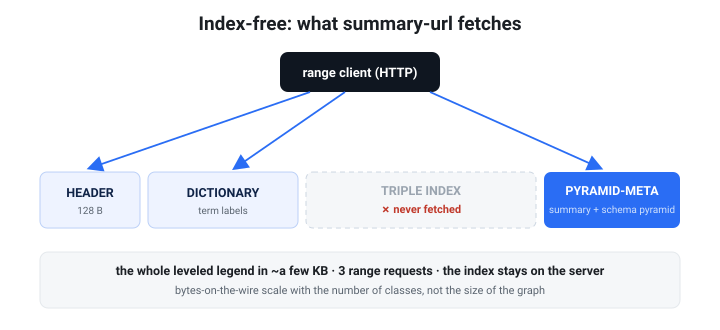

# Semantic zoom — the schema pyramid

> **The one-paragraph pitch.** Open any `.rete` and ask *"what kinds of things are
> in here?"* — and get an answer that **zooms**. At a glance you see the broad
> strokes (`Agent: 4k, Place: 8k`); zoom one step and `Agent` resolves into
> `Person` and `Organisation`; zoom again and `Person` resolves into `Scientist`,
> `Artist`, … down to the leaf classes. It's a **map legend with a zoom control**,
> shipped *inside the file*, and a remote client reads the whole leveled legend in
> **two or three small HTTP range requests — without ever touching the triple
> index.** This is rete's "PMTiles for graphs," applied to *types*.

The schema pyramid is built automatically whenever your data carries an `rdf:type`
hierarchy. There is no flag to remember and nothing extra to host — it travels in
the file's pyramid section and is served over the same range-request transport as
everything else.


*Each level is one type histogram. Read top to bottom and the same instances
resolve from abstract classes into leaves — and the whole stack is fetched
index-free, in a few kilobytes, over HTTP.*

---

## Why it exists

A knowledge graph you've never seen is **opaque**: you don't know which classes
exist, how they relate, or where to start. The flat answer — *"here are 200
classes, alphabetical"* — is noise. What you actually want is to start coarse and
drill down only where it's interesting. That's exactly what a web map gives you for
geography; the schema pyramid gives it for **ontology**.

Three things make this work, and they're really one idea:

- The data's **`rdfs:subClassOf`** axioms define an abstraction hierarchy
  (`Astronomer ⊑ Scientist ⊑ Person ⊑ Agent`).
- rete **rolls every instance's type up that hierarchy** to a chosen depth, once,
  at build time, and stores one **type histogram per level**.
- The whole thing lives in the **pyramid-meta** section, which range-reading
  clients fetch *without* the triple index — so it is **index-free and instant**,
  the cheapest tier of the [three-tier exploration model](dataset-cards.md#the-three-tier-exploration-model).


*The `subClassOf` chain is the zoom function: instances live at the leaves, and
rolling their types up to depth `d` produces level `d`'s histogram — `Astronomer`
becomes `Scientist` becomes `Person` becomes `Agent`. Nothing is invented; the
ontology in the data does the work.*

---

## What you need in the data

| Ingredient | Predicate | Required? |
|---|---|---|
| **Typed instances** | `rdf:type` (`a`) | Yes — no types, no schema pyramid. |
| **A class hierarchy** | `rdfs:subClassOf` | Optional — without it the pyramid is a single flat level (= the Dataset Card's class list). |

The `subClassOf` axioms can come straight from your data, from an ontology file you
merge in at build time, or be **inferred** with `rete build --materialize` (the
RDFS/OWL-RL reasoner — see [Reasoning](reasoning.md)). Multiple inheritance is
handled by picking a canonical (lexicographically smallest) parent so the rollup is
a deterministic tree.

---

## Build it

Nothing special: it's part of the normal pyramid, so a plain `rete build` produces
it. Take this little graph — five classes in a `subClassOf` tree plus four typed
people/orgs:

```turtle
# people.nt  (N-Triples; prefixes shown for readability)
ex:Scientist     rdfs:subClassOf ex:Person .
ex:Artist        rdfs:subClassOf ex:Person .
ex:Astronomer    rdfs:subClassOf ex:Scientist .
ex:Person        rdfs:subClassOf ex:Agent .
ex:Organisation  rdfs:subClassOf ex:Agent .

ex:ada    a ex:Astronomer .
ex:edwin  a ex:Astronomer .
ex:frida  a ex:Artist .
ex:nasa   a ex:Organisation .
ex:ada    ex:memberOf ex:nasa .
ex:ada    ex:knows    ex:edwin .
ex:frida  ex:knows    ex:ada .
```

```sh
rete build people.nt -o people.rete
```

That's it — `people.rete` now carries the schema pyramid. (If your `subClassOf`
axioms live in a separate ontology, merge them in the same build:
`rete build people.nt ontology.ttl -o people.rete`. If they're only *implied*,
`rete build people.nt --materialize -o people.rete` infers them first.)

---

## Use it

### Browse every level at once

`rete summary` prints the community super-edge graph and then the schema pyramid —
one line per semantic level, coarse (abstract) at the top:

```text
$ rete summary people.rete
…
schema pyramid — 4 level(s), 6 class(es) in the subClassOf hierarchy:
  level 0 (depth 0, round 1): <http://ex/Agent>×4
  level 1 (depth 1, round 0): <http://ex/Person>×3, <http://ex/Organisation>×1
  level 2 (depth 2, round 0): <http://ex/Scientist>×2, <http://ex/Artist>×1, <http://ex/Organisation>×1
  level 3 (depth 3, round 0): <http://ex/Astronomer>×2, <http://ex/Artist>×1, <http://ex/Organisation>×1
  + 3 per-community descriptor(s) for progressive zoom
```

Read it top to bottom and the zoom is visible: **everything is an `Agent` (×4)**;
that `Agent` is `Person ×3` + `Organisation ×1`; that `Person` is `Scientist ×2` +
`Artist ×1`; that `Scientist` is `Astronomer ×2`. **Counts conserve up the
hierarchy** — each level re-partitions the *same* instances at a finer grain.

### Zoom to one level

`--level k` prints just one level's type histogram (`0` = coarsest / most abstract):

```text
$ rete summary people.rete --level 0          # the big picture
schema pyramid level 0 — depth 0 (round 1), 1 class(es):
           4  <http://ex/Agent>

$ rete summary people.rete --level 1          # one step in
schema pyramid level 1 — depth 1 (round 0), 2 class(es):
           3  <http://ex/Person>
           1  <http://ex/Organisation>

$ rete summary people.rete --level 3          # the leaves
schema pyramid level 3 — depth 3 (round 0), 3 class(es):
           2  <http://ex/Astronomer>
           1  <http://ex/Artist>
           1  <http://ex/Organisation>
```

A viewer wires `--level k` to a zoom slider: render level 0 when zoomed out, fetch
deeper levels as the user drills in.

### Over HTTP / S3 — the index-free payoff

This is the selling point. The schema pyramid lives in the pyramid-meta section, so
`summary-url` fetches it **without downloading the file and without touching the
triple index** — only the header, dictionary, and pyramid:



*A range client pulls only the header, dictionary and pyramid-meta — three
ranges, and never the triple index.*

What that costs is set by the **dictionary**, not by the size of the graph. The
pyramid itself scales with the number of classes and stays small — 1.3 MB on the
published `davidrumsey.rete` — but resolving those class IRIs back to strings
pulls the dictionary along with it, so the three reads total **17.4 MB of a
74.8 MB file (23.3 %)**, measured with `rete cost`. On a small file the same
three reads are tens of kilobytes. Either way the permutation indexes — 56.9 %
of that file, and the majority of every published one — are never requested.

```text
$ rete summary-url https://host/people.rete
…
schema pyramid — 4 level(s), 6 class(es) in the subClassOf hierarchy:
  level 0 (depth 0, round 5): <http://ex/Agent>×2847, <http://ex/Place>×1153
  …
fetched 27337 of 161420 bytes in 3 range request(s) — index NOT fetched
```

The bytes-on-the-wire are **bounded by the number of classes, not the size of the
graph** — the same leveled legend costs roughly the same whether the file is a
megabyte or a gigabyte. Put the `.rete` on any range-capable host (S3, a CDN,
GitHub Pages) and a browser or CLI gets a zoomable type map for the cost of a few
kilobytes. See [Dataset Cards → the three-tier model](dataset-cards.md#the-three-tier-exploration-model)
for how this tier sits alongside the index-free `card-url` and the lazy
`sparql-url` tiers.

### Read it programmatically

The Rust API exposes the pyramid index-free through `SummaryView`
(`rete-core`), which reads only the header + dictionary + pyramid ranges:

```rust
use rete_core::{SummaryView, SliceReader};

let view = SummaryView::open_ranged(&SliceReader::new(&bytes))?.unwrap();
for k in 0..view.level_count() {
    let level = view.level_rollup(k).unwrap();
    println!("level {k} (depth {}):", level.depth);
    for (class, n) in &level.classes {
        println!("  {n:>8}  {class}");
    }
}
// view.class_hierarchy : the subClassOf DAG with per-class depth
// view.descriptors     : per-community descriptors (below)
```

Any `RangeReader` works here — back it with an HTTP client and you read the schema
pyramid straight off a URL.

---

## A graph, not a tree — multiple parents and lateral links

A real ontology isn't a strict tree. Two things break the "every class sits in
exactly one branch" assumption, and the schema pyramid keeps **both**:


**1. Non-exclusive `subClassOf` (multiple inheritance).** A class can be a subclass
of several others — `Astronaut ⊑ Scientist` *and* `Astronaut ⊑ Explorer`. The
shipped hierarchy keeps **all** parents, so it is a directed acyclic *graph*, not a
tree. (A single canonical parent — the lexicographically smallest — drives the
deterministic depth/rollup; the rest are preserved as cross-links you can
navigate.) On `ClassNode` you get `parents: Vec<String>` and `canonical_parent()`.

**2. Lateral connections (the non-`is-a` relations).** Beyond "is-a", classes are
*connected* — `Person memberOf Organisation`, `Person knows Person`. The pyramid
rolls these relations up **per level** too, so each level is a small **graph**, not
just a histogram. Zoom out and the relations abstract along with the types:

```text
$ rete summary people.rete --level 1          # concrete
  3  <http://ex/Person>
  1  <http://ex/Organisation>
  relations at this level (2):
       2  <http://ex/Person> --<http://ex/knows>-> <http://ex/Person>
       1  <http://ex/Person> --<http://ex/memberOf>-> <http://ex/Organisation>

$ rete summary people.rete --level 0          # abstracted
  4  <http://ex/Agent>
  relations at this level (2):
       2  <http://ex/Agent> --<http://ex/knows>-> <http://ex/Agent>
       1  <http://ex/Agent> --<http://ex/memberOf>-> <http://ex/Agent>
```

`Person memberOf Organisation` becomes `Agent memberOf Agent` as you zoom out — the
**connections are preserved and generalized**, never dropped. So the answer to *"can
the pyramid be non-exclusive and keep connections?"* is **yes, by construction**:
it's a *leveled multigraph* over the ontology, not a leveled tree. On the API these
are `view.level_links` (`Vec<LevelLinks>`, each a `Vec<ClassRelation>`).

---

## Per-community descriptors (progressive zoom)

Alongside the global levels, the pyramid ships a **descriptor per community**: its
dominant class, local type histogram, and — when the data has them — a geographic
bounding box (CRS84 lon/lat) and a temporal range. These let a client refine the
global picture *locally* — "what's in this region / this cluster?" — again without
fetching any triples. They're available on `view.descriptors`.

> **Status.** The descriptors describe communities and ship in the index-free
> pyramid-meta today. The *physical per-community triple tiles* they're designed to
> annotate are a separate, in-progress storage step; until those land, a descriptor
> is a standalone summary of its community.

---

## No hierarchy? It still works

If your data has types but **no `subClassOf`**, the pyramid degrades gracefully to
a **single flat level** — exactly the class histogram you'd get from the Dataset
Card — so `rete summary --level 0` always answers. Add a hierarchy (or
`--materialize`) later and the levels appear automatically on the next build.

---

## How the ontology is embedded in the format

The ontology isn't a sidecar — it is **derived once at build time and written into
the file's own sections**, where range clients read it without the triple index.
Three *orthogonal* structures are embedded, each answering a different question:


| Structure | Question it answers | Where it lives | Read by |
|---|---|---|---|
| **`subClassOf` DAG** (non-exclusive, with depth) | *is-a* — how classes generalize | pyramid-meta (v2) | `summary` / `summary-url` |
| **Per-level type + relation rollups** | *what & how, at each zoom* | pyramid-meta (v2) | `summary --level k` |
| **Per-community descriptors** | *what's in this cluster/region* | pyramid-meta (v2) | `SummaryView.descriptors` |
| **`class_links`** (leaf relation graph) | *relates-to* — the effective schema | the Dataset Card (metadata) | `card` / `card-url` |
| **Community super-edges** | *co-occurrence* — topological structure | pyramid-meta (v1) | `summary` / `summary-url` |

A few properties that make the embedding work:

- **Self-contained.** The schema pyramid stores class and predicate IRIs in its own
  **string table**, so it can be decoded **without the dictionary** — the ontology
  travels as plain text, not dictionary IDs.
- **Index-free.** Reading any of it never opens the triple index — `rete summary
  [--level k]`, `summary-url`, `card-url`, and `SummaryView` keep to the header +
  the small metadata/pyramid ranges. The index stays on the server.
- **Physically additive (pyramid-meta v2).** The schema block is appended after the
  v1 summary and written **only when the graph has types**, so a typeless file is
  byte-identical to a v1 build and an older reader silently ignores the new bytes.
  See [the format spec §7.4](SPEC.md#74-the-schema-pyramid--semantic-zoom-v2) for
  the exact byte layout.
- **Provenance.** The `subClassOf` axioms come straight from the data, from a merged
  ontology file, or from `rete build --materialize` (the RDFS/OWL-RL reasoner). The
  pyramid never invents structure — it *embeds the ontology that's already there*.
- **Deterministic & bounded.** Same input → byte-identical file (stable content
  hash, safe to cache). Levels (≤ 6), classes/relations per level, and descriptors
  are all capped, so the embedded ontology stays small **regardless of graph size**.

## Cost vs benefit — is the pyramid worth it?

Measured honestly (see the [benchmark](BENCHMARK.md#the-pyramid-cost-vs-benefit)),
the two pyramidal structures have very different economics:

- The **schema pyramid is bounded** — its size and read cost track the *ontology*
  (classes/relations), not the graph, so it stays cheap (~tens of KB, ~20 ms read)
  at any scale. This is the structure that earns its keep for exploration.
- The **community super-edge summary scales with the graph** and adds build time
  (Louvain), and it gives **no** benefit to node-selective lazy queries. If you only
  serve selective SPARQL, `--no-pyramid` is smaller and just as fast.

Rule of thumb: **keep the pyramid when you want index-free overview/exploration;
drop it (`--no-pyramid`) when you only serve selective queries at scale.**

## When to reach for it

- **Publishing a dataset** people will explore cold — the schema pyramid is the
  zoomable legend that tells them what to ask.
- **A browser/edge client** that should show "the shape of the data" before
  running a single SPARQL query — render level 0 without touching the triple
  index, drill down on demand.
- **Faceted / drill-down UIs** — wire the levels to a type facet that starts
  abstract and refines as the user narrows.

If your data is **untyped** or has **no class hierarchy**, the payoff is smaller (a
single flat level); everything else here still applies.

---

See also: [Dataset Cards](dataset-cards.md) (the self-describing card + starter
queries that ride the same index-free path), [Reasoning](reasoning.md)
(`--materialize` to infer `subClassOf`), and [the format spec](SPEC.md#7-the-pyramid--community-summarization).
