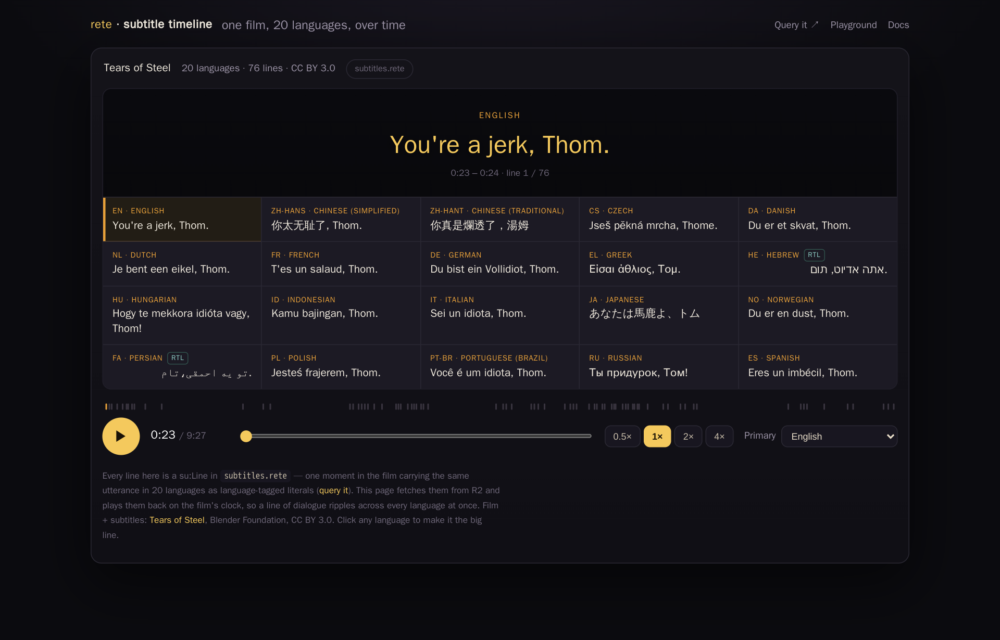

# Subtitle timeline — one film, 20 languages, over time

**[▸ Play the timeline →](subtitles.html)** — a browser app that replays one film's
dialogue in 20 languages at once, every line lighting up the instant it's spoken,
straight from a temporal `.rete` graph. No video file: what moves is the subtitle
data itself, on the film's own clock.

<figure class="fig-center">
  
  <figcaption>One moment in Tears of Steel, shown simultaneously in all 20 subtitle languages as the film's clock advances.</figcaption>
</figure>

## Watching one line become twenty

A big **hero line** sits up top in whichever language is currently "primary."
Below it, a grid holds all 20 languages side by side; the cell for the active
line lights up in every language together, so you watch one utterance ripple
across Spanish, Japanese, Persian, Hebrew and the rest at the same instant.
Right-to-left languages are right-aligned and carry an "RTL" badge rather than
being forced into a left-to-right layout. Click any cell — or use the primary
selector — to promote that language to the hero spot.

Transport is a play/pause button, a scrubber, a running clock against the
film's total duration, and tick marks along a timeline (one per line, lit as
they're passed) plus speed controls at 0.5×, 1×, 2× and 4×.

## A temporal graph, not a video

Every line is a `su:Line` node: one moment in the film, carrying the *same*
utterance in all 20 languages as language-tagged literals (`su:text "…"@lang`)
on a single node. The page fetches a small JSON snapshot of that graph and
plays it back against the film's clock — nothing is prerendered per language;
the grid is just the graph's own temporal structure made visible. The film and
its subtitles are [Tears of Steel](https://mango.blender.org/), Blender
Foundation, CC BY 3.0.

## The same data, queryable

The graph behind the app is a regular playground dataset — open it and ask
questions with SPARQL instead of watching:

- [`subtitles`](playground.html#dataset=subtitles&load=lazy) — Tears of Steel
  in 20 languages, ~14.4K triples: what's on screen at a given second, the
  whole film in one language, full-text search across dialogue, or a
  translation diff between two languages for the same line.

A scrub and a query are the same range read over the same file — the app just
asks for the line at the current second, exactly like a time-bounded SPARQL
query would.
