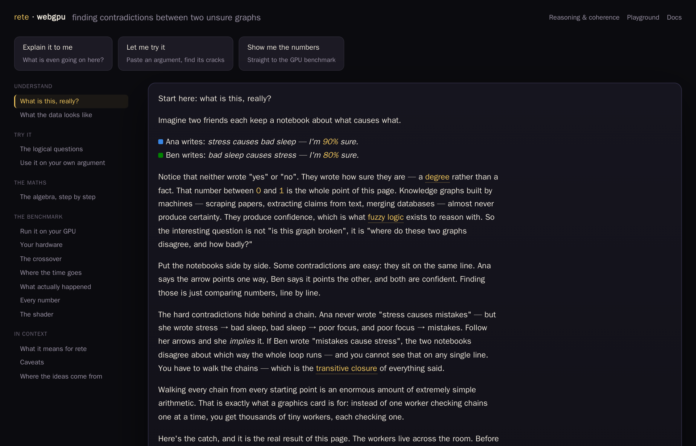

# WebGPU coherence — finding contradictions between two unsure graphs

**[▸ Run the experiment →](webgpu.html)** — a page you run yourself, on your own
GPU: it explains the idea, lets you paste an argument to find its cracks, then
benchmarks WebGPU against a single CPU core on your actual hardware.

This is an **experiment**, not a shipped feature: a real benchmark with honest
numbers, including where the idea does not pay off.

<figure class="fig-center">
  
  <figcaption>Two notebooks of "what causes what", each claim carrying a confidence instead of a yes/no — the page finds where they disagree, and how badly.</figcaption>
</figure>

## The question

Knowledge graphs built by machines — scraped from papers, extracted from text,
merged from databases — almost never produce certainty. They produce
**confidence**: a degree between 0 and 1, reasoned about with fuzzy logic
rather than plain boolean logic. So the interesting question is not "is this
graph wrong", it's **where do two such graphs disagree, and by how much**.

Some contradictions are easy: two claims sit on the same line, one graph's
arrow pointing one way and the other's the opposite, and comparing them is a
single number-to-number check. The hard ones hide behind a chain — no single
claim contradicts anything, but *following the arrows* (the graph's
transitive closure, computed with max-min composition instead of ordinary
matrix multiply) reveals that a graph implies something its own author never
wrote, and that implication is what clashes with the other graph.

## What you can do on the page

Read the explanation of same-line vs. chained contradictions with a worked
six-statement example, then paste your own cause-and-effect argument into an
editable sandbox to see which of its claims disagree, echo each other, or
form a suspicious cycle. From there, the page turns into a benchmark you run
yourself: it generates a synthetic fuzzy graph of your chosen size, runs the
same two checks as WebGPU compute shaders, races them against a single CPU
core (an honest baseline, since rete's own engine is single-threaded in the
browser too), and reports your GPU's numbers next to the reference run.

## The honest result

WebGPU is **not a general win** here. For an elementwise same-line check
(`min` of two confidence values, counted), the speedup plateaus around
**2×**, because at scale almost all the wall-clock time is spent uploading
data, not computing. For the chained check — an iterated max-min closure,
the operation behind hidden contradictions — the win is real: **15–17×
end-to-end**, and **144–212×** when only the compute is counted. Same GPU,
same data; the difference is how much arithmetic each kernel does per byte
moved.

The practical rule that falls out of this: **stage once, run many.** Upload
bandwidth is the wall, so a coherence check only pays for its own upload if
you sweep several thresholds or rules against the same resident graph rather
than uploading once per question. And this is explicitly **not** an argument
for GPU-accelerated SPARQL — remote `.rete` queries are bound by network
round trips and local ones already finish in single-digit milliseconds, both
well below the latency floor of a GPU dispatch. The win only shows up for
whole-graph, seconds-scale batch jobs like this one.

See also [reasoning & coherence](reasoning.html) for the OWL 2 QL side of
consistency checking, and [SPARQL support](sparql.html) for RDF-star, which
is how a confidence value attaches to a triple in the first place.
